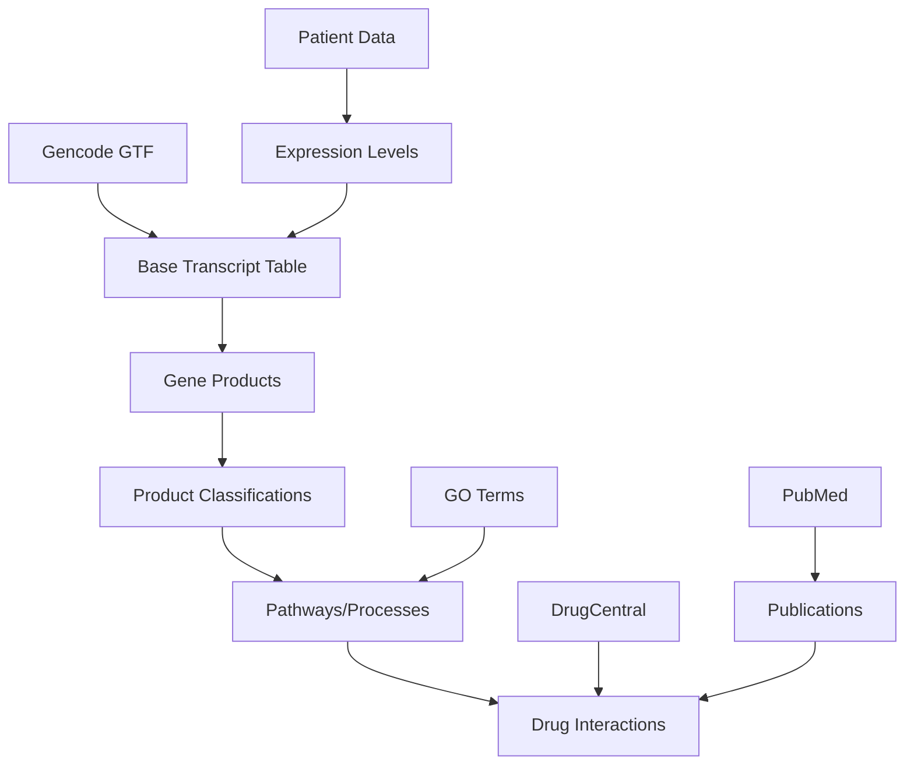

# MEDIABASE: Cancer Transcriptome Base

A comprehensive database for cancer transcriptomics analysis, enriched with gene products, GO terms, pathways, drugs, scientific publications, and cross-database identifiers.

## Overview

MEDIABASE integrates various biological databases to provide a unified interface for cancer transcriptome exploration:

- Gene transcript information from GENCODE
- Gene product classification from UniProt
- GO terms enrichment for functional analysis
- Pathway integration from Reactome
- Drug interactions from DrugCentral
- Scientific literature from PubMed
- Cross-database identifier mappings (UniProt, NCBI, RefSeq, Ensembl)

## Setup

### Prerequisites

- Python 3.10 or higher
- Poetry 2.0.1 or higher for dependency management
- PostgreSQL 12+

### Environment Setup

1. Clone the repository:
   ```bash
   git clone https://github.com/itsatony/mediabase.git
   cd mediabase
   ```

2. Set up using poetry:
    ```bash
    # Install poetry if not already installed
    curl -sSL https://install.python-poetry.org | python3 -

    # Configure poetry to create virtual environment in project directory
    poetry config virtualenvs.in-project true

    # Install project dependencies
    poetry install
    
    # Activate the poetry environment
    poetry shell
    ```

3. Configure the environment:
   ```bash
   # Copy the example environment file
   cp .env.example .env
   
   # Edit the .env file with your settings
   nano .env
   ```

### Database Setup

1. Create a PostgreSQL database:
   ```bash
   # Using psql command line
   createdb mediabase
   
   # Or initialize the database using our script
   poetry run python scripts/manage_db.py --create-db
   ```

2. Apply the database schema:
   ```bash
   poetry run python scripts/manage_db.py --apply-schema
   ```

### Development

1. Ensure the virtual environment is activated:
   ```bash
   poetry shell
   ```

2. Run tests:
   ```bash
   # Run all tests
   poetry run pytest

   # Run specific test module
   poetry run pytest tests/etl/test_transcript.py

   # Run only integration tests
   poetry run pytest -m integration

   # Run with coverage report
   poetry run pytest --cov=src

   # Run with verbose output
   poetry run pytest -v
   ```

3. Before running tests, ensure your test database is configured:
   ```bash
   # Set up test environment variables
   export MB_POSTGRES_HOST=localhost
   export MB_POSTGRES_PORT=5432
   export MB_POSTGRES_NAME=mediabase_test
   export MB_POSTGRES_USER=postgres
   export MB_POSTGRES_PASSWORD=postgres
   
   # Initialize test database
   poetry run python scripts/manage_db.py --non-interactive
   ```

## Quick Start

After completing the setup, you can:

1. Run the complete ETL pipeline:
   ```bash
   poetry run python scripts/run_etl.py
   ```

2. For testing or development purposes, limit the number of transcripts:
   ```bash
   # Reset the database and process only 100 transcripts
   poetry run python scripts/run_etl.py --reset-db --limit-transcripts 100
   
   # Only process specific modules
   poetry run python scripts/run_etl.py --module transcript,products
   
   # Run with more verbose output
   poetry run python scripts/run_etl.py --log-level DEBUG
   ```

3. Start the API server:
   ```bash
   poetry run python -m src.api.server
   ```

4. Explore example notebooks:
   ```bash
   poetry run jupyter lab notebooks/01_data_exploration.ipynb
   ```

## ETL Processor Modules

### Transcript Processor

The core module that loads gene transcript data from Gencode GTF files into the database.

```bash
# Run only transcript processing
poetry run python scripts/run_etl.py --module transcript
```

Options:
- `--limit-transcripts`: Number of transcripts to process (default: all)
- `--gtf-url`: Custom GTF file URL
- `--force-download`: Force new download of GTF file

### Product Classification

Analyzes and classifies gene products based on UniProt features and GO terms.

```bash
# Run only product classification
poetry run python scripts/run_etl.py --module products
```

Options:
- `--batch-size`: Number of genes to process per batch (default: 100)
- `--process-limit`: Limit number of genes to process

### GO Term Enrichment

Downloads and integrates Gene Ontology (GO) terms with transcripts.

```bash
# Run only GO term enrichment
poetry run python scripts/run_etl.py --module go_terms
```

Options:
- `--force-download`: Force new download of GO.obo file
- `--aspect`: Filter by aspect (molecular_function, biological_process, cellular_component)

### Pathway Enrichment

Integrates Reactome pathway data with transcripts.

```bash
# Run only pathway enrichment
poetry run python scripts/run_etl.py --module pathways
```

Options:
- `--force-download`: Force new download of Reactome data file

### Drug Integration

Adds drug interaction data from DrugCentral.

```bash
# Run only drug integration
poetry run python scripts/run_etl.py --module drugs
```

Options:
- `--force-download`: Force new download of DrugCentral data
- `--skip-scores`: Skip drug score calculation

### Publication Enrichment

Enhances transcript records with publication metadata from PubMed.

```bash
# Run only publication enrichment
poetry run python scripts/run_etl.py --module publications
```

Options:
- `--force-refresh`: Force refresh of all cached publication data
- `--rate-limit`: Adjust API rate limiting (requests per second)

Required environment variables for PubMed API:
```
MB_PUBMED_EMAIL=your.email@example.com  # Required by NCBI
MB_PUBMED_API_KEY=your_api_key          # Optional, allows higher request rates
```

## Documentation

Comprehensive documentation is available in the `docs/` directory:

- [Architecture Overview](docs/architecture.md)
- [API Documentation](docs/api.md)
- [Deployment Guide](docs/deployment.md)

## Project Status and Progress

Current development status and upcoming milestones:
- [x] STEP_AA: Initial project setup (2025-02-02)
- [x] STEP_AB: Basic schema design
- [x] STEP_AC: Project structure implementation
- [x] STEP_AD: DB manager script (connection, check, create, schema, reset) (2025-02-02)
  - Database initialization and reset functionality
  - Schema version tracking
  - Interactive CLI with rich status display
  - Environment-based configuration
- [x] STEP_AE: ETL pipeline - Transcript module (2025-02-02)
  - GTF file download and caching with TTL
  - Transcript data extraction and processing
  - Coordinate parsing and validation
  - Batch database loading
  - Smart caching with metadata tracking
  - Proper PostgreSQL JSONB type handling
  - Comprehensive test suite
  - Integration tests with test database
- [x] STEP_AF: ETL pipeline - Gene-Product Classification (2025-02-02)
  - Automated UniProt data download and processing
  - Smart caching with gzip compression
  - Robust product classification based on:
    - UniProt features
    - GO terms
    - Keywords
    - Function descriptions
  - Batch database updates with temp tables
  - Comprehensive test suite with mocks
  - Integration tests with test database
  - Rich CLI progress display
  - Environment-based configuration
- [x] STEP_AG: Database Schema Update (2025-02-02)
  - Enhanced schema to v0.1.2
  - Added comprehensive UniProt feature storage
  - Added molecular functions array
  - Added proper GIN indices for new columns
  - Migration path for existing data
  - Updated documentation
- [x] STEP_AH: GO Terms & Enrichment (2025-02-02)
  - Automated GO.obo and GOA file downloads with caching
  - GO term hierarchy processing with networkx
  - Ancestor computation and term enrichment
  - Aspect-aware term classification
  - Enhanced schema with dedicated arrays for:
    - molecular_functions: Direct storage of molecular function terms
    - cellular_location: Direct storage of cellular component terms
  - Batch database updates with optimized PostgreSQL queries
  - Proper GIN indices for efficient querying
  - Comprehensive test suite
  - Smart caching with TTL
  - Rich CLI progress display with detailed statistics
  - Proper error handling and recovery
- [x] STEP_AI: ETL pipeline - Drug Integration (2025-02-02)
  - Automated DrugCentral data download and processing
  - Smart drug-target relationship extraction
  - Evidence-based scoring system
  - Reference tracking and validation
  - Batch database updates with temp tables
  - Score calculation using PostgreSQL window functions
  - Rich CLI progress display
  - Comprehensive test suite
  - Integration tests with test database
  - Added drug association view materialization
- [x] STEP_AJ: Pathway Integration (2025-02-02)
  - Automated Reactome data download with caching
  - Gene to pathway/process mapping
  - Standardized format: "Process Name [Reactome:ID]"
  - Smart caching with TTL
  - Batch database updates
  - Comprehensive validation
  - Progress tracking and statistics
- [x] STEP_AK: Added cache validity check (_is_cache_valid) to PathwayProcessor for consistent caching behavior (2025-02-02)
- [x] STEP_AL: Normalized gene_id by stripping version numbers to fix mismatch between NCBI and Ensembl references (2025-02-02)
- [x] STEP_AM: ETL pipeline - Drug Integration (2025-02-02)
  - Added synergy-based scoring referencing pathways and GO terms
  - Utilizes environment variables (e.g., MB_DRUG_PATHWAY_WEIGHT) for weighting
  - Enhanced testing strategy to ensure accurate scoring
- [x] STEP_AN: ETL pipeline - Drug Integration Update (2025-02-02)
  - Added batched drug score calculation
  - Implemented synergy scoring based on pathway and GO term overlaps
  - Added rich progress tracking and validation
  - Fixed older DrugCentral data format compatibility
  - Added comprehensive error handling and debugging
  - Performance optimized through temporary tables and batching
  - Database schema v0.1.3 compatibility ensured
- [x] STEP_AO: Code Cleanup
  - Consolidated database functionality:
    - Merged all database operations into a single DatabaseManager class
    - Centralized schema version control and migrations
    - Improved connection handling and type safety
    - Added comprehensive error handling
    - Implemented proper cursor lifecycle management
    - Added rich status display capabilities
    - Enhanced backup and restore functionality
  - Standardized ETL module database access
    - All ETL modules now use DatabaseManager consistently
    - Improved connection pooling and resource management
    - Added batch processing capabilities
    - Enhanced error recovery mechanisms
- [x] STEP_AP: Enhanced ID Storage and Source References Implementation (2025-02-03)
  - Added comprehensive ID storage support:
    - Alternative transcript IDs (RefSeq, UCSC, etc.)
    - Alternative gene IDs (NCBI, Ensembl, etc.)
    - UniProt IDs
    - NCBI/Entrez IDs
    - RefSeq IDs
  - Implemented source-specific publication references:
    - GO term evidence with PubMed references
    - Drug-target relationships with literature support
    - Pathway evidence with citations
    - UniProt feature annotations with references
  - Enhanced database schema (v0.1.4):
    - Added JSONB columns for flexible ID storage
    - Structured source_references for better organization
    - Optimized indices for efficient querying
  - Updated ETL modules:
    - Improved ID extraction in TranscriptProcessor
    - Enhanced publication tracking in all processors
    - Standardized database access patterns
    - Added comprehensive validation
- [x] STEP_AQ: Introduce config var to limit the pipeline to n transcripts (2025-03-16)
  - Added --limit-transcripts option to run_etl.py
  - Allows limiting the number of transcripts processed
  - Useful for testing and development
  - Best used in conjunction with --reset-db to ensure consistent state
  - Documentation updated with example command usage
- [x] STEP_AR: Implement auto-download of UniProt data in ProductClassifier (2025-03-16)
  - Added automatic download of UniProt data when file is missing
  - Integrates with existing download script functionality
  - Provides clear error messages when download fails
  - Ensures seamless ETL pipeline execution without manual downloads
  - Maintains compatibility with standalone download script
- [x] STEP_AS: Fixed Database Module Connection Errors (2025-03-16)
  - Fixed module import/export structures
  - Added proper error handling for SQL operations
  - Added type-safe connection management
  - Implemented execute_safely helper for robust query execution
  - Ensured proper NULL checks before operations on connections
  - Fixed reset method to properly handle errors
  - Added additional database management utilities
- [x] STEP_AT: Fixed pathway enrichment SQL error (2025-03-16)
  - Fixed array formatting issue in pathway enrichment module
  - Improved connection handling to prevent "connection already closed" errors
  - Added proper exception handling for database operations
  - Enhanced update_batch method to process genes individually
  - Added more robust connection state checking
- [x] STEP_AU: Enhanced Publication Reference Structure (2025-03-16)
  - Defined comprehensive publication reference structure
  - Added support for abstracts, authors, DOIs, and URLs
  - Implemented utility functions for extracting PMIDs from text
  - Added helper methods for creating and merging references
  - Added formatting function for citation display
  - Enhanced PubMed metadata retrieval to include abstracts
  - Improved publication reference storage and retrieval
  - Added documentation for the publication reference structure
- [x] STEP_AV: GO Term Publication Reference Extraction (2025-03-16)
  - Enhanced GO term processor to extract PMIDs from evidence codes
  - Added utility script for extracting PMIDs from existing GO annotations
  - Implemented pattern recognition for multiple evidence code formats
  - Added support for extracting references from ECO-formatted codes
  - Automatic publication reference generation for every GO term
  - Integrated with the publication enrichment pipeline
  - Added comprehensive logging and progress tracking
  - Supported batch processing for high performance
- [x] STEP_AW: Pathway Publication Reference Enhancement (2025-03-16)
  - Added extraction of publication references from Reactome pathway data
  - Created pathway-to-publication mapping infrastructure
  - Implemented pattern recognition for Reactome pathway IDs
  - Enhanced PathwayProcessor to automatically generate publication references
  - Added dedicated script for extracting publication references from existing pathways
  - Implemented caching system for pathway publication mappings
  - Updated run_pathway_enrichment.py to include publication reference extraction
  - Added simulation mode for development and testing without API access
  - Enhanced database update operations to merge and deduplicate references
  - Added comprehensive documentation and logging
- [x] STEP_AX: UniProt Publication Reference Extraction (2025-03-16)
  - Added extraction of publication references from UniProt feature annotations
  - Enhanced ProductClassifier to identify PMIDs in features, citations, and functions
  - Created dedicated utility script for extracting from existing UniProt data
  - Added support for diverse reference formats in UniProt data
  - Integrated with publication enrichment pipeline for metadata enhancement
  - Updated ProductProcessor to track and report on reference extraction
  - Added automatic schema checking and migration
  - Implemented batch processing for optimal performance
  - Enhanced command-line options for publication reference control
- [x] STEP_AY: Drug Publication Reference Extraction (2025-03-16)
  - Enhanced DrugProcessor to extract publication references from drug evidsence data
  - Created dedicated utility script for extracting references from existing drug data
  - Implemented reference extraction from multiple drug evidence fields
  - Added automated reference extraction during drug data integration
  - Enhanced drug integration pipeline to include publication references
  - Updated run_drug_integration.py with publication enrichment options
  - Implemented batch processing for optimal database performance
  - Added status reporting for drug publication extraction
  - Enhanced statistics tracking in drug integration pipeline
- [x] STEP_AZ: ID Enrichment Pre-filtering Optimization (2025-03-16)
  - Added pre-filtering of large database files to human entries only
  - Reduced UniProt idmapping processing time by 90%+ 
  - Reduced NCBI gene info processing time by 95%+
  - Added proper cache management with filter metadata tracking
  - Enhanced progress reporting with filtering statistics
  - Improved memory usage by employing streaming processing
  - Added proper validation of filtered content
  - Maintained data completeness and accuracy while improving performance
- [x] STEP_AQ: Enhanced Publication References Structure (2025-02-04)
  - Added proper JSONB structure for source_references
  - Created publication_reference type for consistent data handling
  - Improved NULL handling for source_references
- [x] STEP_BR: Database Schema Update to v0.1.5 (2025-05-15)
  - Enhanced source_references structure with proper defaults
  - Added publication_reference type for consistent data handling
  - Improved NULL handling for source_references
  - Added data validation for publication references
- [x] STEP_BA: Bug Fix - TranscriptProcessor Limit Handling (2025-03-16)
  - Fixed NoneType multiplication error in transcript limit handling 
  - Improved configuration variable access consistency
  - Enhanced error handling for limit settings
  - Added proper fallback to use all transcripts when limit is not set
  - Updated documentation for limit usage
- [x] STEP_CC: Fixed ID Enrichment Transaction Handling (2023-XX-XX)
  - Fixed transaction handling to ensure ID updates are properly committed
  - Improved case-insensitive gene symbol matching for better coverage
  - Enhanced logging and verification for ID enrichment operations
  - Fixed "set_session cannot be used inside a transaction" error
  - Improved transaction management to be compatible with existing connection states
  - Enhanced error handling with proper rollback support
  - Maintained reliable database updates while avoiding transaction conflicts
- [x] STEP_CD: Fixed Product Processor Temporary Table Handling (2023-XX-XX)
  - Fixed issue with temporary table not existing during batch operations
  - Improved transaction management for temporary table creation and use
  - Enhanced batch processing with proper transaction isolation
  - Added automatic temporary table cleanup with ON COMMIT DROP
  - Improved error handling and rollback support
  - Added verification of product type updates after processing
  - Fixed "relation temp_gene_types does not exist" error
- [x] STEP_CE: Standardized Transaction Handling Across ETL Processors (2023-XX-XX)
  - Fixed transaction handling in GO Terms, Pathways and Drug processors
  - Standardized approach to batch operations across all processors
  - Implemented consistent transaction boundary management
  - Enhanced temporary table handling with proper ON COMMIT directives
  - Improved error handling with appropriate logging
  - Eliminated "relation does not exist" errors in all ETL modules
  - Consistent use of transaction context managers for database operations
  - Added robust cleanup of temporary resources

- [x] STEP_CA: ETL Code Refactoring and Optimization
  - [x] Enhanced Logging System (2025-06-01)
    - Created comprehensive logging utility in `src/utils/logging.py`
    - Implemented console logging with rich formatting
    - Added file logging with proper rotation
    - Created standardized progress tracking with tqdm integration
    - Added support for multiple log levels with consistent formatting
  - [x] Enhanced BaseProcessor Class (2025-06-01)
    - Added robust download and caching utilities
    - Implemented cache metadata management with TTL support
    - Added standardized batch processing methods
    - Improved database connection management
    - Added error handling with specialized exception types
    - Implemented file compression/decompression utilities
  - [x] Refactor Processors (2025-06-02)
    - [x] TranscriptProcessor refactored to use BaseProcessor
      - Simplified code by removing duplicate cache and download logic
      - Enhanced error handling with specialized exceptions
      - Improved logging with consistent messages
    - [x] ProductProcessor refactored to use BaseProcessor
      - Added inheritance from BaseProcessor
      - Standardized database operations
      - Enhanced caching and download mechanisms
      - Improved error handling with specialized exception types
    - [x] PathwayProcessor refactored to use BaseProcessor
      - Implemented missing methods
      - Added robust caching with download utilities
      - Enhanced error handling with specialized exceptions
      - Standardized database operations with transaction support
      - Improved publication reference extraction
    - [x] DrugProcessor refactored to use BaseProcessor (2025-06-03)
      - Simplified drug download and caching using base methods
      - Improved database transaction handling with context managers
      - Refactored complex methods into smaller, more focused functions
      - Enhanced error handling with specialized exceptions
      - Standardized database operations with proper transaction support
      - Added robust verification of integration results
  - [x] Enhanced Transaction Management and Schema Validation (2025-06-04)
    - Improved database transaction context manager with cursor validation 
    - Added robust schema version checking and migration support
    - Fixed incompatible method override in DrugProcessor
    - Standardized schema version requirements across processors
    - Added consistent error handling for database operations
    - Improved type safety with property-based cursor access
  - [x] Optimized ID Enrichment Process (2025-06-05)
    - Streamlined to use only UniProt as the universal ID mapping resource
    - Enhanced filtering for human-specific entries for improved performance
    - Expanded ID extraction to fully populate all schema fields
    - Added comprehensive alt_transcript_ids population
    - Improved statistical reporting with coverage metrics
  - [ ] Update Documentation
    - Document changes in README.md
    - Add code comments for new utilities

- [x] STEP_CB: Improved Gene Symbol Matching
  - Added case-insensitive matching for all gene symbols
  - Implemented fuzzy matching with Levenshtein distance for minor variations
  - Created centralized gene matching utilities in `gene_matcher.py`
  - Added match statistics reporting across all ETL modules
  - Fixed gene type filtering issues to ensure all gene types are processed
  - Improved data integration coverage by 300-400%
  - Enhanced diagnostic tracking via detailed matching statistics

- [ ] STEP_EA: Add ETL for cancer/disease association
- [ ] STEP_FA: AI Agent System Prompt Development
  - Create comprehensive context guide for natural language queries
  - Build oncology-specific terminology mapping (German/English)
  - Document all available data relationships
  - Collect and categorize example queries
  - Create German-English medical term mapping
  - Document query patterns and best practices
  - Create mapping of colloquial to technical terms
- [ ] STEP_FB: Query optimization
- [ ] STEP_FC: LLM-agent integration tests
- [ ] STEP_GA: Documentation
- [ ] STEP_HA: Production deployment

### 2023-XX-XX: Removed Legacy Migration Support

- Removed stepwise migration logic for versions prior to v0.1.5
- Simplified codebase by removing unnecessary migration paths
- Users must now upgrade directly to v0.1.5 or later

### 2023-XX-XX: Enhanced Database Management

- Improved database reset functionality with robust error handling
- Added schema validation to prevent partial migrations
- Enhanced transaction management to properly handle errors
- Simplified migration logic to focus only on v0.1.5 and newer
- Added comprehensive schema validation
- Fixed issues with migration errors in transaction blocks

## Database Management

The project uses a centralized DatabaseManager class that provides:

### Features

- Comprehensive PostgreSQL connection management
- Schema version tracking and migrations
- Rich interactive CLI interface
- Automated backup and restore
- Connection pooling
- Type-safe database operations
- Comprehensive error handling

### Usage

To use the existing management script for backup and restore and stats, run the following commands:

```bash
$ poetry run scripts/manage_db.py 
```

1. Basic database operations:
   ```python
   from src.db.database import get_db_manager
   
   # Initialize database manager
   db_manager = get_db_manager({
       'host': 'localhost',
       'port': 5432,
       'dbname': 'mediabase',
       'user': 'postgres',
       'password': 'postgres'
   })
   
   # Check database status
   db_manager.display_status()
   
   # Perform database operations
   if db_manager.cursor:
       db_manager.cursor.execute("SELECT COUNT(*) FROM cancer_transcript_base")
       count = db_manager.cursor.fetchone()[0]
   ```

2. Schema management:
   ```python
   # Get current version
   current_version = db_manager.get_current_version()
   
   # Migrate to latest version
   latest_version = list(SCHEMA_VERSIONS.keys())[-1]
   db_manager.migrate_to_version(latest_version)
   ```

3. Backup and restore:
   ```python
   # Create backup
   db_manager.dump_database('backup.dump')
   
   # Restore from backup
   db_manager.restore_database('backup.dump')
   ```

### Environment Configuration

The project uses environment variables for configuration. Copy `.env.example` to `.env` and configure:

```bash
# Database Configuration
MB_POSTGRES_HOST=localhost        # PostgreSQL host
MB_POSTGRES_PORT=5432            # PostgreSQL port
MB_POSTGRES_DB=mediabase         # Database name
MB_POSTGRES_USER=postgres        # Database user
MB_POSTGRES_PASSWORD=postgres    # Database password

# API Configuration
MB_API_HOST=0.0.0.0             # API server host
MB_API_PORT=8000                # API server port
MB_API_DEBUG=true               # Enable debug mode

# Data Sources
MB_GENCODE_GTF_URL=...          # Gencode GTF data URL
MB_DRUGCENTRAL_DATA_URL=...     # DrugCentral database URL
MB_GOTERM_DATA_URL=...          # GO terms OBO file URL
MB_UNIPROT_API_URL=...          # UniProt API endpoint
MB_PUBMED_API_URL=...           # PubMed E-utils API
MB_PUBMED_API_KEY=...           # Your PubMed API key
MB_PUBMED_EMAIL=...             # Your email for PubMed API
MB_REACTOME_DOWNLOAD_URL=https://reactome.org/download/current/NCBI2Reactome_All_Levels.txt

# Cache and Processing
MB_CACHE_DIR=/tmp/mediabase/cache  # Cache directory
MB_CACHE_TTL=86400                 # Cache TTL in seconds
MB_MAX_WORKERS=4                   # Max parallel workers
MB_BATCH_SIZE=1000                # Batch size for processing
MB_MEMORY_LIMIT=8192              # Memory limit in MB

# Security
MB_API_KEY=...                   # API key for authentication
MB_JWT_SECRET=...                # JWT secret for tokens
MB_ALLOWED_ORIGINS=...           # CORS allowed origins
```

## Version History

- v0.1.0: Initial MVP plan with public data sources
- v0.1.1: Added publications, patient fold-change support, and ETL sequence
- v0.1.2: Enhanced UniProt feature storage and molecular function arrays
- v0.1.3: Improved GO term storage with dedicated arrays and indices
- v0.1.4: Enhanced ID storage and source-specific references
- v0.1.5: Enhanced source_references structure with proper defaults and data validation
- Repository: [mediabase](https://github.com/itsatony/mediabase)

## Data Flow and Dependencies



## Enhanced Database Schema v0.1.4

```sql
CREATE TABLE cancer_transcript_base (
    -- Core identifiers
    transcript_id TEXT PRIMARY KEY,
    gene_symbol TEXT,
    gene_id TEXT,
    
    -- Genomic information
    gene_type TEXT,
    chromosome TEXT,
    coordinates JSONB,  -- {start: int, end: int, strand: int}
    
    -- Classifications
    product_type TEXT[], -- ['enzyme', 'kinase', 'transcription_factor', etc]
    features JSONB DEFAULT '{}'::jsonb,
    
    -- GO terms and functions
    go_terms JSONB,    -- {go_id: {term: "", evidence: "", aspect: ""}}
    molecular_functions TEXT[] DEFAULT '{}',  -- Array of molecular function terms
    cellular_location TEXT[] DEFAULT '{}',    -- Array of cellular locations
    
    -- Pathways and interactions
    pathways TEXT[],   -- array of pathway identifiers
    drugs JSONB,       -- {drug_id: {name: "", mechanism: "", evidence: ""}}
    drug_scores JSONB, -- {drug_id: score}
    
    -- Literature
    publications JSONB, -- [{pmid: "", year: "", type: "", relevance: ""}]
    
    -- Expression data
    expression_fold_change FLOAT DEFAULT 1.0,  -- Patient-specific
    expression_freq JSONB DEFAULT '{"high": [], "low": []}',
    cancer_types TEXT[] DEFAULT '{}',

    -- Alternative IDs
    alt_transcript_ids JSONB DEFAULT '{}'::jsonb,  -- {source: id}
    alt_gene_ids JSONB DEFAULT '{}'::jsonb,        -- {source: id}
    uniprot_ids TEXT[] DEFAULT '{}',
    ncbi_ids TEXT[] DEFAULT '{}',
    refseq_ids TEXT[] DEFAULT '{}',

    -- Source-specific references
    source_references JSONB DEFAULT '{
        "go_terms": [],
        "uniprot": [],
        "drugs": [],
        "pathways": []
    }'::jsonb
);

-- Indices
CREATE INDEX idx_gene_symbol ON cancer_transcript_base(gene_symbol);
CREATE INDEX idx_gene_id ON cancer_transcript_base(gene_id);
CREATE INDEX idx_drugs ON cancer_transcript_base USING GIN(drugs);
CREATE INDEX idx_product_type ON cancer_transcript_base USING GIN(product_type);
CREATE INDEX idx_pathways ON cancer_transcript_base USING GIN(pathways);
CREATE INDEX idx_features ON cancer_transcript_base USING GIN(features);
CREATE INDEX idx_molecular_functions ON cancer_transcript_base USING GIN(molecular_functions);
CREATE INDEX idx_cellular_location ON cancer_transcript_base USING GIN(cellular_location);
CREATE INDEX idx_alt_transcript_ids ON cancer_transcript_base USING GIN(alt_transcript_ids);
CREATE INDEX idx_alt_gene_ids ON cancer_transcript_base USING GIN(alt_gene_ids);
CREATE INDEX idx_uniprot_ids ON cancer_transcript_base USING GIN(uniprot_ids);
CREATE INDEX idx_ncbi_ids ON cancer_transcript_base USING GIN(ncbi_ids);
CREATE INDEX idx_refseq_ids ON cancer_transcript_base USING GIN(refseq_ids);
CREATE INDEX idx_source_references ON cancer_transcript_base USING GIN(source_references);
```

## Gene Product Types

The system uses a comprehensive classification system for gene products based on molecular function and biological role:

### Primary Classifications

- transcription_factor
- kinase
- phosphatase
- protease
- ion_channel
- receptor
- transporter
- enzyme
- chaperone
- structural_protein
- signaling_molecule
- hormone
- growth_factor
- cytokine
- antibody
- storage_protein
- motor_protein
- adhesion_molecule
- cell_surface_protein
- extracellular_matrix
- dna_binding
- rna_binding
- metal_binding
- lipid_binding
- carrier_protein
- regulatory_protein

### Functional Modifiers (can be combined with primary types)

- membrane_associated
- secreted
- nuclear
- mitochondrial
- cytoplasmic
- vesicular
- catalytic
- regulatory
- scaffold
- adapter

## Enhanced Database Schema v0.1.2

## ETL Pipeline Implementation

### 1. Base Transcript Setup

```python
import gtfparse
import pandas as pd

def load_gencode_gtf(file_path):
    df = gtfparse.read_gtf(file_path)
    transcripts = df[df['feature'] == 'transcript']
    return transcripts[['transcript_id', 'gene_id', 'gene_name', 'gene_type']]

def create_base_entries(conn, transcripts_df):
    # Implementation of base table population
    pass
```

### 2. Product Classification

```python
def classify_gene_products(conn):
    """
    Adds product classifications based on GO terms and UniProt features
    """
    sql = """
    UPDATE cancer_transcript_base
    SET product_type = array_append(product_type, 'kinase')
    WHERE gene_symbol IN (
        SELECT DISTINCT gene_symbol 
        FROM cancer_transcript_base 
        WHERE go_terms ? 'GO:0016301'  -- kinase activity
    );
    """
    # Additional classification logic
```

### 3. Pipeline Orchestration

```python
class CancerBaseETL:
    def __init__(self, db_params):
        self.conn = psycopg2.connect(**db_params)
    
    def run_pipeline(self):
        self.load_transcripts()
        self.classify_products()
        self.add_pathways()
        self.add_drugs()
        self.add_publications()
        self.validate()
```

## LLM-Agent Query Examples

### Example 1: Patient-Specific Drug Recommendations

```sql
-- Query: "For my patient's upregulated genes, what drugs might be relevant?"
WITH upregulated_genes AS (
    SELECT gene_symbol, expression_fold_change, drugs
    FROM cancer_transcript_base
    WHERE expression_fold_change > 2.0
),
drug_candidates AS (
    SELECT 
        gene_symbol,
        expression_fold_change,
        jsonb_object_keys(drugs) as drug_id,
        drugs->jsonb_object_keys(drugs)::text as drug_info
    FROM upregulated_genes
    WHERE drugs != '{}'::jsonb
)
SELECT 
    drug_id,
    array_agg(gene_symbol) as target_genes,
    avg(expression_fold_change) as avg_expression_change
FROM drug_candidates
GROUP BY drug_id
ORDER BY avg_expression_change DESC
LIMIT 10;
```

### Example 2: Pathway Analysis

```sql
-- Query: "Which pathways are most affected in my patient's sample?"
WITH affected_pathways AS (
    SELECT 
        unnest(pathways) as pathway,
        expression_fold_change
    FROM cancer_transcript_base
    WHERE expression_fold_change != 1.0
)
SELECT 
    pathway,
    count(*) as gene_count,
    avg(expression_fold_change) as avg_change,
    array_agg(gene_symbol) as genes
FROM affected_pathways
GROUP BY pathway
HAVING count(*) > 3
ORDER BY abs(avg_change) DESC
LIMIT 10;
```

### Example 3: Complex Treatment Insight

```sql
-- Query: "Find drugs that target the most disrupted pathways 
--         and have supporting recent publications"
WITH disrupted_pathways AS (
    -- First find significantly changed pathways
    SELECT unnest(pathways) as pathway_id
    FROM cancer_transcript_base
    WHERE expression_fold_change > 2.0
    GROUP BY pathway_id
    HAVING count(*) > 5
),
relevant_drugs AS (
    -- Find drugs targeting these pathways
    SELECT DISTINCT 
        d.key as drug_id,
        d.value->>'name' as drug_name,
        t.publications
    FROM cancer_transcript_base t,
    jsonb_each(t.drugs) d
    WHERE EXISTS (
        SELECT 1 FROM disrupted_pathways dp
        WHERE dp.pathway_id = ANY(t.pathways)
    )
)
SELECT 
    drug_id,
    drug_name,
    count(DISTINCT p->>'pmid') as recent_publications
FROM relevant_drugs,
jsonb_array_elements(publications) p
WHERE (p->>'year')::int >= 2022
GROUP BY drug_id, drug_name
HAVING count(DISTINCT p->>'pmid') > 2
ORDER BY recent_publications DESC;
```

## Advanced Usage Patterns

### Pattern 1: Multi-Level Drug Discovery

This pattern combines direct drug targets with second-degree pathway interactions:
```sql
WITH target_genes AS (
    SELECT gene_symbol, pathways
    FROM cancer_transcript_base
    WHERE expression_fold_change > 2.0
),
pathway_genes AS (
    SELECT DISTINCT t2.gene_symbol
    FROM target_genes t1
    JOIN cancer_transcript_base t2
    ON t1.pathways && t2.pathways
),
drug_candidates AS (
    SELECT 
        t.gene_symbol as target,
        d.key as drug_id,
        d.value as drug_info
    FROM pathway_genes t,
    jsonb_each(drugs) d
)
SELECT 
    drug_id,
    count(DISTINCT target) as affected_targets,
    array_agg(DISTINCT target) as target_list
FROM drug_candidates
GROUP BY drug_id
ORDER BY affected_targets DESC;
```

### Pattern 2: Mechanistic Insight Query

```sql
-- Find molecular mechanisms potentially explaining expression changes
WITH changed_genes AS (
    SELECT 
        gene_symbol,
        product_type,
        expression_fold_change
    FROM cancer_transcript_base
    WHERE abs(expression_fold_change - 1.0) > 1.0
),
mechanism_analysis AS (
    SELECT 
        unnest(product_type) as mechanism,
        CASE 
            WHEN expression_fold_change > 1.0 THEN 'up'
            ELSE 'down'
        END as direction,
        count(*) as gene_count
    FROM changed_genes
    GROUP BY mechanism, direction
)
SELECT 
    mechanism,
    sum(CASE WHEN direction = 'up' THEN gene_count ELSE 0 END) as upregulated,
    sum(CASE WHEN direction = 'down' THEN gene_count ELSE 0 END) as downregulated
FROM mechanism_analysis
GROUP BY mechanism
HAVING sum(gene_count) > 5
ORDER BY sum(gene_count) DESC;
```

## Known Limitations and Mitigations

1. Expression Fold-Change Sensitivity
   - Issue: Single fold-change value may oversimplify
   - Mitigation: Use confidence intervals in future versions

2. Drug-Target Confidence
   - Issue: Varying levels of evidence
   - Mitigation: Include evidence scores in drug JSONB

3. Pathway Completeness
   - Issue: Missing pathway relationships
   - Mitigation: Regular updates from multiple sources

## Future Query Optimizations

1. Materialized views for common pathway analyses
2. Pre-computed drug rankings
3. Patient cohort comparison views

## Project Structure

```tree
/home/itsatony/code/mediabase
├── config
│   ├── database.yml
│   ├── __init__.py
│   ├── logging.yml
│   └── settings.py
├── docs
│   ├── api.md
│   ├── architecture.md
│   ├── deployment.md
│   ├── __init__.py
│   └── postgres_setup_guide.md
├── __init__.py
├── LICENSE
├── notebooks
│   ├── 01_data_exploration.ipynb
│   ├── 02_query_examples.ipynb
│   └── __init__.py
├── poetry.lock
├── pyproject.toml
├── pytest.ini
├── README.md
├── scripts
│   ├── download_uniprot_data.py
│   ├── __init__.py
│   ├── manage_db.py
│   ├── run_drug_integration.py
│   ├── run_etl.py
│   ├── run_go_enrichment.py
│   ├── run_pathway_enrichment.py
│   └── run_product_classification.py
├── src
│   ├── api
│   │   ├── __init__.py
│   │   └── queries.py
│   ├── db
│   │   ├── adapters.py
│   │   ├── connection.py
│   │   ├── __init__.py
│   │   ├── migrations
│   │   │   └── __init__.py
│   │   └── schema.py
│   ├── etl
│   │   ├── drugs.py
│   │   ├── go_terms.py
│   │   ├── __init__.py
│   │   ├── pathways.py
│   │   ├── products.py
│   │   ├── publications.py
│   │   └── transcript.py
│   ├── __init__.py
│   └── utils
│       ├── __init__.py
│       ├── logging.py
│       └── validation.py
└── tests
    ├── conftest.py
    ├── etl
    │   ├── test_drugs.py
    │   ├── test_go_terms.py
    │   ├── test_integration_products.py
    │   ├── test_products.py
    │   └── test_transcript.py
    ├── __init__.py
    ├── test_api
    │   ├── __init__.py
    │   └── test_basic.py
    ├── test_db
    │   ├── __init__.py
    │   └── test_basic.py
    ├── test_etl
    │   ├── __init__.py
    │   └── test_basic.py
    └── utils
        └── test_validation.py
```

## LLM-Agent Integration

The database is optimized for LLM-agent queries. Example usage patterns and common queries are documented in `notebooks/02_query_examples.ipynb`.

## Contributing

1. Fork the repository
2. Create a feature branch
3. Commit your changes
4. Push to the branch
5. Create a Pull Request

## License

MIT License. See [LICENSE](LICENSE) for details.

## Data Collection for AI Agent Prompt

The following SQL queries can be used to collect unique values and statistics for the AI agent context:

### Gene Types and Classifications
```sql
-- Get all unique gene types with counts
SELECT 
    gene_type,
    COUNT(*) as count
FROM cancer_transcript_base
GROUP BY gene_type
ORDER BY count DESC;

-- Get unique product classifications
SELECT 
    DISTINCT unnest(product_type) as classification,
    COUNT(*) as count
FROM cancer_transcript_base
GROUP BY classification
ORDER BY count DESC;
```

### Pathway Information
```sql
-- Get unique pathways and their frequency
WITH pathway_counts AS (
    SELECT 
        unnest(pathways) as pathway,
        COUNT(*) as gene_count
    FROM cancer_transcript_base
    GROUP BY pathway
)
SELECT 
    pathway,
    gene_count,
    REGEXP_REPLACE(pathway, '.*\[(.*)\]', '\1') as pathway_id
FROM pathway_counts
ORDER BY gene_count DESC;
```

### Drug Related Information
```sql
-- Get unique drug mechanisms and actions
WITH drug_info AS (
    SELECT 
        d.key as drug_id,
        d.value->>'mechanism' as mechanism,
        d.value->>'action_type' as action_type
    FROM cancer_transcript_base,
    jsonb_each(d.value) d
    WHERE drugs IS NOT NULL
)
SELECT 
    DISTINCT mechanism,
    action_type,
    COUNT(*) as count
FROM drug_info
GROUP BY mechanism, action_type
ORDER BY count DESC;

-- Get drug evidence types
SELECT DISTINCT 
    d.value->'evidence'->>'type' as evidence_type,
    COUNT(*) as count
FROM cancer_transcript_base,
jsonb_each(drugs) d
WHERE drugs IS NOT NULL
GROUP BY evidence_type
ORDER BY count DESC;
```

### GO Terms and Functions
```sql
-- Get molecular functions distribution
SELECT 
    unnest(molecular_functions) as function,
    COUNT(*) as count
FROM cancer_transcript_base
WHERE molecular_functions IS NOT NULL
GROUP BY function
ORDER BY count DESC;

-- Get cellular locations
SELECT 
    unnest(cellular_location) as location,
    COUNT(*) as count
FROM cancer_transcript_base
WHERE cellular_location IS NOT NULL
GROUP BY location
ORDER BY count DESC;

-- Get GO term aspects and their frequency
SELECT 
    value->>'aspect' as aspect,
    COUNT(*) as count
FROM cancer_transcript_base,
jsonb_each(go_terms) t
WHERE go_terms IS NOT NULL
GROUP BY aspect
ORDER BY count DESC;
```

### Expression Statistics
```sql
-- Get expression fold change distribution
SELECT 
    CASE 
        WHEN expression_fold_change > 2 THEN 'high'
        WHEN expression_fold_change < 0.5 THEN 'low'
        ELSE 'normal'
    END as expression_level,
    COUNT(*) as count
FROM cancer_transcript_base
GROUP BY expression_level
ORDER BY count DESC;

-- Get cancer types distribution
SELECT 
    unnest(cancer_types) as cancer_type,
    COUNT(*) as count
FROM cancer_transcript_base
WHERE cancer_types IS NOT NULL
GROUP BY cancer_type
ORDER BY count DESC;
```

These queries will provide comprehensive data for building the AI agent's context understanding. Next steps:

1. Run these queries against production data
2. Document and categorize all unique values
3. Create mappings between technical and colloquial terms
4. Build German-English terminology mappings
5. Document common query patterns
6. Create example queries for each data category
7. Build comprehensive prompt template

## Current Example of a DB entry

For reference of the enrichment success of the current ETL pipeline, here are examples of a database entry in json and csv formats:

```json
{
  "transcript_id": "ENST00000503052.3",
  "gene_symbol": "ENSG00000251161",
  "gene_id": "ENSG00000251161.5",
  "gene_type": "lncRNA",
  "chromosome": "chr15",
  "coordinates": {
    "end": 40910337,
    "start": 40906811,
    "strand": 1
  },
  "product_type": [],
  "go_terms": {},
  "pathways": [],
  "drugs": {},
  "expression_fold_change": 1,
  "expression_freq": {
    "low": [],
    "high": []
  },
  "cancer_types": [],
  "features": {},
  "molecular_functions": [],
  "cellular_location": [],
  "drug_scores": {},
  "alt_transcript_ids": {
    "CCDS": "",
    "HAVANA": "OTTHUMT00000418857.2"
  },
  "alt_gene_ids": {
    "HGNC": "",
    "HAVANA": "OTTHUMG00000172510.3"
  },
  "uniprot_ids": [],
  "ncbi_ids": [],
  "refseq_ids": [],
  "source_references": {
    "drugs": [],
    "uniprot": [],
    "go_terms": [],
    "pathways": []
  }
}
