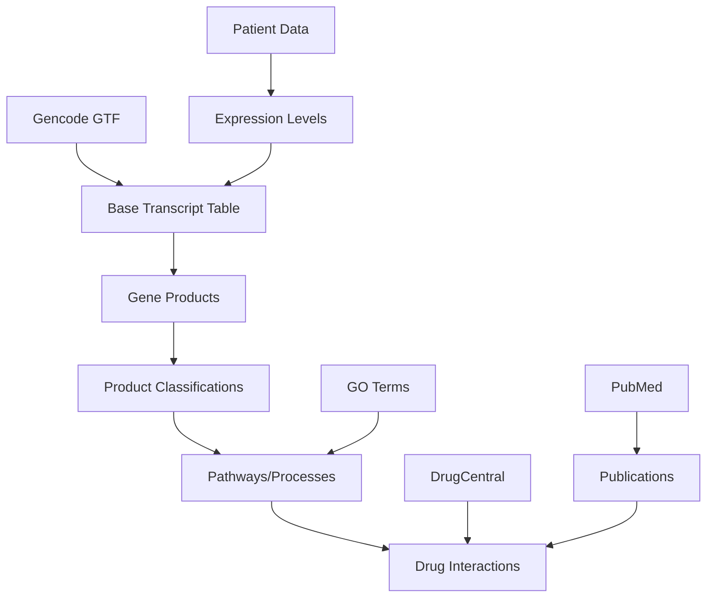

# MEDIA / Cancer Transcriptome Base

A comprehensive database system for cancer transcriptome analysis with LLM-agent assistance. The system provides a unified PostgreSQL-based resource for querying relationships between transcripts, pathways, and drug interactions.

## Overview

This project creates a pre-joined database table optimized for LLM-agent queries about cancer transcriptome data, enabling:

- Fast pathway analysis
- Drug interaction lookups
- Gene product classification
- Literature-backed insights
- Patient-specific expression analysis

## Setup

### Prerequisites

- Python 3.10 or higher
- Python venv module (`python3-venv` package)
- Git
- PostgreSQL 12+

### Environment Setup

1. Clone the repository:
   ```bash
   git clone https://github.com/itsatony/mediabase.git
   cd mediabase
   ```

2. Set up the virtual environment:
   ```bash
   # Make the setup script executable
   chmod +x setup_venv.sh
   
   # Run the setup script
   ./setup_venv.sh
   
   # Activate the virtual environment
   source mbase/bin/activate
   ```

3. Initialize the project:
   ```bash
   # Make the setup script executable
   chmod +x setup_project.sh
   
   # Run the project setup script
   ./setup_project.sh
   ```

4. Configure the environment:
   ```bash
   # Copy the example environment file
   cp .env.example .env
   
   # Edit the .env file with your settings
   nano .env
   ```

### Development

1. Ensure the virtual environment is activated:
   ```bash
   source mbase/bin/activate
   ```

2. Install dependencies:
   ```bash
   poetry install
   ```

3. Run tests:
   ```bash
   # Run all tests
   poetry run pytest

   # Run specific test module
   poetry run pytest tests/etl/test_transcript.py

   # Run only integration tests
   poetry run pytest -m integration

   # Run with coverage report
   poetry run pytest --cov=src

   # Run with verbose output
   poetry run pytest -v
   ```

4. Before running tests, ensure your test database is configured:
   ```bash
   # Set up test environment variables
   export MB_POSTGRES_HOST=localhost
   export MB_POSTGRES_PORT=5432
   export MB_POSTGRES_NAME=mediabase_test
   export MB_POSTGRES_USER=postgres
   export MB_POSTGRES_PASSWORD=postgres
   
   # Initialize test database
   poetry run python scripts/manage_db.py --non-interactive
   ```

## Quick Start

After completing the setup, you can:

1. Run the ETL pipeline (will load and insert the inital transcript data):
   ```bash
   poetry run python scripts/run_etl.py
   ```

2. Start the API server:
   ```bash
   poetry run python -m src.api.server
   ```

3. Explore example notebooks:
   ```bash
   poetry run jupyter lab notebooks/01_data_exploration.ipynb
   ```

### Running Gene Product Classification

1. Download and process UniProt data:
   ```bash
   poetry run python scripts/download_uniprot_data.py
   ```

2. Run the classification:
   ```bash
   poetry run python scripts/run_product_classification.py
   ```

   Options:
   - `--batch-size`: Number of genes to process per batch (default: 100)
   - `--log-level`: Logging level (DEBUG, INFO, WARNING, ERROR)

3. Run tests:
   ```bash
   # Run all product classification tests
   poetry run pytest tests/etl/test_products.py

   # Run only integration tests
   poetry run pytest tests/etl/test_integration_products.py

   # Run with coverage
   poetry run pytest tests/etl/test_products.py --cov=src.etl.products
   ```

### Running GO Term Enrichment

1. Download and process GO terms:
   ```bash
   poetry run python scripts/run_go_enrichment.py
   ```

   Options:
   - `--batch-size`: Number of terms to process per batch (default: 100)
   - `--log-level`: Logging level (DEBUG, INFO, WARNING, ERROR)
   - `--force-download`: Force new download of GO.obo file
   - `--aspect`: Filter by aspect (molecular_function, biological_process, cellular_component)

2. Monitor progress:
   ```bash
   # Check database statistics
   poetry run python scripts/manage_db.py
   ```

3. Run tests:
   ```bash
   # Run GO term tests
   poetry run pytest tests/etl/test_go_terms.py

   # Run with coverage
   poetry run pytest tests/etl/test_go_terms.py --cov=src.etl.go_terms
   ```

### Running Pathway Enrichment

1. Download and process Reactome pathways:
   ```bash
   poetry run python scripts/run_pathway_enrichment.py
   ```

   Options:
   - `--batch-size`: Number of pathways to process per batch (default: 100)
   - `--log-level`: Logging level (DEBUG, INFO, WARNING, ERROR)
   - `--force-download`: Force new download of Reactome data file

2. Monitor progress:
   ```bash
   # Check database statistics
   poetry run python scripts/manage_db.py
   ```

   Example output:
   ```
   Processing pathways: 100%|████████| 18619/18619 [02:15<00:00, 137.42it/s]
   INFO: Pathway enrichment completed:
   - Total genes processed: 18,619
   - Genes with pathways: 15,234
   - Average pathways per gene: 12.3
   ```

3. Run tests:
   ```bash
   # Run pathway tests
   poetry run pytest tests/etl/test_pathways.py

   # Run with coverage
   poetry run pytest tests/etl/test_pathways.py --cov=src.etl.pathways
   ```

4. Verify pathway data:
   ```bash
   # Check a specific gene's pathways
   psql -U your_user -d your_db -c "
   SELECT gene_symbol, pathways 
   FROM cancer_transcript_base 
   WHERE gene_symbol = 'TP53';"
   ```

   Expected output format:
   ```
   gene_symbol |                        pathways
   ------------+--------------------------------------------------------
   TP53       | {"Apoptosis [Reactome:R-HSA-109581]",
              |  "Cell Cycle [Reactome:R-HSA-1640170]",
              |  "DNA Repair [Reactome:R-HSA-73894]"}
   ```

### Running Drug Integration

1. Download and process DrugCentral data:
   ```bash
   poetry run python scripts/run_drug_integration.py
   ```

   Options:
   - `--batch-size`: Number of drugs to process per batch (default: 100)
   - `--log-level`: Logging level (DEBUG, INFO, WARNING, ERROR)
   - `--skip-scores`: Skip drug score calculation
   - `--force-download`: Force new download of DrugCentral data

2. View drug statistics:
   ```bash
   poetry run python scripts/analyze_drugs.py
   ```

3. Run tests:
   ```bash
   # Run drug integration tests
   poetry run pytest tests/etl/test_drugs.py

   # Run with coverage
   poetry run pytest tests/etl/test_drugs.py --cov=src.etl.drugs
   ```

## Documentation

Comprehensive documentation is available in the `docs/` directory:

- [Architecture Overview](docs/architecture.md)
- [API Documentation](docs/api.md)
- [Deployment Guide](docs/deployment.md)

## Project Status and Progress

Current development status and upcoming milestones:
- [x] Initial project setup (2025-02-02)
- [x] Basic schema design
- [x] Project structure implementation
- [x] DB manager script (connection, check, create, schema, reset) (2025-02-05)
  - Database initialization and reset functionality
  - Schema version tracking
  - Interactive CLI with rich status display
  - Environment-based configuration
- [x] ETL pipeline - Transcript module (2025-02-06)
  - GTF file download and caching with TTL
  - Transcript data extraction and processing
  - Coordinate parsing and validation
  - Batch database loading
  - Smart caching with metadata tracking
  - Proper PostgreSQL JSONB type handling
  - Comprehensive test suite
  - Integration tests with test database
- [x] ETL pipeline - Gene-Product Classification (2025-02-07)
  - Automated UniProt data download and processing
  - Smart caching with gzip compression
  - Robust product classification based on:
    - UniProt features
    - GO terms
    - Keywords
    - Function descriptions
  - Batch database updates with temp tables
  - Comprehensive test suite with mocks
  - Integration tests with test database
  - Rich CLI progress display
  - Environment-based configuration
- [x] Database Schema Update (2025-02-08)
  - Enhanced schema to v0.1.2
  - Added comprehensive UniProt feature storage
  - Added molecular functions array
  - Added proper GIN indices for new columns
  - Migration path for existing data
  - Updated documentation
- [x] GO Terms & Enrichment (2025-02-09)
  - Automated GO.obo and GOA file downloads with caching
  - GO term hierarchy processing with networkx
  - Ancestor computation and term enrichment
  - Aspect-aware term classification
  - Enhanced schema with dedicated arrays for:
    - molecular_functions: Direct storage of molecular function terms
    - cellular_location: Direct storage of cellular component terms
  - Batch database updates with optimized PostgreSQL queries
  - Proper GIN indices for efficient querying
  - Comprehensive test suite
  - Smart caching with TTL
  - Rich CLI progress display with detailed statistics
  - Proper error handling and recovery
- [x] ETL pipeline - Drug Integration (2025-02-10)
  - Automated DrugCentral data download and processing
  - Smart drug-target relationship extraction
  - Evidence-based scoring system
  - Reference tracking and validation
  - Batch database updates with temp tables
  - Score calculation using PostgreSQL window functions
  - Rich CLI progress display
  - Comprehensive test suite
  - Integration tests with test database
  - Added drug association view materialization
- [x] Pathway Integration (2025-02-11)
  - Automated Reactome data download with caching
  - Gene to pathway/process mapping
  - Standardized format: "Process Name [Reactome:ID]"
  - Smart caching with TTL
  - Batch database updates
  - Comprehensive validation
  - Progress tracking and statistics
- [x] Added cache validity check (_is_cache_valid) to PathwayProcessor for consistent caching behavior (2025-02-11)
- [x] Normalized gene_id by stripping version numbers to fix mismatch between NCBI and Ensembl references (2025-02-11)
- [x] ETL pipeline - Drug Integration (2025-02-12)
  - Added synergy-based scoring referencing pathways and GO terms
  - Utilizes environment variables (e.g., MB_DRUG_PATHWAY_WEIGHT) for weighting
  - Enhanced testing strategy to ensure accurate scoring
- [x] ETL pipeline - Drug Integration Update (2025-02-13)
  - Added batched drug score calculation
  - Implemented synergy scoring based on pathway and GO term overlaps
  - Added rich progress tracking and validation
  - Fixed older DrugCentral data format compatibility
  - Added comprehensive error handling and debugging
  - Performance optimized through temporary tables and batching
  - Database schema v0.1.3 compatibility ensured
- [ ] AI Agent System Prompt Development
  - Create comprehensive context guide for natural language queries
  - Build oncology-specific terminology mapping (German/English)
  - Document all available data relationships
  - Collect and categorize example queries
  - Create German-English medical term mapping
  - Document query patterns and best practices
  - Create mapping of colloquial to technical terms
- [ ] ETL pipeline - Publication Integration
- [ ] Query optimization
- [ ] LLM-agent integration tests
- [ ] Documentation
- [ ] Production deployment

## Database Management

The project includes a robust database management script (`scripts/manage_db.py`) that provides:

### Features

- PostgreSQL connection management
- Database creation and reset capabilities
- Schema version tracking
- Rich interactive CLI interface
- Non-interactive mode for automation

### Usage

1. Interactive Mode:
   ```bash
   poetry run python scripts/manage_db.py
   ```
   This will:
   - Check database connection
   - Display current database status
   - Offer schema reset if database exists
   - Create new database and schema if needed

2. Non-interactive Mode:
   ```bash
   poetry run python scripts/manage_db.py --non-interactive
   ```
   Useful for scripts and CI/CD pipelines.

### Environment Configuration

The project uses environment variables for configuration. Copy `.env.example` to `.env` and configure:

```bash
# Database Configuration
MB_POSTGRES_HOST=localhost        # PostgreSQL host
MB_POSTGRES_PORT=5432            # PostgreSQL port
MB_POSTGRES_DB=mediabase         # Database name
MB_POSTGRES_USER=postgres        # Database user
MB_POSTGRES_PASSWORD=postgres    # Database password

# API Configuration
MB_API_HOST=0.0.0.0             # API server host
MB_API_PORT=8000                # API server port
MB_API_DEBUG=true               # Enable debug mode

# Data Sources
MB_GENCODE_GTF_URL=...          # Gencode GTF data URL
MB_DRUGCENTRAL_DATA_URL=...     # DrugCentral database URL
MB_GOTERM_DATA_URL=...          # GO terms OBO file URL
MB_UNIPROT_API_URL=...          # UniProt API endpoint
MB_PUBMED_API_URL=...           # PubMed E-utils API
MB_PUBMED_API_KEY=...           # Your PubMed API key
MB_PUBMED_EMAIL=...             # Your email for PubMed API
MB_REACTOME_DOWNLOAD_URL=https://reactome.org/download/current/NCBI2Reactome_All_Levels.txt

# Cache and Processing
MB_CACHE_DIR=/tmp/mediabase/cache  # Cache directory
MB_CACHE_TTL=86400                 # Cache TTL in seconds
MB_MAX_WORKERS=4                   # Max parallel workers
MB_BATCH_SIZE=1000                # Batch size for processing
MB_MEMORY_LIMIT=8192              # Memory limit in MB

# Security
MB_API_KEY=...                   # API key for authentication
MB_JWT_SECRET=...                # JWT secret for tokens
MB_ALLOWED_ORIGINS=...           # CORS allowed origins
```

## Version History

- v0.1.0: Initial MVP plan with public data sources
- v0.1.1: Added publications, patient fold-change support, and ETL sequence
- v0.1.2: Enhanced UniProt feature storage and molecular function arrays
- v0.1.3: Improved GO term storage with dedicated arrays and indices
- Repository: [mediabase](https://github.com/itsatony/mediabase)

## Data Flow and Dependencies



## Enhanced Database Schema v0.1.3

```sql
CREATE TABLE cancer_transcript_base (
    -- Core identifiers
    transcript_id TEXT PRIMARY KEY,
    gene_symbol TEXT,
    gene_id TEXT,
    
    -- Genomic information
    gene_type TEXT,
    chromosome TEXT,
    coordinates JSONB,  -- {start: int, end: int, strand: int}
    
    -- Classifications
    product_type TEXT[], -- ['enzyme', 'kinase', 'transcription_factor', etc]
    features JSONB DEFAULT '{}'::jsonb,
    
    -- GO terms and functions
    go_terms JSONB,    -- {go_id: {term: "", evidence: "", aspect: ""}}
    molecular_functions TEXT[] DEFAULT '{}',  -- Array of molecular function terms
    cellular_location TEXT[] DEFAULT '{}',    -- Array of cellular locations
    
    -- Pathways and interactions
    pathways TEXT[],   -- array of pathway identifiers
    drugs JSONB,       -- {drug_id: {name: "", mechanism: "", evidence: ""}}
    drug_scores JSONB, -- {drug_id: score}
    
    -- Literature
    publications JSONB, -- [{pmid: "", year: "", type: "", relevance: ""}]
    
    -- Expression data
    expression_fold_change FLOAT DEFAULT 1.0,  -- Patient-specific
    expression_freq JSONB DEFAULT '{"high": [], "low": []}',
    cancer_types TEXT[] DEFAULT '{}'
);

-- Indices
CREATE INDEX idx_gene_symbol ON cancer_transcript_base(gene_symbol);
CREATE INDEX idx_gene_id ON cancer_transcript_base(gene_id);
CREATE INDEX idx_drugs ON cancer_transcript_base USING GIN(drugs);
CREATE INDEX idx_product_type ON cancer_transcript_base USING GIN(product_type);
CREATE INDEX idx_pathways ON cancer_transcript_base USING GIN(pathways);
CREATE INDEX idx_features ON cancer_transcript_base USING GIN(features);
CREATE INDEX idx_molecular_functions ON cancer_transcript_base USING GIN(molecular_functions);
CREATE INDEX idx_cellular_location ON cancer_transcript_base USING GIN(cellular_location);
```

## Gene Product Types

The system uses a comprehensive classification system for gene products based on molecular function and biological role:

### Primary Classifications

- transcription_factor
- kinase
- phosphatase
- protease
- ion_channel
- receptor
- transporter
- enzyme
- chaperone
- structural_protein
- signaling_molecule
- hormone
- growth_factor
- cytokine
- antibody
- storage_protein
- motor_protein
- adhesion_molecule
- cell_surface_protein
- extracellular_matrix
- dna_binding
- rna_binding
- metal_binding
- lipid_binding
- carrier_protein
- regulatory_protein

### Functional Modifiers (can be combined with primary types)

- membrane_associated
- secreted
- nuclear
- mitochondrial
- cytoplasmic
- vesicular
- catalytic
- regulatory
- scaffold
- adapter

## Enhanced Database Schema v0.1.2

## ETL Pipeline Implementation

### 1. Base Transcript Setup

```python
import gtfparse
import pandas as pd

def load_gencode_gtf(file_path):
    df = gtfparse.read_gtf(file_path)
    transcripts = df[df['feature'] == 'transcript']
    return transcripts[['transcript_id', 'gene_id', 'gene_name', 'gene_type']]

def create_base_entries(conn, transcripts_df):
    # Implementation of base table population
    pass
```

### 2. Product Classification

```python
def classify_gene_products(conn):
    """
    Adds product classifications based on GO terms and UniProt features
    """
    sql = """
    UPDATE cancer_transcript_base
    SET product_type = array_append(product_type, 'kinase')
    WHERE gene_symbol IN (
        SELECT DISTINCT gene_symbol 
        FROM cancer_transcript_base 
        WHERE go_terms ? 'GO:0016301'  -- kinase activity
    );
    """
    # Additional classification logic
```

### 3. Pipeline Orchestration

```python
class CancerBaseETL:
    def __init__(self, db_params):
        self.conn = psycopg2.connect(**db_params)
    
    def run_pipeline(self):
        self.load_transcripts()
        self.classify_products()
        self.add_pathways()
        self.add_drugs()
        self.add_publications()
        self.validate()
```

## LLM-Agent Query Examples

### Example 1: Patient-Specific Drug Recommendations

```sql
-- Query: "For my patient's upregulated genes, what drugs might be relevant?"
WITH upregulated_genes AS (
    SELECT gene_symbol, expression_fold_change, drugs
    FROM cancer_transcript_base
    WHERE expression_fold_change > 2.0
),
drug_candidates AS (
    SELECT 
        gene_symbol,
        expression_fold_change,
        jsonb_object_keys(drugs) as drug_id,
        drugs->jsonb_object_keys(drugs)::text as drug_info
    FROM upregulated_genes
    WHERE drugs != '{}'::jsonb
)
SELECT 
    drug_id,
    array_agg(gene_symbol) as target_genes,
    avg(expression_fold_change) as avg_expression_change
FROM drug_candidates
GROUP BY drug_id
ORDER BY avg_expression_change DESC
LIMIT 10;
```

### Example 2: Pathway Analysis

```sql
-- Query: "Which pathways are most affected in my patient's sample?"
WITH affected_pathways AS (
    SELECT 
        unnest(pathways) as pathway,
        expression_fold_change
    FROM cancer_transcript_base
    WHERE expression_fold_change != 1.0
)
SELECT 
    pathway,
    count(*) as gene_count,
    avg(expression_fold_change) as avg_change,
    array_agg(gene_symbol) as genes
FROM affected_pathways
GROUP BY pathway
HAVING count(*) > 3
ORDER BY abs(avg_change) DESC
LIMIT 10;
```

### Example 3: Complex Treatment Insight

```sql
-- Query: "Find drugs that target the most disrupted pathways 
--         and have supporting recent publications"
WITH disrupted_pathways AS (
    -- First find significantly changed pathways
    SELECT unnest(pathways) as pathway_id
    FROM cancer_transcript_base
    WHERE expression_fold_change > 2.0
    GROUP BY pathway_id
    HAVING count(*) > 5
),
relevant_drugs AS (
    -- Find drugs targeting these pathways
    SELECT DISTINCT 
        d.key as drug_id,
        d.value->>'name' as drug_name,
        t.publications
    FROM cancer_transcript_base t,
    jsonb_each(t.drugs) d
    WHERE EXISTS (
        SELECT 1 FROM disrupted_pathways dp
        WHERE dp.pathway_id = ANY(t.pathways)
    )
)
SELECT 
    drug_id,
    drug_name,
    count(DISTINCT p->>'pmid') as recent_publications
FROM relevant_drugs,
jsonb_array_elements(publications) p
WHERE (p->>'year')::int >= 2022
GROUP BY drug_id, drug_name
HAVING count(DISTINCT p->>'pmid') > 2
ORDER BY recent_publications DESC;
```

## Advanced Usage Patterns

### Pattern 1: Multi-Level Drug Discovery

This pattern combines direct drug targets with second-degree pathway interactions:
```sql
WITH target_genes AS (
    SELECT gene_symbol, pathways
    FROM cancer_transcript_base
    WHERE expression_fold_change > 2.0
),
pathway_genes AS (
    SELECT DISTINCT t2.gene_symbol
    FROM target_genes t1
    JOIN cancer_transcript_base t2
    ON t1.pathways && t2.pathways
),
drug_candidates AS (
    SELECT 
        t.gene_symbol as target,
        d.key as drug_id,
        d.value as drug_info
    FROM pathway_genes t,
    jsonb_each(drugs) d
)
SELECT 
    drug_id,
    count(DISTINCT target) as affected_targets,
    array_agg(DISTINCT target) as target_list
FROM drug_candidates
GROUP BY drug_id
ORDER BY affected_targets DESC;
```

### Pattern 2: Mechanistic Insight Query

```sql
-- Find molecular mechanisms potentially explaining expression changes
WITH changed_genes AS (
    SELECT 
        gene_symbol,
        product_type,
        expression_fold_change
    FROM cancer_transcript_base
    WHERE abs(expression_fold_change - 1.0) > 1.0
),
mechanism_analysis AS (
    SELECT 
        unnest(product_type) as mechanism,
        CASE 
            WHEN expression_fold_change > 1.0 THEN 'up'
            ELSE 'down'
        END as direction,
        count(*) as gene_count
    FROM changed_genes
    GROUP BY mechanism, direction
)
SELECT 
    mechanism,
    sum(CASE WHEN direction = 'up' THEN gene_count ELSE 0 END) as upregulated,
    sum(CASE WHEN direction = 'down' THEN gene_count ELSE 0 END) as downregulated
FROM mechanism_analysis
GROUP BY mechanism
HAVING sum(gene_count) > 5
ORDER BY sum(gene_count) DESC;
```

## Known Limitations and Mitigations

1. Expression Fold-Change Sensitivity
   - Issue: Single fold-change value may oversimplify
   - Mitigation: Use confidence intervals in future versions

2. Drug-Target Confidence
   - Issue: Varying levels of evidence
   - Mitigation: Include evidence scores in drug JSONB

3. Pathway Completeness
   - Issue: Missing pathway relationships
   - Mitigation: Regular updates from multiple sources

## Future Query Optimizations

1. Materialized views for common pathway analyses
2. Pre-computed drug rankings
3. Patient cohort comparison views

## Project Structure

```tree
mediabase/
├── .github/
│   └── workflows/
│       └── tests.yml
├── src/
│   ├── etl/
│   │   ├── __init__.py
│   │   ├── transcript.py
│   │   ├── products.py
│   │   ├── pathways.py
│   │   ├── drugs.py
│   │   └── publications.py
│   ├── db/
│   │   ├── __init__.py
│   │   ├── schema.py
│   │   ├── migrations/
│   │   └── connection.py
│   ├── utils/
│   │   ├── __init__.py
│   │   ├── logging.py
│   │   └── validation.py
│   └── api/
│       ├── __init__.py
│       └── queries.py
├── tests/
│   ├── __init__.py
│   ├── conftest.py
│   ├── test_etl/
│   ├── test_db/
│   └── test_api/
├── notebooks/
│   ├── 01_data_exploration.ipynb
│   └── 02_query_examples.ipynb
├── config/
│   ├── __init__.py
│   ├── settings.py
│   └── logging.yml
├── scripts/
│   ├── setup_db.py
│   └── run_etl.py
├── docs/
│   ├── architecture.md
│   ├── api.md
│   └── deployment.md
├── .env.example
├── pyproject.toml
├── poetry.lock
└── README.md
```

## LLM-Agent Integration

The database is optimized for LLM-agent queries. Example usage patterns and common queries are documented in `notebooks/02_query_examples.ipynb`.

## Contributing

1. Fork the repository
2. Create a feature branch
3. Commit your changes
4. Push to the branch
5. Create a Pull Request

## License

MIT License. See [LICENSE](LICENSE) for details.

## Data Collection for AI Agent Prompt

The following SQL queries can be used to collect unique values and statistics for the AI agent context:

### Gene Types and Classifications
```sql
-- Get all unique gene types with counts
SELECT 
    gene_type,
    COUNT(*) as count
FROM cancer_transcript_base
GROUP BY gene_type
ORDER BY count DESC;

-- Get unique product classifications
SELECT 
    DISTINCT unnest(product_type) as classification,
    COUNT(*) as count
FROM cancer_transcript_base
GROUP BY classification
ORDER BY count DESC;
```

### Pathway Information
```sql
-- Get unique pathways and their frequency
WITH pathway_counts AS (
    SELECT 
        unnest(pathways) as pathway,
        COUNT(*) as gene_count
    FROM cancer_transcript_base
    GROUP BY pathway
)
SELECT 
    pathway,
    gene_count,
    REGEXP_REPLACE(pathway, '.*\[(.*)\]', '\1') as pathway_id
FROM pathway_counts
ORDER BY gene_count DESC;
```

### Drug Related Information
```sql
-- Get unique drug mechanisms and actions
WITH drug_info AS (
    SELECT 
        d.key as drug_id,
        d.value->>'mechanism' as mechanism,
        d.value->>'action_type' as action_type
    FROM cancer_transcript_base,
    jsonb_each(drugs) d
    WHERE drugs IS NOT NULL
)
SELECT 
    DISTINCT mechanism,
    action_type,
    COUNT(*) as count
FROM drug_info
GROUP BY mechanism, action_type
ORDER BY count DESC;

-- Get drug evidence types
SELECT DISTINCT 
    d.value->'evidence'->>'type' as evidence_type,
    COUNT(*) as count
FROM cancer_transcript_base,
jsonb_each(drugs) d
WHERE drugs IS NOT NULL
GROUP BY evidence_type
ORDER BY count DESC;
```

### GO Terms and Functions
```sql
-- Get molecular functions distribution
SELECT 
    unnest(molecular_functions) as function,
    COUNT(*) as count
FROM cancer_transcript_base
WHERE molecular_functions IS NOT NULL
GROUP BY function
ORDER BY count DESC;

-- Get cellular locations
SELECT 
    unnest(cellular_location) as location,
    COUNT(*) as count
FROM cancer_transcript_base
WHERE cellular_location IS NOT NULL
GROUP BY location
ORDER BY count DESC;

-- Get GO term aspects and their frequency
SELECT 
    value->>'aspect' as aspect,
    COUNT(*) as count
FROM cancer_transcript_base,
jsonb_each(go_terms) t
WHERE go_terms IS NOT NULL
GROUP BY aspect
ORDER BY count DESC;
```

### Expression Statistics
```sql
-- Get expression fold change distribution
SELECT 
    CASE 
        WHEN expression_fold_change > 2 THEN 'high'
        WHEN expression_fold_change < 0.5 THEN 'low'
        ELSE 'normal'
    END as expression_level,
    COUNT(*) as count
FROM cancer_transcript_base
GROUP BY expression_level
ORDER BY count DESC;

-- Get cancer types distribution
SELECT 
    unnest(cancer_types) as cancer_type,
    COUNT(*) as count
FROM cancer_transcript_base
WHERE cancer_types IS NOT NULL
GROUP BY cancer_type
ORDER BY count DESC;
```

These queries will provide comprehensive data for building the AI agent's context understanding. Next steps:

1. Run these queries against production data
2. Document and categorize all unique values
3. Create mappings between technical and colloquial terms
4. Build German-English terminology mappings
5. Document common query patterns
6. Create example queries for each data category
7. Build comprehensive prompt template
