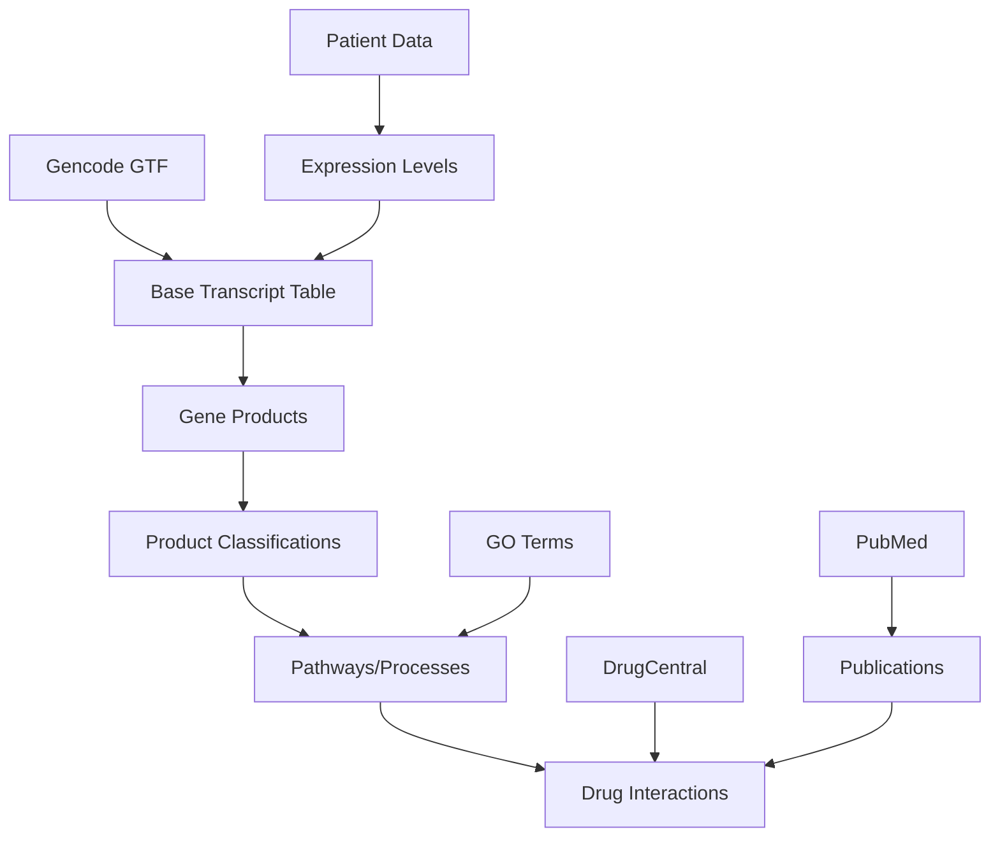

# Project Overview

## README.md Content

````markdown
# MEDIABASE: Cancer Transcriptome Base

A comprehensive database for cancer transcriptomics analysis, enriched with gene products, GO terms, pathways, drugs, and scientific publications.

## Overview

MEDIABASE integrates various biological databases to provide a unified interface for cancer transcriptome exploration:

- Gene transcript information from GENCODE
- Gene product classification from UniProt
- GO terms enrichment for functional analysis
- Pathway integration from Reactome
- Drug interactions from DrugCentral
- Scientific literature from PubMed

## Setup

### Prerequisites

- Python 3.10 or higher
- Poetry for dependency management
- Git
- PostgreSQL 12+

### Environment Setup

1. Clone the repository:
   ```bash
   git clone https://github.com/itsatony/mediabase.git
   cd mediabase

2. Set up using poetry:
    ```bash
    # Install poetry if not already installed
    curl -sSL https://install.python-poetry.org | python3 -

    # Configure poetry to create virtual environment in project directory
    poetry config virtualenvs.in-project true

    # Initialize poetry project 
    poetry init

    # Install project dependencies
    poetry install

    # Activate the poetry environment
    poetry shell
    ```

3. Configure the environment:
   ```bash
   # Copy the example environment file
   cp .env.example .env
   
   # Edit the .env file with your settings
   nano .env
   ```

### Development

1. Ensure the virtual environment is activated:
   ```bash
   source mbase/bin/activate
   ```

2. Install dependencies:
   ```bash
   poetry install
   ```

3. Run tests:
   ```bash
   # Run all tests
   poetry run pytest

   # Run specific test module
   poetry run pytest tests/etl/test_transcript.py

   # Run only integration tests
   poetry run pytest -m integration

   # Run with coverage report
   poetry run pytest --cov=src

   # Run with verbose output
   poetry run pytest -v
   ```

4. Before running tests, ensure your test database is configured:
   ```bash
   # Set up test environment variables
   export MB_POSTGRES_HOST=localhost
   export MB_POSTGRES_PORT=5432
   export MB_POSTGRES_NAME=mediabase_test
   export MB_POSTGRES_USER=postgres
   export MB_POSTGRES_PASSWORD=postgres
   
   # Initialize test database
   poetry run python scripts/manage_db.py --non-interactive
   ```

## Quick Start

After completing the setup, you can:

1. Run the ETL pipeline (will load and insert the inital transcript data):
   ```bash
   poetry run python scripts/run_etl.py
   ```

2. For testing or development purposes, limit the number of transcripts:
   ```bash
   # Reset the database and process only 100 transcripts
   poetry run python scripts/run_etl.py --reset-db --limit-transcripts 100
   
   # Only process transcript data (not drugs, pathways, etc.)
   poetry run python scripts/run_etl.py --reset-db --limit-transcripts 100 --module transcript
   
   # If you want to run with more verbose output
   poetry run python scripts/run_etl.py --reset-db --limit-transcripts 100 --log-level DEBUG
   ```

3. Start the API server:
   ```bash
   poetry run python -m src.api.server
   ```

4. Explore example notebooks:
   ```bash
   poetry run jupyter lab notebooks/01_data_exploration.ipynb
   ```

### Running Gene Product Classification

1. Download and process UniProt data:
   ```bash
   poetry run python scripts/download_uniprot_data.py
   ```

2. Run the classification:
   ```bash
   poetry run python scripts/run_product_classification.py
   ```

   Options:
   - `--batch-size`: Number of genes to process per batch (default: 100)
   - `--log-level`: Logging level (DEBUG, INFO, WARNING, ERROR)

3. Run tests:
   ```bash
   # Run all product classification tests
   poetry run pytest tests/etl/test_products.py

   # Run only integration tests
   poetry run pytest tests/etl/test_integration_products.py

   # Run with coverage
   poetry run pytest tests/etl/test_products.py --cov=src.etl.products
   ```

### Running GO Term Enrichment

1. Download and process GO terms:
   ```bash
   poetry run python scripts/run_go_enrichment.py
   ```

   Options:
   - `--batch-size`: Number of terms to process per batch (default: 100)
   - `--log-level`: Logging level (DEBUG, INFO, WARNING, ERROR)
   - `--force-download`: Force new download of GO.obo file
   - `--aspect`: Filter by aspect (molecular_function, biological_process, cellular_component)

2. Monitor progress:
   ```bash
   # Check database statistics
   poetry run python scripts/manage_db.py
   ```

3. Run tests:
   ```bash
   # Run GO term tests
   poetry run pytest tests/etl/test_go_terms.py

   # Run with coverage
   poetry run pytest tests/etl/test_go_terms.py --cov=src.etl.go_terms
   ```

### Running Pathway Enrichment

1. Download and process Reactome pathways:
   ```bash
   poetry run python scripts/run_pathway_enrichment.py
   ```

   Options:
   - `--batch-size`: Number of pathways to process per batch (default: 100)
   - `--log-level`: Logging level (DEBUG, INFO, WARNING, ERROR)
   - `--force-download`: Force new download of Reactome data file

2. Monitor progress:
   ```bash
   # Check database statistics
   poetry run python scripts/manage_db.py
   ```

   Example output:
   ```
   Processing pathways: 100%|████████| 18619/18619 [02:15<00:00, 137.42it/s]
   INFO: Pathway enrichment completed:
   - Total genes processed: 18,619
   - Genes with pathways: 15,234
   - Average pathways per gene: 12.3
   ```

3. Run tests:
   ```bash
   # Run pathway tests
   poetry run pytest tests/etl/test_pathways.py

   # Run with coverage
   poetry run pytest tests/etl/test_pathways.py --cov=src.etl.pathways
   ```

4. Verify pathway data:
   ```bash
   # Check a specific gene's pathways
   psql -U your_user -d your_db -c "
   SELECT gene_symbol, pathways 
   FROM cancer_transcript_base 
   WHERE gene_symbol = 'TP53';"
   ```

   Expected output format:
   ```
   gene_symbol |                        pathways
   ------------+--------------------------------------------------------
   TP53       | {"Apoptosis [Reactome:R-HSA-109581]",
              |  "Cell Cycle [Reactome:R-HSA-1640170]",
              |  "DNA Repair [Reactome:R-HSA-73894]"}
   ```

### Running Drug Integration

1. Download and process DrugCentral data:
   ```bash
   poetry run python scripts/run_drug_integration.py
   ```

   Options:
   - `--batch-size`: Number of drugs to process per batch (default: 100)
   - `--log-level`: Logging level (DEBUG, INFO, WARNING, ERROR)
   - `--skip-scores`: Skip drug score calculation
   - `--force-download`: Force new download of DrugCentral data

2. View drug statistics:
   ```bash
   poetry run python scripts/analyze_drugs.py
   ```

3. Run tests:
   ```bash
   # Run drug integration tests
   poetry run pytest tests/etl/test_drugs.py

   # Run with coverage
   poetry run pytest tests/etl/test_drugs.py --cov=src.etl.drugs
   ```

### Publication Enrichment

The publication enrichment module enhances existing transcript records with metadata from scientific literature. It:

1. Extracts PubMed IDs (PMIDs) from GO terms, pathways, drugs, and UniProt references
2. Retrieves comprehensive publication metadata from PubMed's E-utilities API
3. Caches responses for efficient future use
4. Enhances source-specific publication references with titles, authors, abstracts, etc.

To run only the publications enrichment:
```
poetry run python scripts/run_etl.py --module publications
```

Additional options for publication enrichment:
```
# Force refresh all cached publication data
poetry run python scripts/run_etl.py --module publications --force-refresh

# Adjust API rate limiting (requests per second)
poetry run python scripts/run_etl.py --module publications --rate-limit 0.1
```

Required environment variables for PubMed API:
```
MB_PUBMED_EMAIL=your.email@example.com  # Required by NCBI
MB_PUBMED_API_KEY=your_api_key          # Optional, allows higher request rates
```

## Documentation

Comprehensive documentation is available in the `docs/` directory:

- [Architecture Overview](docs/architecture.md)
- [API Documentation](docs/api.md)
- [Deployment Guide](docs/deployment.md)

## Project Status and Progress

Current development status and upcoming milestones:
- [x] STEP_AA: Initial project setup (2025-02-02)
- [x] STEP_AB: Basic schema design
- [x] STEP_AC: Project structure implementation
- [x] STEP_AD: DB manager script (connection, check, create, schema, reset) (2025-02-02)
  - Database initialization and reset functionality
  - Schema version tracking
  - Interactive CLI with rich status display
  - Environment-based configuration
- [x] STEP_AE: ETL pipeline - Transcript module (2025-02-02)
  - GTF file download and caching with TTL
  - Transcript data extraction and processing
  - Coordinate parsing and validation
  - Batch database loading
  - Smart caching with metadata tracking
  - Proper PostgreSQL JSONB type handling
  - Comprehensive test suite
  - Integration tests with test database
- [x] STEP_AF: ETL pipeline - Gene-Product Classification (2025-02-02)
  - Automated UniProt data download and processing
  - Smart caching with gzip compression
  - Robust product classification based on:
    - UniProt features
    - GO terms
    - Keywords
    - Function descriptions
  - Batch database updates with temp tables
  - Comprehensive test suite with mocks
  - Integration tests with test database
  - Rich CLI progress display
  - Environment-based configuration
- [x] STEP_AG: Database Schema Update (2025-02-02)
  - Enhanced schema to v0.1.2
  - Added comprehensive UniProt feature storage
  - Added molecular functions array
  - Added proper GIN indices for new columns
  - Migration path for existing data
  - Updated documentation
- [x] STEP_AH: GO Terms & Enrichment (2025-02-02)
  - Automated GO.obo and GOA file downloads with caching
  - GO term hierarchy processing with networkx
  - Ancestor computation and term enrichment
  - Aspect-aware term classification
  - Enhanced schema with dedicated arrays for:
    - molecular_functions: Direct storage of molecular function terms
    - cellular_location: Direct storage of cellular component terms
  - Batch database updates with optimized PostgreSQL queries
  - Proper GIN indices for efficient querying
  - Comprehensive test suite
  - Smart caching with TTL
  - Rich CLI progress display with detailed statistics
  - Proper error handling and recovery
- [x] STEP_AI: ETL pipeline - Drug Integration (2025-02-02)
  - Automated DrugCentral data download and processing
  - Smart drug-target relationship extraction
  - Evidence-based scoring system
  - Reference tracking and validation
  - Batch database updates with temp tables
  - Score calculation using PostgreSQL window functions
  - Rich CLI progress display
  - Comprehensive test suite
  - Integration tests with test database
  - Added drug association view materialization
- [x] STEP_AJ: Pathway Integration (2025-02-02)
  - Automated Reactome data download with caching
  - Gene to pathway/process mapping
  - Standardized format: "Process Name [Reactome:ID]"
  - Smart caching with TTL
  - Batch database updates
  - Comprehensive validation
  - Progress tracking and statistics
- [x] STEP_AK: Added cache validity check (_is_cache_valid) to PathwayProcessor for consistent caching behavior (2025-02-02)
- [x] STEP_AL: Normalized gene_id by stripping version numbers to fix mismatch between NCBI and Ensembl references (2025-02-02)
- [x] STEP_AM: ETL pipeline - Drug Integration (2025-02-02)
  - Added synergy-based scoring referencing pathways and GO terms
  - Utilizes environment variables (e.g., MB_DRUG_PATHWAY_WEIGHT) for weighting
  - Enhanced testing strategy to ensure accurate scoring
- [x] STEP_AN: ETL pipeline - Drug Integration Update (2025-02-02)
  - Added batched drug score calculation
  - Implemented synergy scoring based on pathway and GO term overlaps
  - Added rich progress tracking and validation
  - Fixed older DrugCentral data format compatibility
  - Added comprehensive error handling and debugging
  - Performance optimized through temporary tables and batching
  - Database schema v0.1.3 compatibility ensured
- [x] STEP_AO: Code Cleanup
  - Consolidated database functionality:
    - Merged all database operations into a single DatabaseManager class
    - Centralized schema version control and migrations
    - Improved connection handling and type safety
    - Added comprehensive error handling
    - Implemented proper cursor lifecycle management
    - Added rich status display capabilities
    - Enhanced backup and restore functionality
  - Standardized ETL module database access
    - All ETL modules now use DatabaseManager consistently
    - Improved connection pooling and resource management
    - Added batch processing capabilities
    - Enhanced error recovery mechanisms
- [x] STEP_AP: Enhanced ID Storage and Source References Implementation (2025-02-03)
  - Added comprehensive ID storage support:
    - Alternative transcript IDs (RefSeq, UCSC, etc.)
    - Alternative gene IDs (NCBI, Ensembl, etc.)
    - UniProt IDs
    - NCBI/Entrez IDs
    - RefSeq IDs
  - Implemented source-specific publication references:
    - GO term evidence with PubMed references
    - Drug-target relationships with literature support
    - Pathway evidence with citations
    - UniProt feature annotations with references
  - Enhanced database schema (v0.1.4):
    - Added JSONB columns for flexible ID storage
    - Structured source_references for better organization
    - Optimized indices for efficient querying
  - Updated ETL modules:
    - Improved ID extraction in TranscriptProcessor
    - Enhanced publication tracking in all processors
    - Standardized database access patterns
    - Added comprehensive validation
- [x] STEP_AQ: Introduce config var to limit the pipeline to n transcripts (2025-03-16)
  - Added --limit-transcripts option to run_etl.py
  - Allows limiting the number of transcripts processed
  - Useful for testing and development
  - Best used in conjunction with --reset-db to ensure consistent state
  - Documentation updated with example command usage
- [x] STEP_AR: Implement auto-download of UniProt data in ProductClassifier (2025-03-16)
  - Added automatic download of UniProt data when file is missing
  - Integrates with existing download script functionality
  - Provides clear error messages when download fails
  - Ensures seamless ETL pipeline execution without manual downloads
  - Maintains compatibility with standalone download script
- [x] STEP_AS: Fixed Database Module Connection Errors (2025-03-16)
  - Fixed module import/export structures
  - Added proper error handling for SQL operations
  - Added type-safe connection management
  - Implemented execute_safely helper for robust query execution
  - Ensured proper NULL checks before operations on connections
  - Fixed reset method to properly handle errors
  - Added additional database management utilities
- [x] STEP_AT: Fixed pathway enrichment SQL error (2025-03-16)
  - Fixed array formatting issue in pathway enrichment module
  - Improved connection handling to prevent "connection already closed" errors
  - Added proper exception handling for database operations
  - Enhanced update_batch method to process genes individually
  - Added more robust connection state checking
- [x] STEP_AU: Enhanced Publication Reference Structure (2025-03-16)
  - Defined comprehensive publication reference structure
  - Added support for abstracts, authors, DOIs, and URLs
  - Implemented utility functions for extracting PMIDs from text
  - Added helper methods for creating and merging references
  - Added formatting function for citation display
  - Enhanced PubMed metadata retrieval to include abstracts
  - Improved publication reference storage and retrieval
  - Added documentation for the publication reference structure
- [x] STEP_AV: GO Term Publication Reference Extraction (2025-03-16)
  - Enhanced GO term processor to extract PMIDs from evidence codes
  - Added utility script for extracting PMIDs from existing GO annotations
  - Implemented pattern recognition for multiple evidence code formats
  - Added support for extracting references from ECO-formatted codes
  - Automatic publication reference generation for every GO term
  - Integrated with the publication enrichment pipeline
  - Added comprehensive logging and progress tracking
  - Supported batch processing for high performance
- [x] STEP_AW: Pathway Publication Reference Enhancement (2025-03-16)
  - Added extraction of publication references from Reactome pathway data
  - Created pathway-to-publication mapping infrastructure
  - Implemented pattern recognition for Reactome pathway IDs
  - Enhanced PathwayProcessor to automatically generate publication references
  - Added dedicated script for extracting publication references from existing pathways
  - Implemented caching system for pathway publication mappings
  - Updated run_pathway_enrichment.py to include publication reference extraction
  - Added simulation mode for development and testing without API access
  - Enhanced database update operations to merge and deduplicate references
  - Added comprehensive documentation and logging
- [x] STEP_AX: UniProt Publication Reference Extraction (2025-03-16)
  - Added extraction of publication references from UniProt feature annotations
  - Enhanced ProductClassifier to identify PMIDs in features, citations, and functions
  - Created dedicated utility script for extracting from existing UniProt data
  - Added support for diverse reference formats in UniProt data
  - Integrated with publication enrichment pipeline for metadata enhancement
  - Updated ProductProcessor to track and report on reference extraction
  - Added automatic schema checking and migration
  - Implemented batch processing for optimal performance
  - Enhanced command-line options for publication reference control
- [x] STEP_AY: Drug Publication Reference Extraction (2025-03-16)
  - Enhanced DrugProcessor to extract publication references from drug evidsence data
  - Created dedicated utility script for extracting references from existing drug data
  - Implemented reference extraction from multiple drug evidence fields
  - Added automated reference extraction during drug data integration
  - Enhanced drug integration pipeline to include publication references
  - Updated run_drug_integration.py with publication enrichment options
  - Implemented batch processing for optimal database performance
  - Added status reporting for drug publication extraction
  - Enhanced statistics tracking in drug integration pipeline
- [x] STEP_AZ: ID Enrichment Pre-filtering Optimization (2025-03-16)
  - Added pre-filtering of large database files to human entries only
  - Implemented smart caching of both raw and filtered files
  - Reduced UniProt idmapping processing time by 90%+ 
  - Reduced NCBI gene info processing time by 95%+
  - Added proper cache management with filter metadata tracking
  - Enhanced progress reporting with filtering statistics
  - Improved memory usage by employing streaming processing
  - Added proper validation of filtered content
  - Maintained data completeness and accuracy while improving performance
- [x] STEP_BA: Bug Fix - TranscriptProcessor Limit Handling (2025-03-16)
  - Fixed NoneType multiplication error in transcript limit handling 
  - Improved configuration variable access consistency
  - Enhanced error handling for limit settings
  - Added proper fallback to use all transcripts when limit is not set
  - Updated documentation for limit usage
- [ ] STEP_CA: unify console logging for all system parts / modules. especially for ETLs. prefix each line with source module name, add timestamp of start, progress should be filling bars with time elapsed, percentage and counter of total, live-updating this one line.
- [ ] STEP_DA: fix the publication enrichment part. this is the error we got last:
  ```console
  DEBUG:src.etl.publications:Error parsing XML: 'NoneType' object has no attribute 'xpath'
  INFO:src.etl.publications:Saved 199 publications to cache
  Fetching PubMed data:  83%|████████████████████████████████▎                                      | 200/240 [00:03<00:00, 57.33it/s]DEBUG:urllib3.connectionpool:Starting new HTTPS connection (1): eutils.ncbi.nlm.nih.gov:443
  DEBUG:urllib3.connectionpool:https://eutils.ncbi.nlm.nih.gov:443 "GET /entrez/eutils/esummary.fcgi?db=pubmed&tool=mediabase&email=toni.wagner%40vaudience.ai&retmode=json&api_key=0fcaac3eb246f10a2414b27f354b9f1cf609&id=28859078%2C9989505%2C25691535%2C28083649%2C35947500%2C17357160%2C17671431%2C28017370%2C25877302%2C17569869%2C1373383%2C12183469%2C24498351%2C8054366%2C9%2C26647308%2C7539744%2C18976966%2C10%2C58%2C20573744%2C20519654%2C11115895%2C15031724%2C15314609%2C17359283%2C23589386%2C34507348%2C17294403%2C16636079%2C10806483%2C15522866%2C29249973%2C22940612%2C1710033%2C18228599%2C22325362%2C23468431%2C44%2C9427755 HTTP/1.1" 200 None
  DEBUG:urllib3.connectionpool:Starting new HTTPS connection (1): eutils.ncbi.nlm.nih.gov:443
  DEBUG:urllib3.connectionpool:https://eutils.ncbi.nlm.nih.gov:443 "GET /entrez/eutils/efetch.fcgi?db=pubmed&tool=mediabase&email=toni.wagner%40vaudience.ai&retmode=json&api_key=0fcaac3eb246f10a2414b27f354b9f1cf609&id=28859078%2C9989505%2C25691535%2C28083649%2C35947500%2C17357160%2C17671431%2C28017370%2C25877302%2C17569869%2C1373383%2C12183469%2C24498351%2C8054366%2C9%2C26647308%2C7539744%2C18976966%2C10%2C58%2C20573744%2C20519654%2C11115895%2C15031724%2C15314609%2C17359283%2C23589386%2C34507348%2C17294403%2C16636079%2C10806483%2C15522866%2C29249973%2C22940612%2C1710033%2C18228599%2C22325362%2C23468431%2C44%2C9427755&rettype=abstract HTTP/1.1" 200 None
  DEBUG:src.etl.publications:Error parsing XML: 'NoneType' object has no attribute 'xpath'
  Fetching PubMed data: 100%|████████████████████████████████████| 240/240 [00:05<00:00, 46.98it/s]
  INFO:src.etl.publications:Saved 239 publications to cache
  INFO:src.etl.publications:Updating 239 publications in the database
  Enriching references in database: 100%|███████████████████████████████████████████| 72228/72228 [00:01<00:00, 70493.16it/s]
  INFO:src.etl.publications:Enrichment completed. Enriched 1003 records. Processed 1003 updates.
  ERROR:src.etl.publications:Publications enrichment failed: function round(double precision, integer) does not exist
  LINE 64:                     ROUND((enriched_pmids::float / NULLIF(un...
                              ^
  HINT:  No function matches the given name and argument types. You might need to add explicit type casts.

  ETL pipeline failed: function round(double precision, integer) does not exist
  LINE 64:                     ROUND((enriched_pmids::float / NULLIF(un...
                              ^
  HINT:  No function matches the given name and argument types. You might need to add explicit type casts.

  ERROR:master_etl:Detailed error trace:
  Traceback (most recent call last):
    File "/home/itsatony/code/mediabase/scripts/run_etl.py", line 217, in run_etl
      publications_processor.run()
    File "/home/itsatony/code/mediabase/src/etl/publications.py", line 729, in run
      cursor.execute("""
  psycopg2.errors.UndefinedFunction: function round(double precision, integer) does not exist
  LINE 64:                     ROUND((enriched_pmids::float / NULLIF(un...
                              ^
  HINT:  No function matches the given name and argument types. You might need to add explicit type casts.
  ```
- [ ] STEP_EA: Add ETL for cancer/disease association
- [ ] STEP_FA: AI Agent System Prompt Development
  - Create comprehensive context guide for natural language queries
  - Build oncology-specific terminology mapping (German/English)
  - Document all available data relationships
  - Collect and categorize example queries
  - Create German-English medical term mapping
  - Document query patterns and best practices
  - Create mapping of colloquial to technical terms
- [ ] STEP_FB: Query optimization
- [ ] STEP_FC: LLM-agent integration tests
- [ ] STEP_GA: Documentation
- [ ] STEP_HA: Production deployment

## Database Management

The project uses a centralized DatabaseManager class that provides:

### Features

- Comprehensive PostgreSQL connection management
- Schema version tracking and migrations
- Rich interactive CLI interface
- Automated backup and restore
- Connection pooling
- Type-safe database operations
- Comprehensive error handling

### Usage

To use the existing management script for backup and restore and stats, run the following commands:

```bash
$ poetry run scripts/manage_db.py 
```

1. Basic database operations:
   ```python
   from src.db.database import get_db_manager
   
   # Initialize database manager
   db_manager = get_db_manager({
       'host': 'localhost',
       'port': 5432,
       'dbname': 'mediabase',
       'user': 'postgres',
       'password': 'postgres'
   })
   
   # Check database status
   db_manager.display_status()
   
   # Perform database operations
   if db_manager.cursor:
       db_manager.cursor.execute("SELECT COUNT(*) FROM cancer_transcript_base")
       count = db_manager.cursor.fetchone()[0]
   ```

2. Schema management:
   ```python
   # Get current version
   current_version = db_manager.get_current_version()
   
   # Migrate to latest version
   latest_version = list(SCHEMA_VERSIONS.keys())[-1]
   db_manager.migrate_to_version(latest_version)
   ```

3. Backup and restore:
   ```python
   # Create backup
   db_manager.dump_database('backup.dump')
   
   # Restore from backup
   db_manager.restore_database('backup.dump')
   ```

### Environment Configuration

The project uses environment variables for configuration. Copy `.env.example` to `.env` and configure:

```bash
# Database Configuration
MB_POSTGRES_HOST=localhost        # PostgreSQL host
MB_POSTGRES_PORT=5432            # PostgreSQL port
MB_POSTGRES_DB=mediabase         # Database name
MB_POSTGRES_USER=postgres        # Database user
MB_POSTGRES_PASSWORD=postgres    # Database password

# API Configuration
MB_API_HOST=0.0.0.0             # API server host
MB_API_PORT=8000                # API server port
MB_API_DEBUG=true               # Enable debug mode

# Data Sources
MB_GENCODE_GTF_URL=...          # Gencode GTF data URL
MB_DRUGCENTRAL_DATA_URL=...     # DrugCentral database URL
MB_GOTERM_DATA_URL=...          # GO terms OBO file URL
MB_UNIPROT_API_URL=...          # UniProt API endpoint
MB_PUBMED_API_URL=...           # PubMed E-utils API
MB_PUBMED_API_KEY=...           # Your PubMed API key
MB_PUBMED_EMAIL=...             # Your email for PubMed API
MB_REACTOME_DOWNLOAD_URL=https://reactome.org/download/current/NCBI2Reactome_All_Levels.txt

# Cache and Processing
MB_CACHE_DIR=/tmp/mediabase/cache  # Cache directory
MB_CACHE_TTL=86400                 # Cache TTL in seconds
MB_MAX_WORKERS=4                   # Max parallel workers
MB_BATCH_SIZE=1000                # Batch size for processing
MB_MEMORY_LIMIT=8192              # Memory limit in MB

# Security
MB_API_KEY=...                   # API key for authentication
MB_JWT_SECRET=...                # JWT secret for tokens
MB_ALLOWED_ORIGINS=...           # CORS allowed origins
```

## Version History

- v0.1.0: Initial MVP plan with public data sources
- v0.1.1: Added publications, patient fold-change support, and ETL sequence
- v0.1.2: Enhanced UniProt feature storage and molecular function arrays
- v0.1.3: Improved GO term storage with dedicated arrays and indices
- v0.1.4: Enhanced ID storage and source-specific references
- Repository: [mediabase](https://github.com/itsatony/mediabase)

## Data Flow and Dependencies



## Enhanced Database Schema v0.1.4

```sql
CREATE TABLE cancer_transcript_base (
    -- Core identifiers
    transcript_id TEXT PRIMARY KEY,
    gene_symbol TEXT,
    gene_id TEXT,
    
    -- Genomic information
    gene_type TEXT,
    chromosome TEXT,
    coordinates JSONB,  -- {start: int, end: int, strand: int}
    
    -- Classifications
    product_type TEXT[], -- ['enzyme', 'kinase', 'transcription_factor', etc]
    features JSONB DEFAULT '{}'::jsonb,
    
    -- GO terms and functions
    go_terms JSONB,    -- {go_id: {term: "", evidence: "", aspect: ""}}
    molecular_functions TEXT[] DEFAULT '{}',  -- Array of molecular function terms
    cellular_location TEXT[] DEFAULT '{}',    -- Array of cellular locations
    
    -- Pathways and interactions
    pathways TEXT[],   -- array of pathway identifiers
    drugs JSONB,       -- {drug_id: {name: "", mechanism: "", evidence: ""}}
    drug_scores JSONB, -- {drug_id: score}
    
    -- Literature
    publications JSONB, -- [{pmid: "", year: "", type: "", relevance: ""}]
    
    -- Expression data
    expression_fold_change FLOAT DEFAULT 1.0,  -- Patient-specific
    expression_freq JSONB DEFAULT '{"high": [], "low": []}',
    cancer_types TEXT[] DEFAULT '{}',

    -- Alternative IDs
    alt_transcript_ids JSONB DEFAULT '{}'::jsonb,  -- {source: id}
    alt_gene_ids JSONB DEFAULT '{}'::jsonb,        -- {source: id}
    uniprot_ids TEXT[] DEFAULT '{}',
    ncbi_ids TEXT[] DEFAULT '{}',
    refseq_ids TEXT[] DEFAULT '{}',

    -- Source-specific references
    source_references JSONB DEFAULT '{
        "go_terms": [],
        "uniprot": [],
        "drugs": [],
        "pathways": []
    }'::jsonb
);

-- Indices
CREATE INDEX idx_gene_symbol ON cancer_transcript_base(gene_symbol);
CREATE INDEX idx_gene_id ON cancer_transcript_base(gene_id);
CREATE INDEX idx_drugs ON cancer_transcript_base USING GIN(drugs);
CREATE INDEX idx_product_type ON cancer_transcript_base USING GIN(product_type);
CREATE INDEX idx_pathways ON cancer_transcript_base USING GIN(pathways);
CREATE INDEX idx_features ON cancer_transcript_base USING GIN(features);
CREATE INDEX idx_molecular_functions ON cancer_transcript_base USING GIN(molecular_functions);
CREATE INDEX idx_cellular_location ON cancer_transcript_base USING GIN(cellular_location);
CREATE INDEX idx_alt_transcript_ids ON cancer_transcript_base USING GIN(alt_transcript_ids);
CREATE INDEX idx_alt_gene_ids ON cancer_transcript_base USING GIN(alt_gene_ids);
CREATE INDEX idx_uniprot_ids ON cancer_transcript_base USING GIN(uniprot_ids);
CREATE INDEX idx_ncbi_ids ON cancer_transcript_base USING GIN(ncbi_ids);
CREATE INDEX idx_refseq_ids ON cancer_transcript_base USING GIN(refseq_ids);
CREATE INDEX idx_source_references ON cancer_transcript_base USING GIN(source_references);
```

## Gene Product Types

The system uses a comprehensive classification system for gene products based on molecular function and biological role:

### Primary Classifications

- transcription_factor
- kinase
- phosphatase
- protease
- ion_channel
- receptor
- transporter
- enzyme
- chaperone
- structural_protein
- signaling_molecule
- hormone
- growth_factor
- cytokine
- antibody
- storage_protein
- motor_protein
- adhesion_molecule
- cell_surface_protein
- extracellular_matrix
- dna_binding
- rna_binding
- metal_binding
- lipid_binding
- carrier_protein
- regulatory_protein

### Functional Modifiers (can be combined with primary types)

- membrane_associated
- secreted
- nuclear
- mitochondrial
- cytoplasmic
- vesicular
- catalytic
- regulatory
- scaffold
- adapter

## Enhanced Database Schema v0.1.2

## ETL Pipeline Implementation

### 1. Base Transcript Setup

```python
import gtfparse
import pandas as pd

def load_gencode_gtf(file_path):
    df = gtfparse.read_gtf(file_path)
    transcripts = df[df['feature'] == 'transcript']
    return transcripts[['transcript_id', 'gene_id', 'gene_name', 'gene_type']]

def create_base_entries(conn, transcripts_df):
    # Implementation of base table population
    pass
```

### 2. Product Classification

```python
def classify_gene_products(conn):
    """
    Adds product classifications based on GO terms and UniProt features
    """
    sql = """
    UPDATE cancer_transcript_base
    SET product_type = array_append(product_type, 'kinase')
    WHERE gene_symbol IN (
        SELECT DISTINCT gene_symbol 
        FROM cancer_transcript_base 
        WHERE go_terms ? 'GO:0016301'  -- kinase activity
    );
    """
    # Additional classification logic
```

### 3. Pipeline Orchestration

```python
class CancerBaseETL:
    def __init__(self, db_params):
        self.conn = psycopg2.connect(**db_params)
    
    def run_pipeline(self):
        self.load_transcripts()
        self.classify_products()
        self.add_pathways()
        self.add_drugs()
        self.add_publications()
        self.validate()
```

## LLM-Agent Query Examples

### Example 1: Patient-Specific Drug Recommendations

```sql
-- Query: "For my patient's upregulated genes, what drugs might be relevant?"
WITH upregulated_genes AS (
    SELECT gene_symbol, expression_fold_change, drugs
    FROM cancer_transcript_base
    WHERE expression_fold_change > 2.0
),
drug_candidates AS (
    SELECT 
        gene_symbol,
        expression_fold_change,
        jsonb_object_keys(drugs) as drug_id,
        drugs->jsonb_object_keys(drugs)::text as drug_info
    FROM upregulated_genes
    WHERE drugs != '{}'::jsonb
)
SELECT 
    drug_id,
    array_agg(gene_symbol) as target_genes,
    avg(expression_fold_change) as avg_expression_change
FROM drug_candidates
GROUP BY drug_id
ORDER BY avg_expression_change DESC
LIMIT 10;
```

### Example 2: Pathway Analysis

```sql
-- Query: "Which pathways are most affected in my patient's sample?"
WITH affected_pathways AS (
    SELECT 
        unnest(pathways) as pathway,
        expression_fold_change
    FROM cancer_transcript_base
    WHERE expression_fold_change != 1.0
)
SELECT 
    pathway,
    count(*) as gene_count,
    avg(expression_fold_change) as avg_change,
    array_agg(gene_symbol) as genes
FROM affected_pathways
GROUP BY pathway
HAVING count(*) > 3
ORDER BY abs(avg_change) DESC
LIMIT 10;
```

### Example 3: Complex Treatment Insight

```sql
-- Query: "Find drugs that target the most disrupted pathways 
--         and have supporting recent publications"
WITH disrupted_pathways AS (
    -- First find significantly changed pathways
    SELECT unnest(pathways) as pathway_id
    FROM cancer_transcript_base
    WHERE expression_fold_change > 2.0
    GROUP BY pathway_id
    HAVING count(*) > 5
),
relevant_drugs AS (
    -- Find drugs targeting these pathways
    SELECT DISTINCT 
        d.key as drug_id,
        d.value->>'name' as drug_name,
        t.publications
    FROM cancer_transcript_base t,
    jsonb_each(t.drugs) d
    WHERE EXISTS (
        SELECT 1 FROM disrupted_pathways dp
        WHERE dp.pathway_id = ANY(t.pathways)
    )
)
SELECT 
    drug_id,
    drug_name,
    count(DISTINCT p->>'pmid') as recent_publications
FROM relevant_drugs,
jsonb_array_elements(publications) p
WHERE (p->>'year')::int >= 2022
GROUP BY drug_id, drug_name
HAVING count(DISTINCT p->>'pmid') > 2
ORDER BY recent_publications DESC;
```

## Advanced Usage Patterns

### Pattern 1: Multi-Level Drug Discovery

This pattern combines direct drug targets with second-degree pathway interactions:
```sql
WITH target_genes AS (
    SELECT gene_symbol, pathways
    FROM cancer_transcript_base
    WHERE expression_fold_change > 2.0
),
pathway_genes AS (
    SELECT DISTINCT t2.gene_symbol
    FROM target_genes t1
    JOIN cancer_transcript_base t2
    ON t1.pathways && t2.pathways
),
drug_candidates AS (
    SELECT 
        t.gene_symbol as target,
        d.key as drug_id,
        d.value as drug_info
    FROM pathway_genes t,
    jsonb_each(drugs) d
)
SELECT 
    drug_id,
    count(DISTINCT target) as affected_targets,
    array_agg(DISTINCT target) as target_list
FROM drug_candidates
GROUP BY drug_id
ORDER BY affected_targets DESC;
```

### Pattern 2: Mechanistic Insight Query

```sql
-- Find molecular mechanisms potentially explaining expression changes
WITH changed_genes AS (
    SELECT 
        gene_symbol,
        product_type,
        expression_fold_change
    FROM cancer_transcript_base
    WHERE abs(expression_fold_change - 1.0) > 1.0
),
mechanism_analysis AS (
    SELECT 
        unnest(product_type) as mechanism,
        CASE 
            WHEN expression_fold_change > 1.0 THEN 'up'
            ELSE 'down'
        END as direction,
        count(*) as gene_count
    FROM changed_genes
    GROUP BY mechanism, direction
)
SELECT 
    mechanism,
    sum(CASE WHEN direction = 'up' THEN gene_count ELSE 0 END) as upregulated,
    sum(CASE WHEN direction = 'down' THEN gene_count ELSE 0 END) as downregulated
FROM mechanism_analysis
GROUP BY mechanism
HAVING sum(gene_count) > 5
ORDER BY sum(gene_count) DESC;
```

## Known Limitations and Mitigations

1. Expression Fold-Change Sensitivity
   - Issue: Single fold-change value may oversimplify
   - Mitigation: Use confidence intervals in future versions

2. Drug-Target Confidence
   - Issue: Varying levels of evidence
   - Mitigation: Include evidence scores in drug JSONB

3. Pathway Completeness
   - Issue: Missing pathway relationships
   - Mitigation: Regular updates from multiple sources

## Future Query Optimizations

1. Materialized views for common pathway analyses
2. Pre-computed drug rankings
3. Patient cohort comparison views

## Project Structure

```tree
/home/itsatony/code/mediabase
├── config
│   ├── database.yml
│   ├── __init__.py
│   ├── logging.yml
│   └── settings.py
├── docs
│   ├── api.md
│   ├── architecture.md
│   ├── deployment.md
│   ├── __init__.py
│   └── postgres_setup_guide.md
├── __init__.py
├── LICENSE
├── notebooks
│   ├── 01_data_exploration.ipynb
│   ├── 02_query_examples.ipynb
│   └── __init__.py
├── poetry.lock
├── pyproject.toml
├── pytest.ini
├── README.md
├── scripts
│   ├── download_uniprot_data.py
│   ├── __init__.py
│   ├── manage_db.py
│   ├── run_drug_integration.py
│   ├── run_etl.py
│   ├── run_go_enrichment.py
│   ├── run_pathway_enrichment.py
│   └── run_product_classification.py
├── src
│   ├── api
│   │   ├── __init__.py
│   │   └── queries.py
│   ├── db
│   │   ├── adapters.py
│   │   ├── connection.py
│   │   ├── __init__.py
│   │   ├── migrations
│   │   │   └── __init__.py
│   │   └── schema.py
│   ├── etl
│   │   ├── drugs.py
│   │   ├── go_terms.py
│   │   ├── __init__.py
│   │   ├── pathways.py
│   │   ├── products.py
│   │   ├── publications.py
│   │   └── transcript.py
│   ├── __init__.py
│   └── utils
│       ├── __init__.py
│       ├── logging.py
│       └── validation.py
└── tests
    ├── conftest.py
    ├── etl
    │   ├── test_drugs.py
    │   ├── test_go_terms.py
    │   ├── test_integration_products.py
    │   ├── test_products.py
    │   └── test_transcript.py
    ├── __init__.py
    ├── test_api
    │   ├── __init__.py
    │   └── test_basic.py
    ├── test_db
    │   ├── __init__.py
    │   └── test_basic.py
    ├── test_etl
    │   ├── __init__.py
    │   └── test_basic.py
    └── utils
        └── test_validation.py
```

## LLM-Agent Integration

The database is optimized for LLM-agent queries. Example usage patterns and common queries are documented in `notebooks/02_query_examples.ipynb`.

## Contributing

1. Fork the repository
2. Create a feature branch
3. Commit your changes
4. Push to the branch
5. Create a Pull Request

## License

MIT License. See [LICENSE](LICENSE) for details.

## Data Collection for AI Agent Prompt

The following SQL queries can be used to collect unique values and statistics for the AI agent context:

### Gene Types and Classifications
```sql
-- Get all unique gene types with counts
SELECT 
    gene_type,
    COUNT(*) as count
FROM cancer_transcript_base
GROUP BY gene_type
ORDER BY count DESC;

-- Get unique product classifications
SELECT 
    DISTINCT unnest(product_type) as classification,
    COUNT(*) as count
FROM cancer_transcript_base
GROUP BY classification
ORDER BY count DESC;
```

### Pathway Information
```sql
-- Get unique pathways and their frequency
WITH pathway_counts AS (
    SELECT 
        unnest(pathways) as pathway,
        COUNT(*) as gene_count
    FROM cancer_transcript_base
    GROUP BY pathway
)
SELECT 
    pathway,
    gene_count,
    REGEXP_REPLACE(pathway, '.*\[(.*)\]', '\1') as pathway_id
FROM pathway_counts
ORDER BY gene_count DESC;
```

### Drug Related Information
```sql
-- Get unique drug mechanisms and actions
WITH drug_info AS (
    SELECT 
        d.key as drug_id,
        d.value->>'mechanism' as mechanism,
        d.value->>'action_type' as action_type
    FROM cancer_transcript_base,
    jsonb_each(d.value) d
    WHERE drugs IS NOT NULL
)
SELECT 
    DISTINCT mechanism,
    action_type,
    COUNT(*) as count
FROM drug_info
GROUP BY mechanism, action_type
ORDER BY count DESC;

-- Get drug evidence types
SELECT DISTINCT 
    d.value->'evidence'->>'type' as evidence_type,
    COUNT(*) as count
FROM cancer_transcript_base,
jsonb_each(drugs) d
WHERE drugs IS NOT NULL
GROUP BY evidence_type
ORDER BY count DESC;
```

### GO Terms and Functions
```sql
-- Get molecular functions distribution
SELECT 
    unnest(molecular_functions) as function,
    COUNT(*) as count
FROM cancer_transcript_base
WHERE molecular_functions IS NOT NULL
GROUP BY function
ORDER BY count DESC;

-- Get cellular locations
SELECT 
    unnest(cellular_location) as location,
    COUNT(*) as count
FROM cancer_transcript_base
WHERE cellular_location IS NOT NULL
GROUP BY location
ORDER BY count DESC;

-- Get GO term aspects and their frequency
SELECT 
    value->>'aspect' as aspect,
    COUNT(*) as count
FROM cancer_transcript_base,
jsonb_each(go_terms) t
WHERE go_terms IS NOT NULL
GROUP BY aspect
ORDER BY count DESC;
```

### Expression Statistics
```sql
-- Get expression fold change distribution
SELECT 
    CASE 
        WHEN expression_fold_change > 2 THEN 'high'
        WHEN expression_fold_change < 0.5 THEN 'low'
        ELSE 'normal'
    END as expression_level,
    COUNT(*) as count
FROM cancer_transcript_base
GROUP BY expression_level
ORDER BY count DESC;

-- Get cancer types distribution
SELECT 
    unnest(cancer_types) as cancer_type,
    COUNT(*) as count
FROM cancer_transcript_base
WHERE cancer_types IS NOT NULL
GROUP BY cancer_type
ORDER BY count DESC;
```

These queries will provide comprehensive data for building the AI agent's context understanding. Next steps:

1. Run these queries against production data
2. Document and categorize all unique values
3. Create mappings between technical and colloquial terms
4. Build German-English terminology mappings
5. Document common query patterns
6. Create example queries for each data category
7. Build comprehensive prompt template

## Current Example of a DB entry

For reference of the enrichment success of the current ETL pipeline, here are examples of a database entry in json and csv formats:

```json
{
  "transcript_id": "ENST00000503052.3",
  "gene_symbol": "ENSG00000251161",
  "gene_id": "ENSG00000251161.5",
  "gene_type": "lncRNA",
  "chromosome": "chr15",
  "coordinates": {
    "end": 40910337,
    "start": 40906811,
    "strand": 1
  },
  "product_type": [],
  "go_terms": {},
  "pathways": [],
  "drugs": {},
  "expression_fold_change": 1,
  "expression_freq": {
    "low": [],
    "high": []
  },
  "cancer_types": [],
  "features": {},
  "molecular_functions": [],
  "cellular_location": [],
  "drug_scores": {},
  "alt_transcript_ids": {
    "CCDS": "",
    "HAVANA": "OTTHUMT00000418857.2"
  },
  "alt_gene_ids": {
    "HGNC": "",
    "HAVANA": "OTTHUMG00000172510.3"
  },
  "uniprot_ids": [],
  "ncbi_ids": [],
  "refseq_ids": [],
  "source_references": {
    "drugs": [],
    "uniprot": [],
    "go_terms": [],
    "pathways": []
  }
}
```

```csv
"transcript_id","gene_symbol","gene_id","gene_type","chromosome","coordinates","product_type","go_terms","pathways","drugs","expression_fold_change","expression_freq","cancer_types","features","molecular_functions","cellular_location","drug_scores","alt_transcript_ids","alt_gene_ids","uniprot_ids","ncbi_ids","refseq_ids","source_references"
"ENST00000503052.3","ENSG00000251161","ENSG00000251161.5","lncRNA","chr15","{""end"":40910337,""start"":40906811,""strand"":1}",[],{},[],{},1,"{""low"":[],""high"":[]}",[],{},{},"{""CCDS"":"""",""HAVANA"":""OTTHUMT00000418857.2""}","{""HGNC"":"""",""HAVANA"":""OTTHUMG00000172510.3""}",[],[],[],"{""drugs"":[],""uniprot"":[],""go_terms"":[],""pathways"":[]}"
"ENST00000613205.4","NUMA1","ENSG00000137497.19","protein_coding","chr11","{""end"":72080693,""start"":72002865,""strand"":-1}","[""nuclear"",""structural_protein"",""cytoplasmic"",""membrane_associated""]","{""GO:0000132"":{""term"":""establishment of mitotic spindle orientation"",""aspect"":""biological_process"",""evidence"":""IMP""},""GO:0000922"":{""term"":""spindle pole"",""aspect"":""cellular_component"",""evidence"":""IDA""},""GO:0001578"":{""term"":""microtubule bundle formation"",""aspect"":""biological_process"",""evidence"":""IMP""},""GO:0005198"":{""term"":""structural molecule activity"",""aspect"":""molecular_function"",""evidence"":""TAS""},""GO:0005515"":{""term"":""protein binding"",""aspect"":""molecular_function"",""evidence"":""IPI""},""GO:0005634"":{""term"":""nucleus"",""aspect"":""cellular_component"",""evidence"":""IDA""},""GO:0005654"":{""term"":""nucleoplasm"",""aspect"":""cellular_component"",""evidence"":""TAS""},""GO:0005694"":{""term"":""chromosome"",""aspect"":""cellular_component"",""evidence"":""IEA""},""GO:0005813"":{""term"":""centrosome"",""aspect"":""cellular_component"",""evidence"":""IDA""},""GO:0005819"":{""term"":""spindle"",""aspect"":""cellular_component"",""evidence"":""TAS""},""GO:0005829"":{""term"":""cytosol"",""aspect"":""cellular_component"",""evidence"":""TAS""},""GO:0005876"":{""term"":""spindle microtubule"",""aspect"":""cellular_component"",""evidence"":""IDA""},""GO:0005886"":{""term"":""plasma membrane"",""aspect"":""cellular_component"",""evidence"":""IDA""},""GO:0005938"":{""term"":""cell cortex"",""aspect"":""cellular_component"",""evidence"":""IDA""},""GO:0006997"":{""term"":""nucleus organization"",""aspect"":""biological_process"",""evidence"":""TAS""},""GO:0008017"":{""term"":""microtubule binding"",""aspect"":""molecular_function"",""evidence"":""IDA""},""GO:0015631"":{""term"":""tubulin binding"",""aspect"":""molecular_function"",""evidence"":""IDA""},""GO:0016328"":{""term"":""lateral plasma membrane"",""aspect"":""cellular_component"",""evidence"":""IEA""},""GO:0016363"":{""term"":""nuclear matrix"",""aspect"":""cellular_component"",""evidence"":""IDA""},""GO:0019904"":{""term"":""protein domain specific binding"",""aspect"":""molecular_function"",""evidence"":""IPI""},""GO:0030425"":{""term"":""dendrite"",""aspect"":""cellular_component"",""evidence"":""IEA""},""GO:0030513"":{""term"":""positive regulation of BMP signaling pathway"",""aspect"":""biological_process"",""evidence"":""ISS""},""GO:0030953"":{""term"":""astral microtubule organization"",""aspect"":""biological_process"",""evidence"":""IMP""},""GO:0031116"":{""term"":""positive regulation of microtubule polymerization"",""aspect"":""biological_process"",""evidence"":""IMP""},""GO:0031616"":{""term"":""spindle pole centrosome"",""aspect"":""cellular_component"",""evidence"":""IDA""},""GO:0032388"":{""term"":""positive regulation of intracellular transport"",""aspect"":""biological_process"",""evidence"":""IMP""},""GO:0032991"":{""term"":""protein-containing complex"",""aspect"":""cellular_component"",""evidence"":""IDA""},""GO:0035091"":{""term"":""phosphatidylinositol binding"",""aspect"":""molecular_function"",""evidence"":""IDA""},""GO:0035371"":{""term"":""microtubule plus-end"",""aspect"":""cellular_component"",""evidence"":""IDA""},""GO:0036449"":{""term"":""microtubule minus-end"",""aspect"":""cellular_component"",""evidence"":""IDA""},""GO:0043025"":{""term"":""neuronal cell body"",""aspect"":""cellular_component"",""evidence"":""IEA""},""GO:0044877"":{""term"":""protein-containing complex binding"",""aspect"":""molecular_function"",""evidence"":""IDA""},""GO:0045618"":{""term"":""positive regulation of keratinocyte differentiation"",""aspect"":""biological_process"",""evidence"":""ISS""},""GO:0051010"":{""term"":""microtubule plus-end binding"",""aspect"":""molecular_function"",""evidence"":""IDA""},""GO:0051011"":{""term"":""microtubule minus-end binding"",""aspect"":""molecular_function"",""evidence"":""IDA""},""GO:0051301"":{""term"":""cell division"",""aspect"":""biological_process"",""evidence"":""IEA""},""GO:0051321"":{""term"":""meiotic cell cycle"",""aspect"":""biological_process"",""evidence"":""IEA""},""GO:0051798"":{""term"":""positive regulation of hair follicle development"",""aspect"":""biological_process"",""evidence"":""ISS""},""GO:0051984"":{""term"":""positive regulation of chromosome segregation"",""aspect"":""biological_process"",""evidence"":""IMP""},""GO:0055028"":{""term"":""cortical microtubule"",""aspect"":""cellular_component"",""evidence"":""IDA""},""GO:0055048"":{""term"":""anastral spindle assembly"",""aspect"":""biological_process"",""evidence"":""IMP""},""GO:0060236"":{""term"":""regulation of mitotic spindle organization"",""aspect"":""biological_process"",""evidence"":""IDA""},""GO:0061673"":{""term"":""mitotic spindle astral microtubule"",""aspect"":""cellular_component"",""evidence"":""IDA""},""GO:0070062"":{""term"":""extracellular exosome"",""aspect"":""cellular_component"",""evidence"":""HDA""},""GO:0070840"":{""term"":""dynein complex binding"",""aspect"":""molecular_function"",""evidence"":""IDA""},""GO:0072686"":{""term"":""mitotic spindle"",""aspect"":""cellular_component"",""evidence"":""IDA""},""GO:0090235"":{""term"":""regulation of metaphase plate congression"",""aspect"":""biological_process"",""evidence"":""IMP""},""GO:0097427"":{""term"":""microtubule bundle"",""aspect"":""cellular_component"",""evidence"":""IDA""},""GO:0097431"":{""term"":""mitotic spindle pole"",""aspect"":""cellular_component"",""evidence"":""IDA""},""GO:0097575"":{""term"":""lateral cell cortex"",""aspect"":""cellular_component"",""evidence"":""ISS""},""GO:0097718"":{""term"":""disordered domain specific binding"",""aspect"":""molecular_function"",""evidence"":""IMP""},""GO:0099738"":{""term"":""cell cortex region"",""aspect"":""cellular_component"",""evidence"":""IDA""},""GO:1902365"":{""term"":""positive regulation of protein localization to spindle pole body"",""aspect"":""biological_process"",""evidence"":""IDA""},""GO:1902846"":{""term"":""positive regulation of mitotic spindle elongation"",""aspect"":""biological_process"",""evidence"":""IMP""},""GO:1904778"":{""term"":""positive regulation of protein localization to cell cortex"",""aspect"":""biological_process"",""evidence"":""IMP""},""GO:1905720"":{""term"":""cytoplasmic microtubule bundle"",""aspect"":""cellular_component"",""evidence"":""IDA""},""GO:1905820"":{""term"":""positive regulation of chromosome separation"",""aspect"":""biological_process"",""evidence"":""IMP""},""GO:1905832"":{""term"":""positive regulation of spindle assembly"",""aspect"":""biological_process"",""evidence"":""IMP""},""GO:1990023"":{""term"":""mitotic spindle midzone"",""aspect"":""cellular_component"",""evidence"":""IDA""}}",[],{},"{""low"":[],""high"":[]}",[],{},"[""disordered domain specific binding"",""dynein complex binding"",""microtubule binding"",""microtubule minus-end binding"",""microtubule plus-end binding"",""phosphatidylinositol binding"",""protein binding"",""protein-containing complex binding"",""protein domain specific binding"",""structural molecule activity"",""tubulin binding""]","[""cell cortex"",""cell cortex region"",""centrosome"",""chromosome"",""cortical microtubule"",""cytoplasmic microtubule bundle"",""cytosol"",""dendrite"",""extracellular exosome"",""lateral cell cortex"",""lateral plasma membrane"",""microtubule bundle"",""microtubule minus-end"",""microtubule plus-end"",""mitotic spindle"",""mitotic spindle astral microtubule"",""mitotic spindle midzone"",""mitotic spindle pole"",""neuronal cell body"",""nuclear matrix"",""nucleoplasm"",""nucleus"",""plasma membrane"",""protein-containing complex"",""spindle"",""spindle microtubule"",""spindle pole"",""spindle pole centrosome""]",{},"{""CCDS"":"""",""HAVANA"":""""}","{""HGNC"":""HGNC:8059"",""HAVANA"":""OTTHUMG00000167697.4""}",[],[],[],"{""drugs"":[],""uniprot"":[],""go_terms"":[{""pmid"":null,""year"":null,""source_db"":""GO"",""evidence_type"":""IMP""},{""pmid"":null,""year"":null,""source_db"":""GO"",""evidence_type"":""IDA""},{""pmid"":null,""year"":null,""source_db"":""GO"",""evidence_type"":""IMP""},{""pmid"":null,""year"":null,""source_db"":""GO"",""evidence_type"":""TAS""},{""pmid"":null,""year"":null,""source_db"":""GO"",""evidence_type"":""IPI""},{""pmid"":null,""year"":null,""source_db"":""GO"",""evidence_type"":""IDA""},{""pmid"":null,""year"":null,""source_db"":""GO"",""evidence_type"":""TAS""},{""pmid"":null,""year"":null,""source_db"":""GO"",""evidence_type"":""IEA""},{""pmid"":null,""year"":null,""source_db"":""GO"",""evidence_type"":""IDA""},{""pmid"":null,""year"":null,""source_db"":""GO"",""evidence_type"":""TAS""},{""pmid"":null,""year"":null,""source_db"":""GO"",""evidence_type"":""TAS""},{""pmid"":null,""year"":null,""source_db"":""GO"",""evidence_type"":""IDA""},{""pmid"":null,""year"":null,""source_db"":""GO"",""evidence_type"":""IDA""},{""pmid"":null,""year"":null,""source_db"":""GO"",""evidence_type"":""IDA""},{""pmid"":null,""year"":null,""source_db"":""GO"",""evidence_type"":""TAS""},{""pmid"":null,""year"":null,""source_db"":""GO"",""evidence_type"":""IDA""},{""pmid"":null,""year"":null,""source_db"":""GO"",""evidence_type"":""IDA""},{""pmid"":null,""year"":null,""source_db"":""GO"",""evidence_type"":""IEA""},{""pmid"":null,""year"":null,""source_db"":""GO"",""evidence_type"":""IDA""},{""pmid"":null,""year"":null,""source_db"":""GO"",""evidence_type"":""IPI""},{""pmid"":null,""year"":null,""source_db"":""GO"",""evidence_type"":""IEA""},{""pmid"":null,""year"":null,""source_db"":""GO"",""evidence_type"":""ISS""},{""pmid"":null,""year"":null,""source_db"":""GO"",""evidence_type"":""IMP""},{""pmid"":null,""year"":null,""source_db"":""GO"",""evidence_type"":""IMP""},{""pmid"":null,""year"":null,""source_db"":""GO"",""evidence_type"":""IDA""},{""pmid"":null,""year"":null,""source_db"":""GO"",""evidence_type"":""IMP""},{""pmid"":null,""year"":null,""source_db"":""GO"",""evidence_type"":""IDA""},{""pmid"":null,""year"":null,""source_db"":""GO"",""evidence_type"":""IDA""},{""pmid"":null,""year"":null,""source_db"":""GO"",""evidence_type"":""IDA""},{""pmid"":null,""year"":null,""source_db"":""GO"",""evidence_type"":""IDA""},{""pmid"":null,""year"":null,""source_db"":""GO"",""evidence_type"":""IEA""},{""pmid"":null,""year"":null,""source_db"":""GO"",""evidence_type"":""IDA""},{""pmid"":null,""year"":null,""source_db"":""GO"",""evidence_type"":""ISS""},{""pmid"":null,""year"":null,""source_db"":""GO"",""evidence_type"":""IDA""},{""pmid"":null,""year"":null,""source_db"":""GO"",""evidence_type"":""IDA""},{""pmid"":null,""year"":null,""source_db"":""GO"",""evidence_type"":""IEA""},{""pmid"":null,""year"":null,""source_db"":""GO"",""evidence_type"":""IEA""},{""pmid"":null,""year"":null,""source_db"":""GO"",""evidence_type"":""ISS""},{""pmid"":null,""year"":null,""source_db"":""GO"",""evidence_type"":""IMP""},{""pmid"":null,""year"":null,""source_db"":""GO"",""evidence_type"":""IDA""},{""pmid"":null,""year"":null,""source_db"":""GO"",""evidence_type"":""IMP""},{""pmid"":null,""year"":null,""source_db"":""GO"",""evidence_type"":""IDA""},{""pmid"":null,""year"":null,""source_db"":""GO"",""evidence_type"":""IDA""},{""pmid"":null,""year"":null,""source_db"":""GO"",""evidence_type"":""HDA""},{""pmid"":null,""year"":null,""source_db"":""GO"",""evidence_type"":""IDA""},{""pmid"":null,""year"":null,""source_db"":""GO"",""evidence_type"":""IDA""},{""pmid"":null,""year"":null,""source_db"":""GO"",""evidence_type"":""IMP""},{""pmid"":null,""year"":null,""source_db"":""GO"",""evidence_type"":""IDA""},{""pmid"":null,""year"":null,""source_db"":""GO"",""evidence_type"":""IDA""},{""pmid"":null,""year"":null,""source_db"":""GO"",""evidence_type"":""ISS""},{""pmid"":null,""year"":null,""source_db"":""GO"",""evidence_type"":""IMP""},{""pmid"":null,""year"":null,""source_db"":""GO"",""evidence_type"":""IDA""},{""pmid"":null,""year"":null,""source_db"":""GO"",""evidence_type"":""IDA""},{""pmid"":null,""year"":null,""source_db"":""GO"",""evidence_type"":""IMP""},{""pmid"":null,""year"":null,""source_db"":""GO"",""evidence_type"":""IMP""},{""pmid"":null,""year"":null,""source_db"":""GO"",""evidence_type"":""IDA""},{""pmid"":null,""year"":null,""source_db"":""GO"",""evidence_type"":""IMP""},{""pmid"":null,""year"":null,""source_db"":""GO"",""evidence_type"":""IMP""},{""pmid"":null,""year"":null,""source_db"":""GO"",""evidence_type"":""IDA""}],""pathways"":[]}"
```

````

## Project Structure

```tree
└── mediabase
    ├── README.md
    ├── .github
    │   └── copilot-instructions.md
    ├── config
    │   └── settings.py
    ├── docs
    │   ├── api.md
    │   ├── architecture.md
    │   ├── deployment.md
    │   ├── postgres_setup_guide.md
    │   └── publication_references.md
    ├── scripts
    │   ├── download_uniprot_data.py
    │   ├── extract_drug_publications.py
    │   ├── extract_go_publications.py
    │   ├── extract_pathway_publications.py
    │   ├── extract_uniprot_publications.py
    │   ├── manage_db.py
    │   ├── run_drug_integration.py
    │   ├── run_etl.py
    │   ├── run_go_enrichment.py
    │   ├── run_id_enrichment.py
    │   ├── run_pathway_enrichment.py
    │   └── run_product_classification.py
    ├── src
    │   ├── __init__.py
    │   ├── api
    │   │   └── queries.py
    │   ├── db
    │   │   ├── __init__.py
    │   │   ├── config.py
    │   │   └── database.py
    │   ├── etl
    │   │   ├── __init__.py
    │   │   ├── base_processor.py
    │   │   ├── drugs.py
    │   │   ├── go_terms.py
    │   │   ├── id_enrichment.py
    │   │   ├── pathways.py
    │   │   ├── products.py
    │   │   ├── publications.py
    │   │   └── transcript.py
    │   └── utils
    │       ├── __init__.py
    │       ├── logging.py
    │       ├── publication_utils.py
    │       └── validation.py
    └── tests
        ├── conftest.py
        ├── etl
        │   ├── test_drugs.py
        │   ├── test_go_terms.py
        │   ├── test_integration.py
        │   ├── test_integration_products.py
        │   ├── test_products.py
        │   ├── test_publications.py
        │   └── test_transcript.py
        ├── test_api
        │   └── test_basic.py
        ├── test_db
        │   └── test_basic.py
        ├── test_etl
        │   └── test_basic.py
        └── utils
            └── test_validation.py
```

## File Contents

### filepath config/settings.py

```python
"""
Configuration settings for Cancer Transcriptome Base.
"""
from typing import Dict, Any

def get_config() -> Dict[str, Any]:
    """Get configuration settings."""
    return {}

```

### filepath docs/api.md

cut for brevity

### filepath docs/architecture.md

cut for brevity

### filepath docs/deployment.md

cut for brevity

### filepath docs/postgres_setup_guide.md

cut for brevity

### filepath docs/publication_references.md

````markdown
# Publication References Guide

This document describes the publication reference extraction and enrichment system in the Cancer Transcriptome Base.

## Overview

The publication reference system extracts literature citations from various data sources and stores them in a structured format for each transcript. References are organized by source category and enriched with metadata from PubMed.

## Reference Structure

Each publication reference is stored with the following structure:

```json
{
  "pmid": "12345678",           // PubMed ID
  "title": "Gene X regulates...", // Publication title
  "abstract": "We demonstrate...", // Publication abstract
  "year": 2020,                 // Publication year
  "journal": "Nature Genetics", // Journal name
  "authors": ["Smith J", "..."], // List of authors
  "evidence_type": "experimental", // Type of evidence
  "citation_count": 42,         // Number of citations
  "source_db": "go_terms",      // Source database
  "doi": "10.1038/ng.123",      // DOI
  "url": "https://pubmed.ncbi.nlm.nih.gov/12345678/" // URL
}
```

## Source Categories

References are organized into four primary source categories:

1. **go_terms**: References from Gene Ontology annotations
2. **pathways**: References from Reactome pathways
3. **drugs**: References from DrugCentral and other drug databases
4. **uniprot**: References from UniProt feature annotations

## Extraction Process

### GO Term References

GO term references are extracted from evidence codes in GO annotations. The extraction process:

1. Parses the evidence code field in GO annotations
2. Uses pattern matching to identify PMIDs (e.g., "PMID:12345678")
3. Creates publication references for each identified PMID
4. Stores references in the `source_references.go_terms` field

Example evidence formats:
- `IMP` (Inferred from Mutant Phenotype)
- `IDA PMID:12345678` (Inferred from Direct Assay with PMID)
- `ISS|PMID:23456789` (Inferred from Sequence Similarity with PMID)

Run the extraction script:
```bash
python scripts/extract_go_publications.py --batch-size 100
```

### Pathway References

Pathway references are extracted from Reactome pathway data. The extraction process:

1. Identifies pathway IDs in the transcript data
2. Queries the Reactome database or simulated data for publications associated with each pathway
3. Creates publication references for each pathway-publication relationship
4. Stores references in the `source_references.pathways` field

Example pathway formats:
- `Apoptosis [Reactome:R-HSA-109581]`
- `Cell Cycle [Reactome:R-HSA-1640170]`

Run the extraction script:
```bash
python scripts/extract_pathway_publications.py --batch-size 100
```

### Drug References

Drug references are extracted from evidence fields in DrugCentral data. The extraction process:

1. Parses references and evidence fields in drug target data
2. Uses pattern matching to identify PMIDs
3. Creates publication references for each identified PMID
4. Stores references in the `source_references.drugs` field

Example evidence formats:
- `PMID: 12345678` (direct PubMed citation)
- `Some evidence text (PMID:12345678)`
- `References: https://pubmed.ncbi.nlm.nih.gov/12345678/`

Run the extraction script:
```bash
python scripts/extract_drug_publications.py --batch-size 100
```

### Metadata Enrichment

After extraction, references are enriched with metadata from PubMed:

1. All PMIDs are collected from the database
2. Metadata is fetched from NCBI E-utilities API
3. References are updated with titles, abstracts, authors, etc.
4. Database is updated with enriched references

## Working with References

### TypedDict Structure

```python
from typing import TypedDict, List, Optional

class Publication(TypedDict, total=False):
    pmid: str
    title: Optional[str]
    abstract: Optional[str]
    year: Optional[int]
    journal: Optional[str]
    authors: Optional[List[str]]
    evidence_type: str
    citation_count: Optional[int]
    source_db: str
    doi: Optional[str]
    url: Optional[str]
```

### Creating References

```python
from src.etl.publications import PublicationsProcessor

# Create a reference with minimal information
processor = PublicationsProcessor(config)
reference = processor.create_publication_reference(
    pmid="12345678",
    evidence_type="experimental",
    source_db="go_terms"
)

# Add to a transcript
processor.add_reference_to_transcript(
    transcript_id="ENST00000123456",
    reference=reference,
    source_category="go_terms"
)
```

### Extracting PMIDs from Text

```python
from src.utils.publication_utils import extract_pmid_from_text, extract_pmids_from_text

# Extract a single PMID
pmid = extract_pmid_from_text("According to PMID:12345678, gene X is...")

# Extract all PMIDs
pmids = extract_pmids_from_text("PMID:12345678 and PMID:23456789 both show...")
```

### Formatting Citations

```python
from src.utils.publication_utils import format_publication_citation

citation = format_publication_citation(reference)
print(citation)
# Smith J et al. Gene X regulates pathway Y. Nature Genetics, 2020. PMID: 12345678
```

## Database Schema

The publication references are stored in the `source_references` JSONB field in the `cancer_transcript_base` table:

```sql
CREATE TABLE cancer_transcript_base (
    // ...existing fields...
    source_references JSONB DEFAULT '{
        "go_terms": [],
        "uniprot": [],
        "drugs": [],
        "pathways": []
    }'::jsonb
);

CREATE INDEX idx_source_references ON cancer_transcript_base USING GIN(source_references);
```

## Querying References

Examples of SQL queries for publication references:

```sql
-- Get all genes with pathway publications
SELECT 
    gene_symbol, 
    jsonb_array_length(source_references->'pathways') as pub_count
FROM 
    cancer_transcript_base
WHERE 
    source_references->'pathways' != '[]'::jsonb
ORDER BY 
    pub_count DESC;

-- Get PMIDs for a specific gene
SELECT 
    gene_symbol,
    jsonb_array_elements(source_references->'go_terms')->>'pmid' as pmid
FROM 
    cancer_transcript_base
WHERE 
    gene_symbol = 'TP53'
    AND source_references->'go_terms' != '[]'::jsonb;

-- Find genes with the most literature support
SELECT 
    gene_symbol,
    (
        jsonb_array_length(source_references->'go_terms') +
        jsonb_array_length(source_references->'pathways') +
        jsonb_array_length(source_references->'drugs') +
        jsonb_array_length(source_references->'uniprot')
    ) as total_refs
FROM 
    cancer_transcript_base
ORDER BY 
    total_refs DESC
LIMIT 10;
```

## Performance Considerations

- Batch processing is used for all database operations
- References are cached where possible to minimize API calls
- Regular commits are used to avoid transaction timeout
- Indices are created on the source_references field for quick lookups

````

### filepath scripts/download_uniprot_data.py

cut for brevity

### filepath scripts/extract_drug_publications.py

cut for brevity

### filepath scripts/extract_go_publications.py

cut for brevity

### filepath scripts/extract_pathway_publications.py

cut for brevity

### filepath scripts/extract_uniprot_publications.py

cut for brevity

### filepath scripts/manage_db.py

cut for brevity

### filepath scripts/run_drug_integration.py

cut for brevity

### filepath scripts/run_etl.py

```python
#!/usr/bin/env python3
"""Master ETL script to process transcripts, gene products, pathways, and drugs."""

import sys
import logging
from pathlib import Path
from rich.console import Console
from rich.logging import RichHandler
from dotenv import load_dotenv
import os
import argparse
from typing import Dict, Any

# Local imports from ETL modules
from src.etl.transcript import TranscriptProcessor
from src.etl.products import ProductProcessor
from src.etl.pathways import PathwayProcessor
from src.etl.drugs import DrugProcessor
from src.db.database import get_db_manager  # This should now be properly recognized

# Setup logging
logging.basicConfig(
    level=logging.INFO,
    format="%(asctime)s - %(message)s",
    datefmt="%H:%M:%S",  # 24h format with hours, minutes, seconds
    handlers=[RichHandler(rich_tracebacks=True)]
)
logger = logging.getLogger("master_etl")
console = Console()

def load_config() -> Dict[str, Any]:
    """Load configuration from environment variables."""
    load_dotenv()
    return {
        'cache_dir':  Path(os.getenv('MB_CACHE_DIR', '/tmp/mediabase/cache')),
        'batch_size': int(os.getenv('MB_BATCH_SIZE', '1000')),
        'host':       os.getenv('MB_POSTGRES_HOST', 'localhost'),
        'port':       int(os.getenv('MB_POSTGRES_PORT', '5432')),
        'dbname':     os.getenv('MB_POSTGRES_NAME', 'mediabase'),
        'user':       os.getenv('MB_POSTGRES_USER', 'postgres'),
        'password':   os.getenv('MB_POSTGRES_PASSWORD', 'postgres'),
        'gtf_url':    os.getenv('MB_GENCODE_GTF_URL'),
        'go_obo_url': os.getenv('MB_GO_OBO_URL'),
        'go_basic_url': os.getenv('MB_GO_BASIC_URL'),
        'reactome_url': os.getenv('MB_REACTOME_DOWNLOAD_URL'),
        'drugcentral_url': os.getenv('MB_DRUGCENTRAL_DATA_URL')
    }

def run_etl(args: argparse.Namespace) -> None:
    """Run ETL pipeline with specified modules."""
    # Create unified configuration
    config = {
        # Database configuration
        'host': os.getenv('MB_POSTGRES_HOST', 'localhost'),
        'port': int(os.getenv('MB_POSTGRES_PORT', '5432')),
        'dbname': os.getenv('MB_POSTGRES_NAME', 'mediabase'),
        'user': os.getenv('MB_POSTGRES_USER', 'postgres'),
        'password': os.getenv('MB_POSTGRES_PASSWORD', 'postgres'),
        
        # ETL configuration
        'batch_size': args.batch_size,  # Will use new default of 100 from argparse
        'cache_dir': os.getenv('MB_CACHE_DIR', '/tmp/mediabase/cache'),
        'force_download': args.force_download,
        
        # New: Transcript limit configuration
        'limit_transcripts': args.limit_transcripts,
        
        # Data source URLs
        'gtf_url': os.getenv('MB_GENCODE_GTF_URL', 'ftp://ftp.ebi.ac.uk/pub/databases/gencode/Gencode_human/release_44/gencode.v44.annotation.gtf.gz'),
        'uniprot_idmapping_selected_url': os.getenv('MB_UNIPROT_IDMAPPING_SELECTED_URL', 'https://ftp.uniprot.org/pub/databases/uniprot/current_release/knowledgebase/idmapping/idmapping_selected.tab.gz'),
        'ncbi_gene_info_url': os.getenv('MB_NCBI_GENE_INFO_URL', 'https://ftp.ncbi.nlm.nih.gov/gene/DATA/gene_info.gz'),
        'vgnc_gene_set_url': os.getenv('MB_VGNC_GENE_SET_URL', 'ftp://ftp.ebi.ac.uk/pub/databases/genenames/vgnc/json/all/all_vgnc_gene_set_All.json'),
        'ensembl_refseq_url': os.getenv('MB_ENSEMBL_REFSEQ_URL', 'https://ftp.ensembl.org/pub/current_tsv/homo_sapiens/Homo_sapiens.GRCh38.113.refseq.tsv.gz'),
        'ensembl_entrez_url': os.getenv('MB_ENSEMBL_ENTREZ_URL', 'https://ftp.ensembl.org/pub/current_tsv/homo_sapiens/Homo_sapiens.GRCh38.113.entrez.tsv.gz'),
        'go_obo_url': os.getenv('MB_GO_OBO_URL', 'http://purl.obolibrary.org/obo/go.obo'),
        'go_basic_url': os.getenv('MB_GO_BASIC_URL', 'http://purl.obolibrary.org/obo/go/go-basic.obo'),
        'drugcentral_url': os.getenv('MB_DRUGCENTRAL_DATA_URL', 'https://unmtid-shinyapps.net/download/DrugCentral/20231006/drugcentral-pgdump_20231006.sql.gz'),
        'reactome_url': os.getenv('MB_REACTOME_DOWNLOAD_URL', 'https://reactome.org/download/current/NCBI2Reactome_All_Levels.txt'),
        
        # Add PubMed specific configurations
        'pubmed_api_key': os.getenv('MB_PUBMED_API_KEY', ''),
        'pubmed_email': os.getenv('MB_PUBMED_EMAIL', ''),
        'force_refresh': args.force_refresh,
        'rate_limit': args.rate_limit,
    }

    # Validate required URLs
    required_urls = {
        'transcript': ['gtf_url'],
        'id_enrichment': ['ncbi_gene_info_url', 'vgnc_gene_set_url', 'uniprot_idmapping_selected_url', 'ensembl_refseq_url', 'ensembl_entrez_url'],
        'go_terms': ['go_obo_url', 'go_basic_url'],
        'pathways': ['reactome_url'],
        'drugs': ['drugcentral_url'],
        'publications': []  # PubMed API doesn't need URLs, just API credentials
    }

    if args.module != 'all':
        # Check only URLs needed for specified module
        for url in required_urls.get(args.module, []):
            if not config.get(url):
                raise ValueError(f"Missing required URL configuration: {url}")
    else:
        # Check all URLs when running all modules
        for urls in required_urls.values():
            for url in urls:
                if not config.get(url):
                    raise ValueError(f"Missing required URL configuration: {url}")
    
    db_manager = get_db_manager(config)
    
    # Add robust database connection validation
    if not db_manager.ensure_connection():
        error_msg = "Could not establish database connection"
        console.print(f"[bold red]{error_msg}[/bold red]")
        raise RuntimeError(error_msg)
    
    try:
        # Handle reset_db if requested
        if args.reset_db:
            console.print("[yellow]Resetting database tables...[/yellow]")
            if not db_manager.reset():
                raise RuntimeError("Database reset failed")
            console.print("[green]Database tables reset successful[/green]")
        
        # Transcript limit warning if not resetting
        if args.limit_transcripts and not args.reset_db:
            console.print(
                "[bold yellow]WARNING: Using --limit-transcripts without --reset-db may result "
                "in inconsistent data. Consider using them together.[/bold yellow]"
            )
            if not args.force:
                if not console.input(
                    "\nContinue anyway? (y/n): "
                ).lower().startswith('y'):
                    console.print("[yellow]Aborting.[/yellow]")
                    return
        
        # Verify schema version - Fix the way we check schema version
        # Ensure connection is valid before executing
        if not db_manager.ensure_connection():
            raise RuntimeError("Database connection lost when checking schema version")
        
        if not db_manager.cursor:
            raise RuntimeError("Database cursor is not available")

        db_manager.cursor.execute("SELECT version FROM schema_version")
        version_row = db_manager.cursor.fetchone()
        current_version = version_row[0] if version_row else None
        
        if current_version != 'v0.1.4':
            console.print("[yellow]Migrating database schema to v0.1.4...[/yellow]")
            if not db_manager.migrate_to_version('v0.1.4'):
                raise RuntimeError("Schema migration failed")
            
        # Run modules in correct order to handle dependencies
        module_sequence = {
            'transcript': 1,    # Base data must come first
            'id_enrichment': 2, # ID enrichment should happen right after transcript loading
            'products': 3,      # Products need transcript data and IDs
            'go_terms': 4,      # GO terms can enhance product classification
            'pathways': 5,      # Pathways may reference products and GO terms
            'drugs': 6,         # Drugs need all previous data
            'publications': 7   # Publications should be processed last
        }
        
        # Sort modules if running multiple
        if args.module == 'all':
            modules = list(module_sequence.keys())
        else:
            modules = [args.module]
            
        modules.sort(key=lambda m: module_sequence.get(m, 999))
        
        for module in modules:
            if module == 'transcript':
                console.print("[bold green]Starting transcript ETL...[/bold green]")
                transcript_processor = TranscriptProcessor(config)
                transcript_processor.run()
                console.print("[green]Transcript ETL completed[/green]")
            
            elif module == 'id_enrichment':
                console.print("[bold green]Starting ID enrichment...[/bold green]")
                from src.etl.id_enrichment import IDEnrichmentProcessor
                id_processor = IDEnrichmentProcessor(config)
                id_processor.run()
                console.print("[green]ID enrichment completed[/green]")
            
            elif module == 'products':
                console.print("[bold green]Running product classification...[/bold green]")
                product_processor = ProductProcessor(config)
                product_processor.run()
                console.print("[green]Product classification completed[/green]")
            
            elif module == 'go_terms':
                console.print("[bold green]Running GO term enrichment...[/bold green]")
                from src.etl.go_terms import GOTermProcessor
                go_processor = GOTermProcessor(config)
                go_processor.run()
                console.print("[green]GO term enrichment completed[/green]")
            
            elif module == 'pathways':
                console.print("[bold green]Running pathway enrichment...[/bold green]")
                pathway_processor = PathwayProcessor(config)
                pathway_processor.run()  # Changed from enrich_transcripts() to run()
                console.print("[green]Pathway enrichment completed[/green]")
            
            elif module == 'drugs':
                console.print("[bold green]Running drug integration...[/bold green]")
                drug_processor = DrugProcessor(config)
                drug_processor.run()
                console.print("[green]Drug integration completed[/green]")
            
            elif module == 'publications':
                console.print("[bold green]Running publications enrichment...[/bold green]")
                from src.etl.publications import PublicationsProcessor
                publications_processor = PublicationsProcessor(config)
                publications_processor.run()
                console.print("[green]Publications enrichment completed[/green]")
        
        # Verify data integrity with proper null checks
        if db_manager.cursor:
            db_manager.cursor.execute("""
                SELECT 
                    COUNT(*) as total,
                    COUNT(CASE WHEN source_references IS NOT NULL 
                          AND source_references != '{}'::jsonb THEN 1 END) as with_refs,
                    COUNT(CASE WHEN (alt_transcript_ids IS NOT NULL 
                          AND alt_transcript_ids != '{}'::jsonb)
                          OR (alt_gene_ids IS NOT NULL 
                          AND alt_gene_ids != '{}'::jsonb) THEN 1 END) as with_alt_ids
                FROM cancer_transcript_base
            """)
            result = db_manager.cursor.fetchone()
            if result:
                console.print(
                    f"\n[bold green]Pipeline completed successfully![/bold green]\n"
                    f"Total records: {result[0]:,}\n"
                    f"Records with references: {result[1]:,}\n"
                    f"Records with alternative IDs: {result[2]:,}"
                )
                
                # Print note about transcript limit if it was used
                if args.limit_transcripts and result[0] < args.limit_transcripts:
                    console.print(
                        f"[yellow]Note: Requested limit was {args.limit_transcripts:,} transcripts "
                        f"but only {result[0]:,} were processed. "
                        f"This may be due to filtering or limited data in the source file.[/yellow]"
                    )
        
    except Exception as e:
        console.print(f"[bold red]ETL pipeline failed: {str(e)}[/bold red]")
        logger.exception("Detailed error trace:")
        sys.exit(1)
    finally:
        if db_manager.conn is not None:
            db_manager.conn.close()

def main() -> None:
    """Main entry point for ETL pipeline."""
    parser = argparse.ArgumentParser(description='Run ETL pipeline')
    parser.add_argument(
        '--module', 
        choices=['all', 'transcript', 'id_enrichment', 'products', 'go_terms', 'pathways', 'drugs', 'publications'],
        default='all',
        help='ETL module to run'
    )
    parser.add_argument(
        '--batch-size',
        type=int,
        default=100,  # Changed from 1000 to 100
        help='Batch size for processing (default: 100)'
    )
    parser.add_argument(
        '--force-download',
        action='store_true',
        help='Force download of source data files'
    )
    parser.add_argument(
        '--log-level',
        choices=['DEBUG', 'INFO', 'WARNING', 'ERROR'],
        default='INFO',
        help='Set logging level'
    )
    # New arguments for transcript limiting and database reset
    parser.add_argument(
        '--limit-transcripts',
        type=int,
        help='Limit the number of transcripts to process (useful for testing)'
    )
    parser.add_argument(
        '--reset-db',
        action='store_true',
        help='Reset the database before running the ETL pipeline'
    )
    parser.add_argument(
        '--force',
        action='store_true',
        help='Force operation without confirmation prompts'
    )
    
    # Add publication-specific arguments
    parser.add_argument(
        '--force-refresh',
        action='store_true',
        help='Force refresh of cached data (including publications)'
    )
    parser.add_argument(
        '--rate-limit',
        type=float,
        default=0.34,
        help='Rate limit for API calls in seconds (default: 0.34, ~3 requests/sec)'
    )
    
    args = parser.parse_args()
    
    # Configure logging based on argument
    logging.getLogger().setLevel(args.log_level)
    
    run_etl(args)

if __name__ == '__main__':
    main()

```

### filepath scripts/run_go_enrichment.py

cut for brevity

### filepath scripts/run_id_enrichment.py

cut for brevity

### filepath scripts/run_pathway_enrichment.py

cut for brevity

### filepath scripts/run_product_classification.py

cut for brevity

### filepath src/__init__.py

```python
"""Cancer Transcriptome Base package."""

__version__ = "0.1.0"

```

### filepath src/api/queries.py

```python
"""
Query definitions and execution for Cancer Transcriptome Base.
"""
from typing import List, Dict, Optional

```

### filepath src/db/__init__.py

```python
"""Database module initialization."""

from .database import get_db_manager, DatabaseManager

__all__ = ['get_db_manager', 'DatabaseManager']

```

### filepath src/db/config.py

```python
"""Database configuration module."""
import os
import logging
from typing import Dict, Any

logger = logging.getLogger(__name__)

def get_db_config() -> Dict[str, Any]:
    """Get database configuration from environment variables with defaults."""
    config = {
        'host': os.getenv('MB_POSTGRES_HOST', 'localhost'),
        'port': int(os.getenv('MB_POSTGRES_PORT', '5432')),
        'dbname': os.getenv('MB_POSTGRES_NAME', 'mediabase'),
        'user': os.getenv('MB_POSTGRES_USER', 'postgres'),
        'password': os.getenv('MB_POSTGRES_PASSWORD', 'postgres'),
    }
    
    # Debug log the configuration (with password masked)
    debug_config = config.copy()
    debug_config['password'] = '****' if debug_config['password'] else None
    logger.debug(f"Database configuration: {debug_config}")
    
    # Validate required fields
    for key in ['host', 'port', 'dbname', 'user', 'password']:
        if not config.get(key):
            logger.warning(f"Missing required database config: {key}")
            
    return config

```

### filepath src/db/database.py

```python
"""Database management module for Cancer Transcriptome Base.

This module consolidates all database-related functionality including:
- Connection management
- Schema definition and versioning
- Migrations
- Custom type adapters
"""

import json
import logging
from pathlib import Path
import os
from typing import Dict, Any, Optional, List, Tuple, cast
import psycopg2
from psycopg2.extensions import (
    connection as pg_connection,
    cursor as pg_cursor,
    register_adapter,
    AsIs,
    ISOLATION_LEVEL_AUTOCOMMIT
)
from rich.console import Console
from rich.table import Table

# Configure logging
logging.basicConfig(level=logging.INFO)
logger = logging.getLogger(__name__)
console = Console()

# Schema version history with migrations
SCHEMA_VERSIONS = {
    "v0.1.0": """
        CREATE TABLE cancer_transcript_base (
            transcript_id TEXT PRIMARY KEY,
            gene_symbol TEXT,
            gene_id TEXT,
            gene_type TEXT,
            chromosome TEXT,
            coordinates JSONB
        );
        CREATE INDEX idx_gene_symbol ON cancer_transcript_base(gene_symbol);
        CREATE INDEX idx_gene_id ON cancer_transcript_base(gene_id);
    """,
    "v0.1.1": """
        ALTER TABLE cancer_transcript_base
        ADD COLUMN product_type TEXT[] DEFAULT '{}',
        ADD COLUMN go_terms JSONB DEFAULT '{}'::jsonb,
        ADD COLUMN pathways TEXT[] DEFAULT '{}',
        ADD COLUMN drugs JSONB DEFAULT '{}'::jsonb,
        ADD COLUMN publications JSONB DEFAULT '[]'::jsonb,
        ADD COLUMN expression_fold_change FLOAT DEFAULT 1.0,
        ADD COLUMN expression_freq JSONB DEFAULT '{"high": [], "low": []}'::jsonb,
        ADD COLUMN cancer_types TEXT[] DEFAULT '{}';
        
        CREATE INDEX idx_product_type ON cancer_transcript_base USING GIN(product_type);
        CREATE INDEX idx_pathways ON cancer_transcript_base USING GIN(pathways);
        CREATE INDEX idx_drugs ON cancer_transcript_base USING GIN(drugs);
    """,
    "v0.1.2": """
        ALTER TABLE cancer_transcript_base
        ADD COLUMN features JSONB DEFAULT '{}'::jsonb,
        ADD COLUMN molecular_functions TEXT[] DEFAULT '{}';
        
        CREATE INDEX idx_features ON cancer_transcript_base USING GIN(features);
        CREATE INDEX idx_molecular_functions ON cancer_transcript_base USING GIN(molecular_functions);
    """,
    "v0.1.3": """
        ALTER TABLE cancer_transcript_base
        ADD COLUMN cellular_location TEXT[] DEFAULT '{}',
        ADD COLUMN drug_scores JSONB DEFAULT '{}'::jsonb;
        
        CREATE INDEX idx_cellular_location ON cancer_transcript_base USING GIN(cellular_location);
    """,
    "v0.1.4": """
        -- Add new ID columns
        ALTER TABLE cancer_transcript_base
        ADD COLUMN alt_transcript_ids JSONB DEFAULT '{}'::jsonb,  -- {source: id}
        ADD COLUMN alt_gene_ids JSONB DEFAULT '{}'::jsonb,        -- {source: id}
        ADD COLUMN uniprot_ids TEXT[] DEFAULT '{}',
        ADD COLUMN ncbi_ids TEXT[] DEFAULT '{}',
        ADD COLUMN refseq_ids TEXT[] DEFAULT '{}';

        -- Add source-specific publication references
        ALTER TABLE cancer_transcript_base
        ADD COLUMN source_references JSONB DEFAULT '{
            "go_terms": [],
            "uniprot": [],
            "drugs": [],
            "pathways": []
        }'::jsonb;

        -- Reference format in arrays:
        -- {
        --   "pmid": "12345678",
        --   "year": 2020,
        --   "evidence_type": "experimental",
        --   "citation_count": 42,
        --   "source_db": "drugcentral"
        -- }

        -- Add indices for new columns
        CREATE INDEX idx_alt_transcript_ids ON cancer_transcript_base USING GIN(alt_transcript_ids);
        CREATE INDEX idx_alt_gene_ids ON cancer_transcript_base USING GIN(alt_gene_ids);
        CREATE INDEX idx_uniprot_ids ON cancer_transcript_base USING GIN(uniprot_ids);
        CREATE INDEX idx_ncbi_ids ON cancer_transcript_base USING GIN(ncbi_ids);
        CREATE INDEX idx_refseq_ids ON cancer_transcript_base USING GIN(refseq_ids);
        CREATE INDEX idx_source_references ON cancer_transcript_base USING GIN(source_references);

        -- Drop old publications column as it's replaced by source_references
        ALTER TABLE cancer_transcript_base DROP COLUMN publications;
    """
}

class DatabaseManager:
    """Manages database operations including connection, schema, and migrations."""
    
    def __init__(self, config: Dict[str, Any]):
        """Initialize database manager with configuration.
        
        Args:
            config: Database configuration dictionary with connection parameters
        """
        # Ensure we have the required database configuration
        self.db_config = {
            'host': config.get('host', 'localhost'),
            'port': config.get('port', 5432),
            'dbname': config.get('dbname', 'mediabase'),
            'user': config.get('user', 'postgres'),
            'password': config.get('password', 'postgres')
        }
        # Store other config options separately
        self.config = {k: v for k, v in config.items() 
                      if k not in self.db_config}
        self.print_config()
        self.conn: Optional[pg_connection] = None
        self.cursor: Optional[pg_cursor] = None
        self._register_adapters()
    
    def _register_adapters(self) -> None:
        """Register custom PostgreSQL adapters."""
        def adapt_dict(dict_value: dict) -> AsIs:
            """Adapt Python dict to PostgreSQL JSON."""
            return AsIs(f"'{json.dumps(dict_value)}'::jsonb")
        
        # Register the dict adapter
        register_adapter(dict, adapt_dict)
    
    def connect(self, db_name: Optional[str] = None) -> bool:
        """Establish database connection."""
        try:
            params = self.db_config.copy()
            if db_name:
                params['dbname'] = db_name
            
            # Only close if connection exists and is open
            if self.conn and not self.conn.closed:
                self.close()
            
            # Create new connection
            conn = cast(pg_connection, psycopg2.connect(**params))
            conn.set_isolation_level(ISOLATION_LEVEL_AUTOCOMMIT)
            self.conn = conn
            self.cursor = self.conn.cursor()
            return True
            
        except psycopg2.Error as e:
            logger.error(f"Connection failed: {e}")
            return False
    
    def close(self) -> None:
        """Close database connection and cursor."""
        if self.cursor is not None:
            self.cursor.close()
        if self.conn is not None:
            self.conn.close()
            self.conn = None
        self.cursor = None

    def create_database(self) -> bool:
        """Create the database if it doesn't exist."""
        dbname = self.config.get('dbname', 'mediabase')
        try:
            if not self.cursor:
                if not self.connect():
                    return False
            if not self.cursor:  # Double check after connect attempt
                return False
                
            self.cursor.execute(
                f"CREATE DATABASE {dbname}"
            )
            return True
        except psycopg2.Error as e:
            logger.error(f"Database creation failed: {e}")
            return False

    def drop_database(self) -> bool:
        """Drop the database with connection handling."""
        dbname = self.config.get('dbname', 'mediabase')
        try:
            # Connect to postgres database
            if not self.connect() or not self.cursor:
                return False

            # Force close other connections
            self.cursor.execute(f"""
                SELECT pg_terminate_backend(pid) 
                FROM pg_stat_activity 
                WHERE datname = %s AND pid != pg_backend_pid()
            """, (dbname,))
            
            # Small delay to ensure connections are closed
            import time
            time.sleep(1)
            
            # Drop the database
            self.cursor.execute(f"DROP DATABASE IF EXISTS {dbname}")
            return True
            
        except psycopg2.Error as e:
            if "ERROR: database" in str(e) and "does not exist" in str(e):
                return True
            logger.error(f"Database drop failed: {e}")
            return False

    def get_current_version(self) -> Optional[str]:
        """Get current schema version."""
        try:
            if self.cursor is None:
                return None
                
            # Create version table if it doesn't exist
            self.cursor.execute("""
                CREATE TABLE IF NOT EXISTS schema_version (
                    id SERIAL PRIMARY KEY,
                    version TEXT NOT NULL,
                    created_at TIMESTAMP DEFAULT CURRENT_TIMESTAMP
                )
            """)
            
            # Get current version
            self.cursor.execute(
                "SELECT version FROM schema_version ORDER BY id DESC LIMIT 1"
            )
            result = self.cursor.fetchone()
            return result[0] if result else None
            
        except psycopg2.Error as e:
            logger.error(f"Version check failed: {e}")
            return None

    def migrate_to_version(self, target_version: str) -> bool:
        """Migrate schema to target version.
        
        Args:
            target_version: Target schema version
            
        Returns:
            bool: True if migration successful
        """
        try:
            current_version = self.get_current_version()
            if current_version == target_version:
                logger.info(f"Already at version {target_version}")
                return True
                
            versions = list(SCHEMA_VERSIONS.keys())
            current_idx = versions.index(current_version) if current_version else -1
            target_idx = versions.index(target_version)
            
            # Apply all migrations between current and target
            for version in versions[current_idx + 1:target_idx + 1]:
                logger.info(f"Migrating to {version}")
                if self.cursor:
                    self.cursor.execute(SCHEMA_VERSIONS[version])
                else:
                    logger.error("Cursor is None, cannot execute migration.")
                    return False
                self.cursor.execute(
                    "INSERT INTO schema_version (version) VALUES (%s)",
                    (version,)
                )
            
            return True
            
        except psycopg2.Error as e:
            logger.error(f"Migration failed: {e}")
            return False

    def get_table_stats(self) -> Dict[str, Any]:
        """Get statistics about the main table."""
        try:
            if self.cursor is None:
                return {"row_count": 0, "size_mb": 0}
            
            # Get row count
            self.cursor.execute(
                "SELECT COUNT(*) FROM cancer_transcript_base"
            )
            result = self.cursor.fetchone()
            row_count = result[0] if result else 0

            # Get table size
            self.cursor.execute("""
                SELECT pg_size_pretty(pg_total_relation_size('cancer_transcript_base')),
                       pg_total_relation_size('cancer_transcript_base') / 1024.0 / 1024.0
                FROM pg_catalog.pg_tables
                WHERE tablename = 'cancer_transcript_base'
            """)
            result = self.cursor.fetchone()
            size_mb = result[1] if result else 0

            return {
                "row_count": row_count,
                "size_mb": round(size_mb, 2)
            }
        except psycopg2.Error:
            return {"row_count": 0, "size_mb": 0}

    def reset(self) -> bool:
        """Reset database tables according to the latest schema version.
        
        Instead of dropping and recreating the entire database, this method:
        1. Drops the tables if they exist
        2. Creates the schema version table
        3. Applies the latest schema version to create tables
        
        Returns:
            bool: True if successful, False otherwise
        """
        try:
            # Ensure we have a valid connection
            if not self.conn or self.conn.closed:
                if not self.connect():
                    return False
            
            if not self.cursor:
                logger.error("No database cursor available")
                return False
            
            # Drop tables if they exist
            logger.info("Dropping existing tables...")
            try:
                self.cursor.execute("""
                    DROP TABLE IF EXISTS cancer_transcript_base CASCADE;
                    DROP TABLE IF EXISTS schema_version CASCADE;
                """)
                if self.conn:  # Add check before accessing commit
                    self.conn.commit()
            except Exception as e:
                logger.error(f"Error dropping tables: {e}")
                if self.conn:  # Add check before accessing rollback
                    self.conn.rollback()
                # Continue anyway - we'll try to create the tables
                
            # Create schema_version table
            logger.info("Creating schema_version table")
            self.cursor.execute("""
                CREATE TABLE IF NOT EXISTS schema_version (
                    id SERIAL PRIMARY KEY,
                    version TEXT NOT NULL,
                    created_at TIMESTAMP DEFAULT CURRENT_TIMESTAMP
                )
            """)
            if self.conn:  # Add check before accessing commit
                self.conn.commit()
            
            # Apply latest schema version
            latest_version = list(SCHEMA_VERSIONS.keys())[-1]
            logger.info(f"Applying schema version {latest_version}")
            
            # Apply all schema versions in order
            for version in SCHEMA_VERSIONS.keys():
                logger.info(f"Applying schema version {version}")
                self.cursor.execute(SCHEMA_VERSIONS[version])
                self.cursor.execute(
                    "INSERT INTO schema_version (version) VALUES (%s)",
                    (version,)
                )
                if self.conn:  # Add check before accessing commit
                    self.conn.commit()
            
            logger.info("Database tables reset successfully")
            return True
            
        except Exception as e:
            logger.error(f"Reset failed: {e}")
            if self.conn:  # Add check before accessing rollback
                self.conn.rollback()
            return False

    def display_status(self) -> None:
        """Display database status using rich tables."""
        current_version = self.get_current_version()
        stats = self.get_table_stats()
        
        table = Table(title="Database Status")
        table.add_column("Component")
        table.add_column("Status")
        
        table.add_row(
            "Connection",
            "[green]Connected[/green]" if self.conn else "[red]Disconnected[/red]"
        )
        table.add_row(
            "Schema Version",
            str(current_version) if current_version else "[yellow]Unknown[/yellow]"
        )
        table.add_row("Records", f"{stats['row_count']:,}")
        table.add_row("Table Size", f"{stats['size_mb']} MB")
        
        console.print(table)

    def check_db_exists(self) -> bool:
        """Check if database exists."""
        dbname = self.config.get('dbname', 'mediabase')
        try:
            if self.cursor is None:
                return False
            self.cursor.execute(
                "SELECT 1 FROM pg_database WHERE datname = %s",
                (dbname,)
            )
            return bool(self.cursor.fetchone())
        except psycopg2.Error as e:
            logger.error(f"Database check failed: {e}")
            return False

    def dump_database(self, output_file: str) -> bool:
        """Dump database to a file using pg_dump.
        
        Args:
            output_file: Path to output file
            
        Returns:
            bool: True if successful, False otherwise
        """
        try:
            import subprocess
            
            # Create environment with PGPASSWORD
            env = os.environ.copy()
            env['PGPASSWORD'] = self.db_config['password']
            
            # Construct pg_dump command
            cmd = [
                'pg_dump',
                '-h', self.db_config['host'],
                '-p', str(self.db_config['port']),
                '-U', self.db_config['user'],
                '-F', 'c',  # Custom format
                '-f', output_file,
                self.db_config['dbname']
            ]
            
            # Run pg_dump with password in environment
            result = subprocess.run(
                cmd,
                env=env,
                capture_output=True,
                text=True
            )
            
            if result.returncode == 0:
                logger.info(f"Database successfully backed up to {output_file}")
                return True
            
            logger.error(f"Dump failed: {result.stderr}")
            return False
                
        except Exception as e:
            logger.error(f"Dump failed: {e}")
            return False

    def restore_database(self, input_file: str) -> bool:
        """Restore database from a dump file."""
        dbname = self.config.get('dbname', 'mediabase')
        dbhost = self.config.get('host', 'localhost')
        dbport = self.config.get('port', 5432)
        dbuser = self.config.get('user', 'postgres')
        dbpass = self.config.get('password', 'postgres')
        try:
            # First ensure we're starting fresh
            if not self.connect():
                return False
                
            self.drop_database()
            self.create_database()
            
            import subprocess
            
            env = os.environ.copy()
            env['PGPASSWORD'] = dbpass
            
            cmd = [
                'pg_restore',
                '-h', dbhost,
                '-p', str(dbport),
                '-U', dbuser,
                '-d', dbname,
                input_file
            ]
            
            result = subprocess.run(cmd, env=env, capture_output=True, text=True)
            
            if result.returncode == 0:
                return True
            logger.error(f"Restore failed: {result.stderr}")
            return False
                
        except Exception as e:
            logger.error(f"Restore failed: {e}")
            return False

    def check_column_exists(self, table: str, column: str) -> bool:
        """Check if a column exists in the specified table.
        
        Args:
            table: Name of the table
            column: Name of the column
            
        Returns:
            bool: True if column exists, False otherwise
        """
        try:
            if not self.cursor:
                self.cursor = self.conn.cursor() if self.conn else None
                if not self.cursor:
                    raise RuntimeError("Could not create database cursor")
                    
            self.cursor.execute("""
                SELECT EXISTS (
                    SELECT 1 
                    FROM information_schema.columns 
                    WHERE table_schema = 'public'
                    AND table_name = %s 
                    AND column_name = %s
                );
            """, (table, column))
            
            result = self.cursor.fetchone()
            return bool(result and result[0])
            
        except Exception as e:
            logger.error(f"Error checking column existence: {e}")
            return False

    def print_config(self) -> None:
        """Print database configuration."""
        table = Table(title="Database Configuration")
        table.add_column("Parameter")
        table.add_column("Value")
        
        for key, value in self.db_config.items():
            table.add_row(key, str(value))
        
        console.print(table)

    def ensure_connection(self) -> bool:
        """Ensure database connection is active and reconnect if needed.
        
        Returns:
            bool: True if a valid connection is available, False otherwise
        """
        try:
            # Check if connection exists
            if not self.conn:
                logger.info("No connection exists. Creating new connection.")
                return self.connect()
            
            # Check if connection is closed
            if self.conn.closed:
                logger.info("Connection is closed. Reconnecting...")
                return self.connect()
            
            # Test if connection is still valid
            try:
                # Create a new cursor if needed
                if not self.cursor or self.cursor.closed:
                    self.cursor = self.conn.cursor()
                
                # Simple query to test connection - with timeout to prevent hanging
                self.conn.set_isolation_level(0)  # Set to AUTOCOMMIT to avoid transaction blocks
                self.cursor.execute("SET statement_timeout = 3000")  # 3 second timeout
                self.cursor.execute("SELECT 1")
                result = self.cursor.fetchone()
                self.cursor.execute("RESET statement_timeout")  # Reset timeout
                self.conn.set_isolation_level(2)  # Reset to normal transaction isolation
                
                return bool(result and result[0] == 1)
            except psycopg2.Error as e:
                logger.warning(f"Connection test failed: {e}. Reconnecting...")
                try:
                    self.close()  # Close the invalid connection
                except:
                    pass  # Ignore errors on closing
                return self.connect()  # Try to reconnect
                
        except Exception as e:
            logger.error(f"Error ensuring database connection: {e}")
            # Try one more time with a fresh connection
            try:
                self.close()
            except:
                pass
            return self.connect()

    def execute_safely(self, query: str, params: Optional[Tuple] = None, 
                       commit: bool = True) -> Optional[pg_cursor]:
        """Execute a query safely with proper error handling and transaction management.
        
        Args:
            query: SQL query to execute
            params: Optional parameters for the query
            commit: Whether to commit after execution
            
        Returns:
            Optional[pg_cursor]: Database cursor or None if operation failed
        """
        # Ensure we have a valid connection first
        if not self.ensure_connection():
            logger.error("Failed to establish database connection")
            return None
            
        try:
            if not self.cursor:
                logger.error("Cursor is None, cannot execute query.")
                return None

            if params:
                self.cursor.execute(query, params)
            else:
                self.cursor.execute(query)
                
            if commit and self.conn:
                self.conn.commit()
                
            return self.cursor
        except Exception as e:
            logger.error(f"Query execution failed: {e}")
            if self.conn:
                self.conn.rollback()
            return None


def get_db_manager(config: Dict[str, Any]) -> DatabaseManager:
    """Create and initialize a database manager instance.
    
    Args:
        config: Database configuration dictionary
        
    Returns:
            DatabaseManager: Initialized database manager
    """
    manager = DatabaseManager(config)
    manager.connect()
    return manager
```

### filepath src/etl/__init__.py

```python
"""ETL modules for the MediaBase project."""

# Import all main processor classes for easier access
from .transcript import TranscriptProcessor
from .products import ProductClassifier, ProductProcessor
from .pathways import PathwayProcessor
from .drugs import DrugProcessor
from .go_terms import GOTermProcessor

# Export all main processor classes
__all__ = [
    'TranscriptProcessor', 
    'ProductClassifier', 
    'ProductProcessor', 
    'PathwayProcessor', 
    'DrugProcessor', 
    'GOTermProcessor',
]

```

### filepath src/etl/base_processor.py

```python
"""Base processor class for ETL modules."""

import logging
from typing import Dict, Any, Optional
from ..db.database import get_db_manager

logger = logging.getLogger(__name__)

class BaseProcessor:
    """Base class for all ETL processors."""
    
    def __init__(self, config: Dict[str, Any]) -> None:
        """Initialize base processor.
        
        Args:
            config: Configuration dictionary containing all settings
                   including nested db configuration
        """
        self.config = config
        
        # Extract nested db config if present
        db_config = config.get('db')
        if not db_config:
            logger.warning("No nested db config found, checking root level")
            # Try to extract db config from root level
            db_config = {
                'host': config.get('host', 'localhost'),
                'port': config.get('port', 5432),
                'dbname': config.get('dbname', 'mediabase'),
                'user': config.get('user', 'postgres'),
                'password': config.get('password', 'postgres')
            }
        
        logger.debug(f"Using database config: {db_config}")
        self.db_manager = get_db_manager(db_config)

```

### filepath src/etl/drugs.py

```python
"""DrugCentral integration module for Cancer Transcriptome Base."""

import logging
import gzip
import json
from pathlib import Path
from typing import Dict, List, Optional, Any, Set, Tuple
import pandas as pd
import requests
from tqdm import tqdm
from psycopg2.extras import execute_batch
from ..db.database import get_db_manager
from datetime import datetime, timedelta
import hashlib
from rich.console import Console
from rich.table import Table
from ..etl.publications import Publication, PublicationsProcessor
from ..utils.publication_utils import extract_pmid_from_text, extract_pmids_from_text

logger = logging.getLogger(__name__)

# Constants
DEFAULT_CACHE_TTL = 86400  # 24 hours in seconds
DEFAULT_BATCH_SIZE = 100
GO_TERM_WEIGHT_FACTOR = 0.5  # GO terms weighted at 50% of pathway weight
DEFAULT_CACHE_DIR = '/tmp/mediabase/cache'

class DrugProcessor:
    """Process drug data from DrugCentral and integrate with transcript data."""

    def __init__(self, config: Dict[str, Any]) -> None:
        """Initialize drug processor with configuration.
        
        Args:
            config: Configuration dictionary containing:
                - drugcentral_url: URL to DrugCentral PostgreSQL dump
                - cache_dir: Directory to store downloaded files
                - cache_ttl: Time-to-live for cached files in seconds
                - batch_size: Size of batches for database operations
        """
        self.config = config
        self.cache_dir = Path(config.get('cache_dir', DEFAULT_CACHE_DIR))
        self.cache_dir.mkdir(parents=True, exist_ok=True)
        self.drug_dir = self.cache_dir / 'drugcentral'
        self.drug_dir.mkdir(exist_ok=True)
        
        self.batch_size = config.get('batch_size', DEFAULT_BATCH_SIZE)
        self.cache_ttl = config.get('cache_ttl', DEFAULT_CACHE_TTL)
        self.drugcentral_url = config.get('drugcentral_url', '')
        if not self.drugcentral_url:
            raise ValueError("DrugCentral URL not configured")
        self.db_manager = get_db_manager(config)

    def _get_cache_key(self, url: str) -> str:
        """Generate a cache key from URL."""
        return hashlib.sha256(url.encode()).hexdigest()

    def download_drugcentral(self) -> Path:
        """Download and extract DrugCentral data."""
        cache_key = self._get_cache_key(self.drugcentral_url)
        file_path = self.drug_dir / f"drugcentral_{cache_key}.tsv.gz"
        meta_path = self.drug_dir / "meta.json"

        # Check cache validity
        if file_path.exists() and meta_path.exists():
            try:
                with open(meta_path, 'r') as f:
                    meta = json.load(f)
                if cache_key in meta:
                    cache_time = datetime.fromisoformat(meta[cache_key]['timestamp'])
                    if datetime.now() - cache_time < timedelta(seconds=self.cache_ttl):
                        logger.info(f"Using cached DrugCentral data: {file_path}")
                        return file_path
            except (json.JSONDecodeError, KeyError) as e:
                logger.debug(f"Cache metadata error: {e}")

        logger.info("Downloading DrugCentral data...")
        response = requests.get(self.drugcentral_url, stream=True)
        total_size = int(response.headers.get('content-length', 0))

        with open(file_path, 'wb') as f, tqdm(
            desc="Downloading",
            total=total_size,
            unit='iB',
            unit_scale=True
        ) as pbar:
            for data in response.iter_content(chunk_size=1024):
                size = f.write(data)
                pbar.update(size)

        # Update metadata
        with open(meta_path, 'w') as f:
            json.dump({
                cache_key: {
                    'timestamp': datetime.now().isoformat(),
                    'file_path': str(file_path)
                }
            }, f)

        return file_path

    def process_drug_targets(self, drug_data_path: Path) -> pd.DataFrame:
        """Process drug target information from DrugCentral."""
        logger.info("Processing DrugCentral target data...")
        
        # First inspect the file format
        try:
            # Read first few lines to determine format
            with gzip.open(drug_data_path, 'rt') as f:
                header = f.readline().strip()
                sample_line = f.readline().strip()
                
                # Clean up quotation marks from header
                header = header.replace('"', '')
                
                # Always print header and sample for debugging
                console = Console()
                
                # Create a table for better visualization
                table = Table(title="DrugCentral Data Sample")
                table.add_column("Type")
                table.add_column("Content")
                
                table.add_row("Header (cleaned)", header)
                table.add_row("Sample", sample_line)
                console.print(table)
                
                # Split and analyze columns
                header_cols = [col.strip() for col in header.split('\t')]
                sample_cols = sample_line.split('\t')
                
                table = Table(title="Column Analysis")
                table.add_column("Index")
                table.add_column("Column Name")
                table.add_column("Sample Value")
                
                for idx, (col, val) in enumerate(zip(header_cols, sample_cols)):
                    table.add_row(str(idx), col, val.replace('"', ''))
                console.print(table)
                
                # Count expected columns
                expected_columns = len(header_cols)
                logger.info(f"Found {expected_columns} columns in data file")
                
                # Map columns to our expected schema
                column_mapping = {}
                for idx, col in enumerate(header_cols):
                    col_clean = col.strip().upper()
                    # Map drug ID
                    if col_clean == 'STRUCT_ID':
                        column_mapping['drug_id'] = col
                    # Map gene symbol
                    elif col_clean == 'GENE':
                        column_mapping['gene_symbol'] = col
                    # Map drug name
                    elif col_clean == 'DRUG_NAME':
                        column_mapping['drug_name'] = col
                    # Map action type
                    elif col_clean == 'ACTION_TYPE':
                        column_mapping['action_type'] = col
                    # Map evidence type
                    elif col_clean == 'ACT_TYPE':
                        column_mapping['evidence_type'] = col
                    # Map evidence score
                    elif col_clean == 'ACT_VALUE':
                        column_mapping['evidence_score'] = col
                    # Map references
                    elif col_clean == 'ACT_SOURCE':
                        column_mapping['references'] = col
                    # Map mechanism (if available)
                    elif col_clean == 'MOA':
                        column_mapping['mechanism'] = col
                
                logger.info("Column mapping found:")
                for our_col, file_col in column_mapping.items():
                    logger.info(f"  {our_col} -> {file_col}")
                
                required_cols = ['drug_id', 'gene_symbol']
                missing = [col for col in required_cols if col not in column_mapping]
                if missing:
                    raise ValueError(
                        f"Missing required columns: {missing}\n"
                        f"Current mapping: {column_mapping}"
                    )
        
        except Exception as e:
            logger.error(f"Error inspecting drug data file: {e}")
            raise
            
        df = pd.DataFrame()  # Initialize df to avoid unbound error
        
        try:
            # Read with pandas, using our mapped columns
            df = pd.read_csv(
                drug_data_path,
                sep='\t',
                compression='gzip',
                on_bad_lines='warn',
                quoting=3,  # QUOTE_NONE
                dtype=str,  # Read all as strings initially
                na_values=['', 'NA', 'null', 'None'],
                keep_default_na=True
            )
            
            # Remove quotes from column names and values
            df.columns = [col.strip('"') for col in df.columns]
            for col in df.columns:
                if df[col].dtype == 'object':
                    df[col] = df[col].str.strip('"')
            
            # Rename columns according to our mapping
            df = df.rename(columns={v: k for k, v in column_mapping.items()})
            
            # Clean and standardize data
            required_cols = ['drug_id', 'gene_symbol']
            if not all(col in df.columns for col in required_cols):
                raise ValueError(
                    f"Missing required columns. Available columns: {df.columns.tolist()}\n"
                    f"Mapping used: {column_mapping}"
                )
            
            df = df.dropna(subset=['drug_id', 'gene_symbol'])
            df['gene_symbol'] = df['gene_symbol'].str.upper()
            df['drug_name'] = df['drug_name'].str.strip() if 'drug_name' in df.columns else df['drug_id']
            
            # Convert evidence score to float where possible
            if 'evidence_score' in df.columns:
                df['evidence_score'] = pd.to_numeric(df['evidence_score'], errors='coerce')
            
            # Fill missing values with defaults using get() to avoid KeyError
            df['mechanism'] = df.get('mechanism', pd.Series('unknown')).fillna('unknown')
            df['action_type'] = df.get('action_type', pd.Series('unknown')).fillna('unknown')
            df['evidence_type'] = df.get('evidence_type', pd.Series('experimental')).fillna('experimental')
            df['evidence_score'] = df.get('evidence_score', pd.Series(1.0)).fillna(1.0)
            df['references'] = df.get('references', pd.Series('')).fillna('')
            
            # Process and validate each row
            processed_data = []
            for _, row in tqdm(df.iterrows(), total=len(df), desc="Processing drug targets"):
                try:
                    processed_row = {
                        'drug_id': str(row['drug_id']),
                        'drug_name': str(row.get('drug_name', row['drug_id'])),
                        'gene_symbol': str(row['gene_symbol']).upper(),
                        'mechanism': str(row.get('mechanism', 'unknown')),
                        'action_type': str(row.get('action_type', 'unknown')),
                        'evidence_type': str(row.get('evidence_type', 'experimental')),
                        'evidence_score': float(row.get('evidence_score', 1.0)),
                        'reference_ids': str(row.get('references', '')).split('|') if row.get('references') else []
                    }
                    
                    # Extract publication references if available
                    references = []
                    if 'references' in row and row['references']:
                        references = self.extract_publication_references(row['references'])
                    
                    # Add publication references if found
                    if references:
                        processed_row['publications'] = [dict(ref) for ref in references]
                    
                    processed_data.append(processed_row)
                except Exception as e:
                    logger.debug(f"Error processing row: {e}\nRow data: {row}")
                    continue

            result_df = pd.DataFrame(processed_data)
            
            # Additional validation and logging
            if result_df.empty:
                raise ValueError("No valid drug target relationships found after processing")
                
            logger.info(f"Successfully processed {len(result_df):,} valid drug-target relationships")
            logger.info(f"Found {result_df['drug_id'].nunique():,} unique drugs")
            logger.info(f"Found {result_df['gene_symbol'].nunique():,} unique genes")
            
            # Sample validation with better formatting
            logger.debug("\nSample of processed data:")
            sample_data = result_df.head()
            for idx, row in sample_data.iterrows():
                logger.debug(f"\nRow {idx}:")
                for col in row.index:
                    logger.debug(f"  {col}: {row[col]}")
            
            return result_df
            
        except pd.errors.ParserError as e:
            logger.error(f"Error parsing drug data file: {e}")
            logger.error("This might indicate a corrupted download or wrong file format.")
            logger.error("Please check the DrugCentral URL and try downloading again.")
            raise
        except Exception as e:
            logger.error(f"Unexpected error processing drug data: {e}")
            logger.error(f"Available columns: {list(df.columns) if 'df' in locals() else 'No DataFrame available'}")
            raise

    def integrate_drugs(self, drug_targets: pd.DataFrame) -> None:
        """Integrate drug information into transcript database."""
        if not self.db_manager.cursor:
            raise RuntimeError("No database connection")
            
        try:
            if self.db_manager.conn:
                # Set appropriate isolation level for DDL operations
                old_isolation_level = self.db_manager.conn.isolation_level
                self.db_manager.conn.set_isolation_level(0)  # AUTOCOMMIT for temp table creation
                
                # Create temporary table with enhanced reference support
                self.db_manager.cursor.execute("""
                    CREATE TEMP TABLE IF NOT EXISTS temp_drug_data (
                        gene_symbol TEXT,
                        drug_data JSONB,
                        drug_references JSONB
                    ) ON COMMIT PRESERVE ROWS
                """)
                
                # Reset isolation level for transaction
                if self.db_manager.conn:
                    self.db_manager.conn.set_isolation_level(old_isolation_level)
                
                # Start transaction for data processing
                self.db_manager.cursor.execute("BEGIN")
                
                # Clear any existing data in temp table
                self.db_manager.cursor.execute("TRUNCATE temp_drug_data")
                
                # Process drugs by gene
                updates = []
                processed = 0
                matched = 0
                
                for gene, group in drug_targets.groupby('gene_symbol'):
                    drug_info = {}
                    references = []
                    
                    for _, row in group.iterrows():
                        drug_info[row.get('drug_id')] = {
                            'name': row.get('drug_name', ''),
                            'mechanism': row.get('mechanism', 'unknown'),
                            'action_type': row.get('action_type', 'unknown'),
                            'evidence': {
                                'type': row.get('evidence_type', 'experimental'),
                                'score': float(row.get('evidence_score', 1.0))
                            }
                        }
                        
                        # Process references
                        if row.get('reference_ids'):
                            for ref_id in row.get('reference_ids', []):
                                if ref_id and isinstance(ref_id, str):
                                    ref_id = ref_id.strip()
                                    
                                    # Skip non-PMID references but log them
                                    if not ref_id.isdigit():
                                        # logger.debug(f"Skipping non-PMID reference: {ref_id}")
                                        continue
                                        
                                    # Drug-specific reference
                                    references.append({
                                        'pmid': ref_id,
                                        'year': None,  # Would need PubMed lookup
                                        'evidence_type': row.get('evidence_type', 'experimental'),
                                        'citation_count': None,
                                        'source_db': 'DrugCentral',
                                        'drug_id': row.get('drug_id', '')
                                    })
                    
                    updates.append((
                        gene,
                        json.dumps(drug_info),
                        json.dumps(references)
                    ))
                    
                    if len(updates) >= self.batch_size:
                        self._update_batch(self.db_manager.cursor, updates)
                        updates = []
                        
                        # Commit each batch to avoid memory issues
                        if self.db_manager.conn:
                            self.db_manager.conn.commit()
                            self.db_manager.cursor.execute("BEGIN")
                
                # Process remaining updates
                if updates:
                    self._update_batch(self.db_manager.cursor, updates)
                
                # Update main table from temp table with enhanced reference handling
                logger.debug("Updating main table from temporary table...")
                self.db_manager.cursor.execute("""
                    UPDATE cancer_transcript_base cb
                    SET 
                        drugs = COALESCE(cb.drugs, '{}'::jsonb) || tdd.drug_data,
                        source_references = jsonb_set(
                            COALESCE(cb.source_references, '{
                                "go_terms": [],
                                "uniprot": [],
                                "drugs": [],
                                "pathways": []
                            }'::jsonb),
                            '{drugs}',
                            tdd.drug_references,
                            true
                        )
                    FROM temp_drug_data tdd
                    WHERE cb.gene_symbol = tdd.gene_symbol
                """)
                
                if self.db_manager.conn:
                    self.db_manager.conn.commit()
                    
                # Drop temporary table
                self.db_manager.cursor.execute("DROP TABLE IF EXISTS temp_drug_data")
                
                if self.db_manager.conn:
                    self.db_manager.conn.commit()
                    
        except Exception as e:
            if self.db_manager.conn:
                self.db_manager.conn.rollback()
            logger.error(f"Drug data integration failed: {e}")
            raise
        finally:
            # Clean up
            try:
                if self.db_manager.cursor:
                    self.db_manager.cursor.execute("DROP TABLE IF EXISTS temp_drug_data")
                if self.db_manager.conn:
                    self.db_manager.conn.commit()
            except Exception as e:
                logger.warning(f"Cleanup failed: {e}")

    def _update_batch(self, cur, updates: List[Tuple[str, str, str]]) -> None:
        """Update a batch of drug data."""
        execute_batch(
            cur,
            """
            INSERT INTO temp_drug_data 
            (gene_symbol, drug_data, drug_references)
            VALUES (%s, %s::jsonb, %s::jsonb)
            """,
            updates,
            page_size=self.batch_size
        )

    def calculate_drug_scores(self) -> None:
        """Calculate synergy-based drug scores using pathways and GO terms."""
        if not self.db_manager.cursor:
            if not self.db_manager.ensure_connection():
                raise RuntimeError("Failed to establish database connection for drug score calculation")
            if not self.db_manager.cursor:  # Check again after connection attempt
                raise RuntimeError("Could not create database cursor for drug score calculation")
            
        try:
            # Create temporary scoring tables
            self.db_manager.cursor.execute("""
                -- Table for storing intermediate pathway scores
                CREATE TEMP TABLE temp_pathway_scores (
                    gene_symbol TEXT,
                    drug_id TEXT,
                    pathway_score FLOAT,
                    PRIMARY KEY (gene_symbol, drug_id)
                );
                
                -- Table for storing intermediate GO term scores
                CREATE TEMP TABLE temp_go_scores (
                    gene_symbol TEXT,
                    drug_id TEXT,
                    go_score FLOAT,
                    PRIMARY KEY (gene_symbol, drug_id)
                );
                
                -- Table for final combined scores
                CREATE TEMP TABLE temp_final_scores (
                    gene_symbol TEXT,
                    drug_scores JSONB
                );
            """)
            
            # Process in batches
            batch_size = self.batch_size
            offset = 0
            total_processed = 0
            
            while True:
                # Ensure cursor is still valid
                if not self.db_manager.cursor or self.db_manager.cursor.closed:
                    if not self.db_manager.ensure_connection():
                        logger.warning("Database connection lost during batch processing, attempting to reconnect...")
                        if not self.db_manager.ensure_connection():
                            raise RuntimeError("Failed to reestablish database connection")
                        logger.info("Database connection reestablished")
                    if not self.db_manager.cursor:  # Double-check after reconnection
                        raise RuntimeError("Could not create database cursor after reconnection")
                        
                # Get batch of genes with drugs
                self.db_manager.cursor.execute("""
                    SELECT gene_symbol, drugs, pathways, go_terms
                    FROM cancer_transcript_base
                    WHERE drugs IS NOT NULL
                    ORDER BY gene_symbol
                    LIMIT %s OFFSET %s
                """, (batch_size, offset))
                
                if not self.db_manager.cursor:
                    raise RuntimeError("Database cursor lost during query execution")
                    
                rows = self.db_manager.cursor.fetchall()
                if not rows:
                    break
                    
                logger.info(f"Processing batch of {len(rows)} genes (offset {offset})")
                
                # Process pathway scores for this batch
                if not self.db_manager.cursor:
                    raise RuntimeError("Database cursor is None before pathway scores query")
                    
                self.db_manager.cursor.execute("""
                    INSERT INTO temp_pathway_scores
                    WITH batch_genes AS (
                        SELECT 
                            t1.gene_symbol,
                            t1.drugs,
                            t1.pathways as source_pathways
                        FROM cancer_transcript_base t1
                        WHERE t1.gene_symbol = ANY(%s)
                    )
                    SELECT DISTINCT
                        bg.gene_symbol,
                        d.key as drug_id,
                        COUNT(DISTINCT t2.gene_symbol)::float as pathway_score
                    FROM batch_genes bg
                    CROSS JOIN LATERAL jsonb_each(bg.drugs) d
                    JOIN cancer_transcript_base t2 
                    ON t2.pathways && bg.source_pathways
                    AND t2.gene_type = 'protein_coding'
                    GROUP BY bg.gene_symbol, d.key
                """, ([row[0] for row in rows],))
                
                # Process GO term scores for this batch
                if not self.db_manager.cursor:
                    raise RuntimeError("Database cursor is None before GO scores query")
                    
                self.db_manager.cursor.execute("""
                    INSERT INTO temp_go_scores
                    WITH batch_genes AS (
                        SELECT 
                            t1.gene_symbol,
                            t1.drugs,
                            t1.go_terms as source_terms
                        FROM cancer_transcript_base t1
                        WHERE t1.gene_symbol = ANY(%s)
                    )
                    SELECT DISTINCT
                        bg.gene_symbol,
                        d.key as drug_id,
                        COUNT(DISTINCT t2.gene_symbol)::float as go_score
                    FROM batch_genes bg
                    CROSS JOIN LATERAL jsonb_each(bg.drugs) d
                    JOIN cancer_transcript_base t2 
                    ON EXISTS (
                        SELECT 1
                        FROM jsonb_object_keys(bg.source_terms) go_id
                        WHERE t2.go_terms ? go_id
                    )
                    AND t2.gene_type = 'protein_coding'
                    GROUP BY bg.gene_symbol, d.key
                """, ([row[0] for row in rows],))
                
                # Combine scores for this batch
                pathway_weight = float(self.config.get('drug_pathway_weight', 1.0))
                go_weight = pathway_weight * GO_TERM_WEIGHT_FACTOR
                
                if not self.db_manager.cursor:
                    raise RuntimeError("Database cursor is None before combined scores query")
                    
                self.db_manager.cursor.execute("""
                    INSERT INTO temp_final_scores
                    SELECT 
                        ps.gene_symbol,
                        jsonb_object_agg(
                            ps.drug_id,
                            (COALESCE(ps.pathway_score * %s, 0) + 
                             COALESCE(gs.go_score * %s, 0))::float
                        ) as drug_scores
                    FROM temp_pathway_scores ps
                    LEFT JOIN temp_go_scores gs 
                    ON ps.gene_symbol = gs.gene_symbol 
                    AND ps.drug_id = gs.drug_id
                    WHERE ps.gene_symbol = ANY(%s)
                    GROUP BY ps.gene_symbol
                """, (pathway_weight, go_weight, [row[0] for row in rows]))
                
                # Update main table for this batch
                if not self.db_manager.cursor:
                    raise RuntimeError("Database cursor is None before updating main table")
                    
                self.db_manager.cursor.execute("""
                    UPDATE cancer_transcript_base cb
                    SET drug_scores = fs.drug_scores
                    FROM temp_final_scores fs
                    WHERE cb.gene_symbol = fs.gene_symbol
                """)
                
                # Clear temporary tables for next batch
                if not self.db_manager.cursor:
                    raise RuntimeError("Database cursor is None before clearing temp tables")
                    
                self.db_manager.cursor.execute("""
                    TRUNCATE temp_pathway_scores, temp_go_scores, temp_final_scores
                """)
                
                total_processed += len(rows)
                offset += batch_size
                
                # Commit each batch
                if self.db_manager.conn and not self.db_manager.conn.closed:
                    self.db_manager.conn.commit()
                logger.info(f"Processed and committed {total_processed} genes so far")
            
            # Log final statistics
            logger.info(f"Drug score calculation completed. Total genes processed: {total_processed}")
            
            # Sample verification with proper null checks
            cursor = self.db_manager.cursor if self.db_manager.ensure_connection() else None
            if not cursor:
                logger.warning("Cannot verify results - unable to establish database connection")
            elif cursor.closed:
                logger.warning("Cannot verify results - database cursor is closed")
            else:
                cursor.execute("""
                    SELECT gene_symbol, drug_scores 
                    FROM cancer_transcript_base 
                    WHERE drug_scores IS NOT NULL 
                    LIMIT 3
                """)
                samples = cursor.fetchall() if cursor and not cursor.closed else []
                if samples:
                    logger.debug("Sample drug scores:")
                    for sample in samples:
                        logger.debug(f"{sample[0]}: {sample[1]}")
            
        except Exception as e:
            logger.error(f"Drug score calculation failed: {e}")
            if self.db_manager.conn and not self.db_manager.conn.closed:
                self.db_manager.conn.rollback()
            raise
        finally:
            # Only clean up temporary tables
            cursor = self.db_manager.cursor if self.db_manager.ensure_connection() else None
            if cursor and not cursor.closed:
                try:
                    cursor.execute("""
                        DROP TABLE IF EXISTS temp_pathway_scores;
                        DROP TABLE IF EXISTS temp_go_scores;
                        DROP TABLE IF EXISTS temp_final_scores;
                    """)
                    if self.db_manager.conn and not self.db_manager.conn.closed:
                        self.db_manager.conn.commit()
                except Exception as e:
                    logger.warning(f"Failed to clean up temporary tables: {e}")

    def load_drugs(self, records: List[tuple]) -> None:
        """Load drug records into database."""
        try:
            if not self.db_manager.cursor:
                raise RuntimeError("No database connection")
                
            # Clear existing drug data
            self.db_manager.cursor.execute(
                "UPDATE cancer_transcript_base SET drugs = '{}'::jsonb"
            )
            
            # Insert new records
            execute_batch(
                self.db_manager.cursor,
                """
                UPDATE cancer_transcript_base
                SET drugs = drugs || %s::jsonb
                WHERE gene_symbol = %s
                """,
                records,
                page_size=self.batch_size
            )
            
            if self.db_manager.conn:
                self.db_manager.conn.commit()
                
        except Exception as e:
            if self.db_manager.conn:
                self.db_manager.conn.rollback()
            logger.error(f"Error loading drugs: {e}")
            raise

    def run(self) -> None:
        """Run the complete drug processing pipeline."""
        try:
            # Download and extract data
            logger.info("Starting drug processing pipeline...")
            drug_data_path = self.download_drugcentral()
            
            # Process drug targets with validation
            drug_targets = self.process_drug_targets(drug_data_path)
            if drug_targets.empty:
                raise ValueError("No valid drug target relationships found")
            
            # Log sample of processed data
            logger.info(
                f"\nProcessed drug targets sample:\n"
                f"Total relationships: {len(drug_targets):,}\n"
                f"Unique drugs: {drug_targets['drug_id'].nunique():,}\n"
                f"Unique genes: {drug_targets['gene_symbol'].nunique():,}\n"
            )
            
            # Integrate with transcript data
            logger.info("Integrating drug data with transcripts...")
            
            # Ensure we have a valid database connection before proceeding
            if not self.db_manager.ensure_connection():
                logger.info("Establishing database connection for drug integration...")
                if not self.db_manager.ensure_connection():
                    raise RuntimeError("Failed to establish database connection for drug integration")
            
            self.integrate_drugs(drug_targets)
            
            # Calculate drug scores
            logger.info("Calculating drug interaction scores...")
            self.calculate_drug_scores()
            
            # Verify results - ensure connection is still valid
            cursor = None
            if not self.db_manager.ensure_connection():
                logger.warning("Database connection lost. Attempting to reconnect for verification...")
                if not self.db_manager.ensure_connection():
                    logger.error("Failed to reestablish database connection for verification")
                    return
            
            # Create a new cursor if needed
            if not self.db_manager.cursor or self.db_manager.cursor.closed:
                logger.warning("Database cursor is not valid. Creating new cursor for verification...")
                if self.db_manager.conn and not self.db_manager.conn.closed:
                    self.db_manager.cursor = self.db_manager.conn.cursor()
            
            cursor = self.db_manager.cursor
            if not cursor or cursor.closed:
                logger.warning("Cannot verify results - unable to create valid database cursor")
                return
                
            cursor.execute("""
                SELECT 
                    COUNT(*) as total,
                    COUNT(CASE WHEN drugs != '{}'::jsonb THEN 1 END) as with_drugs,
                    COUNT(CASE WHEN drug_scores != '{}'::jsonb THEN 1 END) as with_scores,
                    COUNT(CASE WHEN source_references->'drugs' IS NOT NULL 
                              AND source_references->'drugs' != '[]'::jsonb 
                         THEN 1 END) as with_refs
                FROM cancer_transcript_base
            """)
            
            # Null-check before accessing fetchone
            stats = cursor.fetchone() if cursor and not cursor.closed else None
            if stats:
                logger.info(
                    f"Pipeline completed:\n"
                    f"- Total records: {stats[0]:,}\n"
                    f"- Records with drugs: {stats[1]:,}\n"
                    f"- Records with drug scores: {stats[2]:,}\n"
                    f"- Records with drug references: {stats[3]:,}"
                )
            
            logger.info("Drug processing pipeline completed successfully")
            
        except Exception as e:
            logger.error(f"Drug processing pipeline failed: {e}")
            if self.db_manager.conn and not self.db_manager.conn.closed:
                self.db_manager.conn.rollback()
            raise
        finally:
            # Only close at the end of the complete pipeline run
            if self.db_manager.conn and not self.db_manager.conn.closed:
                logger.debug("Closing database connection at end of drug pipeline")
                self.db_manager.conn.close()

    def extract_publication_references(self, drug_references: str) -> List[Publication]:
        """Extract publication references from drug evidence data.
        
        Args:
            drug_references: References field from drug data
            
        Returns:
            List[Publication]: List of publication references
        """
        publications: List[Publication] = []
        
        # Skip empty references
        if not drug_references:
            return publications
            
        # Extract PMIDs from reference text
        pmids = extract_pmids_from_text(drug_references)
        
        # Create publication references for each PMID
        for pmid in pmids:
            publication = PublicationsProcessor.create_publication_reference(
                pmid=pmid,
                evidence_type="DrugCentral",
                source_db="DrugCentral"
            )
            publications.append(publication)
            
        return publications

```

### filepath src/etl/go_terms.py

```python
"""GO terms enrichment module for Cancer Transcriptome Base."""

import logging
import gzip
import json
from pathlib import Path
from typing import Dict, List, Optional, Any, Set, Tuple, Iterator, TypedDict
import requests
from tqdm import tqdm
import obonet
import networkx as nx
from datetime import datetime, timedelta
import hashlib
from ..db.database import get_db_manager
from psycopg2.extras import execute_batch
from io import TextIOWrapper
from rich.console import Console
from rich.table import Table
from ..utils.publication_utils import extract_pmid_from_text, extract_pmids_from_text
from ..etl.publications import Publication, PublicationsProcessor

logger = logging.getLogger(__name__)
console = Console()

# Constants
DEFAULT_CACHE_TTL = 86400  # 24 hours in seconds
DEFAULT_BATCH_SIZE = 1000

class GOTerm(TypedDict):
    """Type definition for GO term data."""
    term: str
    evidence: str
    aspect: str

class GOTermProcessor:
    """Process GO terms and enrich transcript data."""

    def __init__(self, config: Dict[str, Any]) -> None:
        """Initialize the GO term processor."""
        self.config = config
        self.cache_dir = Path(config['cache_dir'])
        self.cache_dir.mkdir(parents=True, exist_ok=True)
        self.go_dir = self.cache_dir / 'go_terms'
        self.go_dir.mkdir(exist_ok=True)
        self.batch_size = config.get('batch_size', 1000)
        self.cache_ttl = config.get('cache_ttl', 86400)  # 24 hours default
        self.goa_url = config.get('goa_url', 'http://ftp.ebi.ac.uk/pub/databases/GO/goa/HUMAN/goa_human.gaf.gz')
        self.db_manager = get_db_manager(config)
        
        # Initialize graph storage
        self.go_graph: Optional[nx.MultiDiGraph] = None
        self.aspect_roots = {
            'molecular_function': 'GO:0003674',
            'biological_process': 'GO:0008150',
            'cellular_component': 'GO:0005575'
        }
        
        # Add mappings for special term types
        self.molecular_function_roots = {
            'GO:0003674',  # molecular_function
        }
        
        self.cellular_location_roots = {
            'GO:0005575',  # cellular_component
        }

    def _ensure_connection(self) -> None:
        """Ensure database connection is active."""
        if not self.db_manager.conn or self.db_manager.conn.closed:
            logger.info("Reconnecting to database...")
            self.db_manager.connect()
        if not self.db_manager.cursor or self.db_manager.cursor.closed:
            if self.db_manager.conn:
                self.db_manager.cursor = self.db_manager.conn.cursor()

    def _get_cache_key(self, url: str) -> str:
        """Generate a cache key from URL."""
        return hashlib.sha256(url.encode()).hexdigest()

    def download_obo(self) -> Path:
        """Download GO OBO file if not in cache or cache is invalid."""
        cache_key = self._get_cache_key(self.config['go_obo_url'])
        obo_path = self.go_dir / f"go_{cache_key}.obo"
        meta_path = self.go_dir / "meta.json"
        
        # Check cache validity
        if obo_path.exists() and meta_path.exists():
            try:
                with open(meta_path, 'r') as f:
                    meta = json.load(f)
                if cache_key in meta:
                    cache_time = datetime.fromisoformat(meta[cache_key]['timestamp'])
                    if datetime.now() - cache_time < timedelta(seconds=self.cache_ttl):
                        return obo_path
            except (json.JSONDecodeError, KeyError):
                pass

        # Download new file
        logger.info("Downloading GO OBO file...")
        response = requests.get(self.config['go_obo_url'], stream=True)
        total_size = int(response.headers.get('content-length', 0))

        with open(obo_path, 'wb') as f, tqdm(
            desc="Downloading",
            total=total_size,
            unit='iB',
            unit_scale=True
        ) as pbar:
            for data in response.iter_content(chunk_size=1024):
                size = f.write(data)
                pbar.update(size)

        # Update metadata
        meta = {}
        if meta_path.exists():
            with open(meta_path, 'r') as f:
                try:
                    meta = json.load(f)
                except json.JSONDecodeError:
                    pass

        meta[cache_key] = {
            'timestamp': datetime.now().isoformat(),
            'file_path': str(obo_path)
        }

        with open(meta_path, 'w') as f:
            json.dump(meta, f)

        return obo_path

    def download_goa(self) -> Path:
        """Download GOA file if not in cache or cache is invalid."""
        cache_key = self._get_cache_key(self.goa_url)
        goa_path = self.go_dir / f"goa_{cache_key}.gaf.gz"
        meta_path = self.go_dir / "meta.json"
        
        # Check cache validity
        if goa_path.exists() and meta_path.exists():
            try:
                with open(meta_path, 'r') as f:
                    meta = json.load(f)
                if cache_key in meta:
                    cache_time = datetime.fromisoformat(meta[cache_key]['timestamp'])
                    if datetime.now() - cache_time < timedelta(seconds=self.cache_ttl):
                        return goa_path
            except (json.JSONDecodeError, KeyError):
                pass

        # Download new file
        logger.info("Downloading GOA file...")
        response = requests.get(self.goa_url, stream=True)
        total_size = int(response.headers.get('content-length', 0))

        with open(goa_path, 'wb') as f, tqdm(
            desc="Downloading",
            total=total_size,
            unit='iB',
            unit_scale=True
        ) as pbar:
            for data in response.iter_content(chunk_size=1024):
                size = f.write(data)
                pbar.update(size)

        # Update metadata
        self._update_cache_meta(cache_key, goa_path)
        return goa_path

    def _update_cache_meta(self, cache_key: str, file_path: Path) -> None:
        """Update cache metadata."""
        meta_path = self.go_dir / "meta.json"
        meta = {}
        if meta_path.exists():
            with open(meta_path, 'r') as f:
                try:
                    meta = json.load(f)
                except json.JSONDecodeError:
                    pass

        meta[cache_key] = {
            'timestamp': datetime.now().isoformat(),
            'file_path': str(file_path)
        }

        with open(meta_path, 'w') as f:
            json.dump(meta, f)

    def load_go_graph(self, obo_path: Path) -> None:
        """Load GO terms into a networkx graph."""
        logger.info("Loading GO graph...")
        self.go_graph = obonet.read_obo(obo_path)
        logger.info(f"Loaded {len(self.go_graph)} GO terms")

    def get_ancestors(self, term_id: str, aspect: Optional[str] = None) -> Set[str]:
        """Get all ancestors of a GO term up to the root."""
        if not self.go_graph:
            raise ValueError("GO graph not loaded")
            
        ancestors = set()
        to_visit = {term_id}
        
        while to_visit:
            current = to_visit.pop()
            ancestors.add(current)
            
            # Get all parents through 'is_a' and 'part_of' relationships
            parents = set()
            for _, parent, data in self.go_graph.out_edges(current, data=True):
                if data.get('relation') in {'is_a', 'part_of'}:
                    parents.add(parent)
            
            # Add unvisited parents to the queue
            to_visit.update(parents - ancestors)
        
        # Filter by aspect if specified
        if aspect and aspect in self.aspect_roots:
            root = self.aspect_roots[aspect]
            if root in ancestors:
                return {a for a in ancestors if self.get_aspect(a) == aspect}
            return set()
            
        return ancestors - {term_id}  # Exclude the term itself

    def get_aspect(self, term_id: str) -> Optional[str]:
        """Get the aspect (namespace) of a GO term."""
        if not self.go_graph or term_id not in self.go_graph:
            return None
        
        term_data = self.go_graph.nodes.get(term_id, {})
        namespace = term_data.get('namespace')
        
        if namespace == 'molecular_function':
            return 'molecular_function'
        elif namespace == 'biological_process':
            return 'biological_process'
        elif namespace == 'cellular_component':
            return 'cellular_component'
        return None

    def enrich_transcripts(self) -> None:
        """Enrich transcript data with GO term hierarchies."""
        self._ensure_connection()
        if not self.go_graph:
            raise ValueError("GO graph not loaded")

        if not self.db_manager.cursor:
            raise RuntimeError("No database connection")

        try:
            cur = self.db_manager.cursor
            
            # Get transcripts with existing GO terms
            cur.execute("""
                SELECT transcript_id, go_terms 
                FROM cancer_transcript_base 
                WHERE go_terms IS NOT NULL 
                AND gene_type = 'protein_coding'
            """)
            
            total_processed = 0
            total_enriched = 0
            
            updates = []
            for transcript_id, go_terms in tqdm(cur.fetchall(), desc="Processing GO terms"):
                if not go_terms:
                    continue
                        
                initial_term_count = len(go_terms)
                enriched_terms = {}
                
                # Process existing terms
                for go_id, term_data in go_terms.items():
                    # Get original term data
                    term_info = {
                        'term': term_data.get('term', ''),
                        'evidence': term_data.get('evidence', ''),
                        'aspect': term_data.get('aspect', '')
                    }
                    enriched_terms[go_id] = term_info
                    
                    # Add ancestors with inherited evidence
                    ancestors = self.get_ancestors(go_id, term_data.get('aspect', ''))
                    for ancestor in ancestors:
                        if ancestor in self.go_graph.nodes:
                            ancestor_data = self.go_graph.nodes.get(ancestor, {})
                            if ancestor not in enriched_terms:
                                enriched_terms[ancestor] = {
                                    'term': ancestor_data.get('name', ''),
                                    'evidence': f"Inherited from {go_id}",
                                    'aspect': ancestor_data.get('namespace', '')
                                }
                
                final_term_count = len(enriched_terms)
                if final_term_count > initial_term_count:
                    total_enriched += 1
                    
                total_processed += 1
                
                updates.append((
                    json.dumps(enriched_terms),
                    transcript_id
                ))
                
                if len(updates) >= self.batch_size:
                    self._update_batch(cur, updates)
                    if self.db_manager.conn is not None:
                        self.db_manager.conn.commit()
                    updates = []
            
            # Process remaining updates
            if updates:
                self._update_batch(cur, updates)
                if self.db_manager.conn is not None:
                    self.db_manager.conn.commit()
            
            logger.info(
                f"GO term enrichment completed:\n"
                f"- Total transcripts processed: {total_processed}\n"
                f"- Transcripts enriched with ancestors: {total_enriched}"
            )
            
        except Exception as e:
            logger.error(f"GO term enrichment failed: {e}")
            if self.db_manager.conn is not None and not self.db_manager.conn.closed:
                self.db_manager.conn.rollback()
            raise

    def _extract_special_terms(self, go_terms: Dict[str, GOTerm]) -> Tuple[List[str], List[str]]:
        """Extract molecular functions and cellular locations from GO terms.
        
        Args:
            go_terms: Dictionary of GO terms
            
        Returns:
            Tuple of (molecular_functions, cellular_locations)
        """
        molecular_functions: Set[str] = set()
        cellular_locations: Set[str] = set()
        
        for go_id, term_data in go_terms.items():
            # Skip terms without proper data
            if not isinstance(term_data, dict) or 'aspect' not in term_data or 'term' not in term_data:
                continue
                
            term_name = term_data.get('term', '')
            aspect = term_data.get('aspect', '')
            
            # Classify terms based on aspect
            if aspect == 'molecular_function':
                molecular_functions.add(term_name)
            elif aspect == 'cellular_component':
                cellular_locations.add(term_name)
        
        return list(molecular_functions), list(cellular_locations)

    def extract_publication_references(self, go_terms: Dict[str, GOTerm]) -> List[Publication]:
        """Extract publication references from GO terms.
        
        Args:
            go_terms: Dictionary of GO terms
            
        Returns:
            List[Publication]: List of extracted publication references
        """
        publications: List[Publication] = []
        
        for go_id, term_data in go_terms.items():
            # Extract PMID from evidence code
            evidence_code = term_data.get('evidence', '')
            evidence_text = f"{evidence_code} {go_id} {term_data.get('term', '')}"
            
            # First use the utility to try to extract PMIDs
            pmids = extract_pmids_from_text(evidence_text)
            
            # If that doesn't work, check if evidence code itself contains references
            if not pmids and ':' in evidence_code:
                # Some evidence codes might have format "ECO:0000269|PubMed:12345678"
                parts = evidence_code.split('|')
                for part in parts:
                    if 'PubMed:' in part or 'PMID:' in part:
                        pmid = part.split(':')[-1].strip()
                        if pmid.isdigit():
                            # Using a set, so we need pmids as a set
                            pmids_set = set(pmids)
                            pmids_set.add(pmid)
                            pmids = list(pmids_set)
            
            # Create publication references for each PMID found
            for pmid in pmids:
                publication = PublicationsProcessor.create_publication_reference(
                    pmid=pmid,
                    evidence_type=term_data.get('evidence', 'unknown'),
                    source_db='GO'
                )
                publications.append(publication)
            
            # If no PMIDs found but we have evidence code, still create a reference
            if not pmids and evidence_code:
                publication = PublicationsProcessor.create_publication_reference(
                    pmid=None,
                    evidence_type=evidence_code,
                    source_db='GO'
                )
                publications.append(publication)
        
        return publications

    def _update_batch(self, cur, updates: List[Tuple[str, str]]) -> None:
        """Update a batch of enriched GO terms."""
        try:
            # First ensure schema is at correct version
            if not self.db_manager.check_column_exists('cancer_transcript_base', 'source_references'):
                # Add required columns for v0.1.4
                cur.execute("""
                    ALTER TABLE cancer_transcript_base 
                    ADD COLUMN IF NOT EXISTS molecular_functions TEXT[] DEFAULT '{}',
                    ADD COLUMN IF NOT EXISTS cellular_location TEXT[] DEFAULT '{}',
                    ADD COLUMN IF NOT EXISTS alt_transcript_ids JSONB DEFAULT '{}'::jsonb,
                    ADD COLUMN IF NOT EXISTS alt_gene_ids JSONB DEFAULT '{}'::jsonb,
                    ADD COLUMN IF NOT EXISTS uniprot_ids TEXT[] DEFAULT '{}',
                    ADD COLUMN IF NOT EXISTS ncbi_ids TEXT[] DEFAULT '{}',
                    ADD COLUMN IF NOT EXISTS refseq_ids TEXT[] DEFAULT '{}',
                    ADD COLUMN IF NOT EXISTS source_references JSONB DEFAULT '{
                        "go_terms": [],
                        "uniprot": [],
                        "drugs": [],
                        "pathways": []
                    }'::jsonb;

                    -- Add indices for new columns
                    CREATE INDEX IF NOT EXISTS idx_molecular_functions 
                    ON cancer_transcript_base USING GIN(molecular_functions);
                    
                    CREATE INDEX IF NOT EXISTS idx_cellular_location 
                    ON cancer_transcript_base USING GIN(cellular_location);
                    
                    CREATE INDEX IF NOT EXISTS idx_source_references 
                    ON cancer_transcript_base USING GIN(source_references);
                    
                    CREATE INDEX IF NOT EXISTS idx_alt_ids 
                    ON cancer_transcript_base USING GIN(alt_transcript_ids, alt_gene_ids);
                """)
                if self.db_manager.conn:
                    self.db_manager.conn.commit()
                    logger.info("Schema updated to include required columns")
            
            # Process each update to extract publications
            for go_terms_json, gene_symbol in updates:
                try:
                    # Parse GO terms from JSON string
                    go_terms = json.loads(go_terms_json)
                    
                    # Extract publications from GO terms
                    publications = self.extract_publication_references(go_terms)
                    
                    # Add publications to source_references
                    if publications:
                        pub_json = json.dumps(publications)
                        
                        # Update source_references for this gene
                        cur.execute("""
                            UPDATE cancer_transcript_base
                            SET source_references = jsonb_set(
                                COALESCE(source_references, '{}'::jsonb),
                                '{go_terms}',
                                COALESCE(
                                    source_references->'go_terms',
                                    '[]'::jsonb
                                ) || %s::jsonb
                            )
                            WHERE gene_symbol = %s
                        """, (pub_json, gene_symbol))
                except json.JSONDecodeError:
                    logger.warning(f"Invalid JSON for gene {gene_symbol}: {go_terms_json}")
                except Exception as e:
                    logger.warning(f"Error processing GO terms for {gene_symbol}: {e}")
            
            # Original batch update for go_terms, molecular_functions, etc.
            # ... rest of the existing _update_batch implementation ...
            execute_batch(
                cur,
                """
                WITH term_extraction AS (
                    SELECT 
                        gene_symbol,
                        go_terms,
                        (
                            SELECT array_agg(DISTINCT value->>'term')
                            FROM jsonb_each(go_terms::jsonb) AS t(key, value)
                            WHERE (value->>'aspect')::text = 'molecular_function'
                        ) AS molecular_functions,
                        (
                            SELECT array_agg(DISTINCT value->>'term')
                            FROM jsonb_each(go_terms::jsonb) AS t(key, value)
                            WHERE (value->>'aspect')::text = 'cellular_component'
                        ) AS cellular_location
                    FROM (
                        SELECT 
                            unnest(%s::text[]) AS gene_symbol,
                            unnest(%s::jsonb[]) AS go_terms
                    ) AS updates
                )
                UPDATE cancer_transcript_base AS ctb
                SET 
                    go_terms = te.go_terms,
                    molecular_functions = COALESCE(te.molecular_functions, '{}'),
                    cellular_location = COALESCE(te.cellular_location, '{}')
                FROM term_extraction te
                WHERE ctb.gene_symbol = te.gene_symbol
                AND ctb.gene_type = 'protein_coding'
                RETURNING ctb.gene_symbol, ctb.go_terms IS NOT NULL as updated;
                """,
                [(
                    [u[1] for u in batch],  # gene_symbols
                    [u[0] for u in batch]   # go_terms
                ) for batch in [updates]],
                page_size=self.batch_size
            )
            
            if self.db_manager.conn:
                self.db_manager.conn.commit()
                
        except Exception as e:
            logger.error(f"Batch update failed: {e}")
            raise

    def process_goa_file(self, goa_path: Path) -> Dict[str, Dict[str, GOTerm]]:
        """Process GOA file and extract gene-GO term mappings."""
        gene_go_terms: Dict[str, Dict[str, GOTerm]] = {}
        
        # First, get and show sample of valid gene symbols
        valid_genes = self._get_valid_genes()
        sample_entries: List[List[str]] = []
        
        with gzip.open(goa_path, 'rt') as f:
            for line in tqdm(f, 'Processing GOA entries'):
                if line.startswith('!'):
                    continue
                
                fields = line.strip().split('\t')
                if len(fields) < 15:
                    continue
                
                if not self.go_graph:
                    logger.error("GO graph not loaded")
                    continue
                    
                # Store sample entries before any filtering
                if len(sample_entries) < 5 and not line.startswith('!'):
                    sample_entries.append(fields)
                
                # Extract required fields with safe access
                gene_symbol = fields[2].upper() if len(fields) > 2 else ''
                go_id = fields[4] if len(fields) > 4 else ''
                evidence = fields[6] if len(fields) > 6 else ''
                aspect = fields[8] if len(fields) > 8 else ''
                
                if not (gene_symbol and go_id and evidence and aspect):
                    continue
                
                if gene_symbol not in valid_genes or go_id not in self.go_graph:
                    continue
                
                # Get GO term data with safe access
                node_data = self.go_graph.nodes.get(go_id, {})
                term_name = node_data.get('name', '')
                if not term_name:  # Skip if no term name found
                    continue
                
                # Initialize gene entry if needed
                if gene_symbol not in gene_go_terms:
                    gene_go_terms[gene_symbol] = {}
                
                # Store GO term with safe type construction
                gene_go_terms[gene_symbol][go_id] = {
                    'term': term_name,
                    'evidence': evidence,
                    'aspect': self._convert_aspect(aspect)
                }
        
        # Display statistics and samples
        self._display_goa_stats(
            processed=len(sample_entries),
            matched=len(gene_go_terms),
            gene_go_terms=gene_go_terms,
            sample_entries=sample_entries
        )
        
        return gene_go_terms

    def _display_goa_stats(
        self, 
        processed: int, 
        matched: int, 
        gene_go_terms: Dict[str, Dict[str, GOTerm]], 
        sample_entries: List[List[str]]
    ) -> None:
        """Display GOA processing statistics and samples."""
        # Display sample entries
        table = Table(title="Sample GOA Entries")
        table.add_column("DB")
        table.add_column("Object ID")
        table.add_column("Gene Symbol")
        table.add_column("GO ID")
        table.add_column("Evidence")
        table.add_column("Aspect")
        
        for entry in sample_entries:
            if len(entry) >= 9:
                db = entry[0]
                obj_id = entry[1]
                gene = entry[2]
                go_id = entry[4]
                evidence = entry[6]
                aspect = entry[8]
                table.add_row(db, obj_id, gene, go_id, evidence, aspect)
        console.print(table)

        # Display processed terms sample
        if gene_go_terms:
            sample_gene = next(iter(gene_go_terms))
            sample_terms = gene_go_terms.get(sample_gene, {})
            
            if sample_terms:  # Only create table if we have terms
                table = Table(title=f"Sample Processed GO Terms for {sample_gene}")
                table.add_column("GO ID")
                table.add_column("Term")
                table.add_column("Evidence")
                table.add_column("Aspect")
                
                for go_id, term_data in list(sample_terms.items())[:5]:
                    table.add_row(
                        go_id,
                        term_data['term'],
                        term_data['evidence'],
                        term_data['aspect']
                    )
                console.print(table)
        
        logger.info(
            f"GOA Processing Stats:\n"
            f"- Total entries processed: {processed:,}\n"
            f"- Matched to database genes: {matched:,}\n"
            f"- Genes with GO terms: {len(gene_go_terms):,}"
        )

    def _get_valid_genes(self) -> Set[str]:
        """Get set of valid gene symbols from database."""
        valid_genes: Set[str] = set()
        if not self.db_manager.cursor:
            raise RuntimeError("No database connection")
            
        try:
            self.db_manager.cursor.execute("""
                SELECT DISTINCT gene_symbol 
                FROM cancer_transcript_base 
                WHERE gene_type = 'protein_coding'
                AND gene_symbol IS NOT NULL
            """)
            valid_genes = {row[0] for row in self.db_manager.cursor.fetchall() if row[0]}
            logger.info(f"Found {len(valid_genes)} valid gene symbols in database")
        except Exception as e:
            logger.error(f"Error getting valid genes: {e}")
            raise
        return valid_genes

    def _convert_aspect(self, aspect_code: str) -> str:
        """Convert single-letter aspect code to full name."""
        aspects = {
            'P': 'biological_process',
            'F': 'molecular_function',
            'C': 'cellular_component'
        }
        return aspects.get(aspect_code, '')

    def populate_initial_terms(self) -> None:
        """Populate initial GO terms from GOA data."""
        self._ensure_connection()
        # Download and process GOA file
        goa_path = self.download_goa()
        gene_go_terms = self.process_goa_file(goa_path)
        
        if not gene_go_terms:
            logger.warning("No GO terms found to populate")
            return

        if not self.db_manager.cursor:
            raise RuntimeError("No database connection")

        try:
            cur = self.db_manager.cursor
            
            # First, get a count of existing terms
            cur.execute("""
                SELECT COUNT(*) FROM cancer_transcript_base 
                WHERE go_terms IS NOT NULL
            """)
            result = cur.fetchone()
            initial_count = result[0] if result else 0
            logger.info(f"Initial GO terms count: {initial_count}")

            # Clear existing GO terms
            cur.execute("""
                UPDATE cancer_transcript_base 
                SET go_terms = NULL, molecular_functions = NULL
                WHERE gene_type = 'protein_coding'
            """)
            
            # Process in smaller batches with regular commits
            updates = []
            processed = 0
            batch_size = min(1000, self.batch_size)
            
            with tqdm(total=len(gene_go_terms), desc="Updating GO terms") as pbar:
                for gene_symbol, go_terms in gene_go_terms.items():
                    if go_terms:
                        updates.append((
                            json.dumps(go_terms),
                            gene_symbol
                        ))
                        
                        if len(updates) >= batch_size:
                            self._update_batch(cur, updates)
                            if self.db_manager.conn is not None:
                                self.db_manager.conn.commit()
                            processed += len(updates)
                            pbar.update(len(updates))
                            updates = []
            
            # Process remaining updates
            if updates:
                self._update_batch(cur, updates)
                if self.db_manager.conn is not None:
                    self.db_manager.conn.commit()
                processed += len(updates)
                pbar.update(len(updates))

            # Verify the updates
            cur.execute("""
                SELECT 
                    COUNT(*) as total_genes,
                    COUNT(CASE WHEN go_terms IS NOT NULL THEN 1 END) as with_terms,
                    COUNT(CASE WHEN molecular_functions IS NOT NULL THEN 1 END) as with_mf
                FROM cancer_transcript_base
                WHERE gene_type = 'protein_coding'
            """)
            stats = cur.fetchone()
            
            if stats:
                logger.info(
                    "Database Update Results:\n"
                    f"- Total genes processed: {processed:,}\n"
                    f"- Genes in database: {stats[0]:,}\n"
                    f"- Genes with GO terms: {stats[1]:,}\n"
                    f"- Genes with molecular functions: {stats[2]:,}"
                )
            else:
                logger.warning("No statistics available from the database query.")
                
            if self.db_manager.conn is not None:
                self.db_manager.conn.commit()
            logger.info("Initial GO terms population completed successfully")
            
        except Exception as e:
            logger.error(f"Initial GO terms population failed: {e}")
            if self.db_manager.conn is not None and not self.db_manager.conn.closed:
                self.db_manager.conn.rollback()
            raise

    def run(self) -> None:
        """Run the complete GO term enrichment pipeline."""
        try:
            self._ensure_connection()
            
            # First check schema version
            current_version = self.db_manager.get_current_version()
            if current_version != 'v0.1.4':
                logger.info(f"Current schema version {current_version} needs update to v0.1.4")
                if not self.db_manager.migrate_to_version('v0.1.4'):
                    raise RuntimeError("Failed to migrate database schema to v0.1.4")
                logger.info("Schema successfully updated to v0.1.4")
            
            # Then proceed with normal pipeline
            obo_path = self.download_obo()
            self.load_go_graph(obo_path)
            
            logger.info("Populating initial GO terms from GOA...")
            self.populate_initial_terms()
            
            # Ensure connection is still valid before enrichment
            self._ensure_connection()
            
            logger.info("Enriching GO terms with ancestors...")
            self.enrich_transcripts()
            
            logger.info("GO term processing completed successfully")
            
        except Exception as e:
            logger.error(f"GO term processing failed: {e}")
            raise
        finally:
            # Only close connection when completely done
            if hasattr(self, 'db_manager'):
                self.db_manager.close()


```

### filepath src/etl/id_enrichment.py

```python
"""ID enrichment module for Cancer Transcriptome Base.

This module maps different database identifiers to each transcript/gene in the database,
enhancing the ability to match and integrate data from various sources.
"""

import logging
import gzip
import json
import os
import sys
import tempfile
import shutil
import re
from pathlib import Path
from typing import Dict, List, Set, Any, Optional, Tuple
import requests
from tqdm import tqdm
import pandas as pd
import hashlib
from datetime import datetime, timedelta
from psycopg2.extras import execute_batch

from ..db.database import get_db_manager

logger = logging.getLogger(__name__)

# Constants
DEFAULT_CACHE_TTL = 86400  # 24 hours
DEFAULT_BATCH_SIZE = 1000
# Terminal width for padding progress messages
TERM_WIDTH = os.get_terminal_size().columns if sys.stdout.isatty() else 100
# Human taxonomy ID for filtering
HUMAN_TAXON_ID = "9606"

# Helper function for single-line progress updates
def update_progress(message: str) -> None:
    """Print progress update on a single, updating line.
    
    Args:
        message: The progress message to display
    """
    # Pad with spaces to clear previous content and add carriage return
    print(f"\r{message:<{TERM_WIDTH}}", end="", flush=True)

class IDEnrichmentProcessor:
    """Process and enrich transcript records with external database identifiers."""

    def __init__(self, config: Dict[str, Any]) -> None:
        """Initialize ID enrichment processor with configuration.
        
        Args:
            config: Configuration dictionary containing:
                - cache_dir: Directory to cache downloaded mapping files
                - batch_size: Size of batches for database operations
                - uniprot_mapping_url: URL for UniProt ID mapping service
                - ncbi_gene_info_url: URL for NCBI gene info file
                - vgnc_gene_set_url: URL for VGNC complete set
        """
        self.config = config
        self.cache_dir = Path(config.get('cache_dir', '/tmp/mediabase/cache')) / 'id_mapping'
        self.cache_dir.mkdir(parents=True, exist_ok=True)
        self.batch_size = config.get('batch_size', DEFAULT_BATCH_SIZE)
        self.cache_ttl = config.get('cache_ttl', DEFAULT_CACHE_TTL)
        self.force_download = config.get('force_download', False)
        
        # ID mapping source URLs with defaults
        self.ncbi_gene_info_url = config.get(
            'ncbi_gene_info_url',
            'https://ftp.ncbi.nlm.nih.gov/gene/DATA/gene_info.gz'
        )
        self.vgnc_gene_set_url = config.get(
            'vgnc_gene_set_url',
            'https://ftp.ebi.ac.uk/pub/databases/genenames/vgnc/json/all/all_vgnc_gene_set_All.json'
        )
        self.uniprot_idmapping_selected_url = config.get(
            'uniprot_idmapping_selected_url',
            'https://ftp.uniprot.org/pub/databases/uniprot/current_release/knowledgebase/idmapping/idmapping_selected.tab.gz'
        )
        
        # Add transcript mapping source URLs with defaults
        self.ensembl_refseq_url = config.get(
            'ensembl_refseq_url',
            'https://ftp.ensembl.org/pub/current_tsv/homo_sapiens/Homo_sapiens.GRCh38.113.refseq.tsv.gz'
        )
        self.ensembl_entrez_url = config.get(
            'ensembl_entrez_url',
            'https://ftp.ensembl.org/pub/current_tsv/homo_sapiens/Homo_sapiens.GRCh38.113.entrez.tsv.gz'
        )
        
        self.db_manager = get_db_manager(config)
        
    def _get_cache_key(self, url: str, filters: Optional[Dict[str, str]] = None) -> str:
        """Generate a cache key from URL and optional filters.
        
        Args:
            url: Source URL
            filters: Optional dictionary of filters applied to the data
            
        Returns:
            str: Hash string to use as cache key
        """
        # Create a combined string of URL and filters
        key_str = url
        if filters:
            for k, v in sorted(filters.items()):
                key_str += f"_{k}={v}"
        
        return hashlib.sha256(key_str.encode()).hexdigest()
        
    def _is_cache_valid(self, cache_key: str) -> bool:
        """Check if cache is still valid for a given cache key."""
        meta_path = self.cache_dir / "meta.json"
        if self.force_download:
            return False
        if not meta_path.exists():
            return False
        try:
            with open(meta_path, 'r') as f:
                meta = json.load(f)
            if cache_key not in meta:
                return False
            cache_time = datetime.fromisoformat(meta[cache_key]['timestamp'])
            return (datetime.now() - cache_time) < timedelta(seconds=self.cache_ttl)
        except (json.JSONDecodeError, KeyError, ValueError):
            return False
            
    def _update_cache_meta(self, cache_key: str, file_path: Path, 
                          filters: Optional[Dict[str, str]] = None) -> None:
        """Update cache metadata with filters information.
        
        Args:
            cache_key: The cache key
            file_path: Path to the cached file
            filters: Optional dictionary of filters applied to the data
        """
        meta_path = self.cache_dir / "meta.json"
        meta = {}
        if meta_path.exists():
            try:
                with open(meta_path, 'r') as f:
                    meta = json.load(f)
            except json.JSONDecodeError:
                pass

        meta[cache_key] = {
            'timestamp': datetime.now().isoformat(),
            'file_path': str(file_path),
            'filters': filters or {}
        }

        with open(meta_path, 'w') as f:
            json.dump(meta, f)

    def _filter_uniprot_idmapping(self, input_path: Path, output_path: Path) -> None:
        """Filter UniProt idmapping file to only include human entries.
        
        Args:
            input_path: Path to the original unfiltered file
            output_path: Path where to save the filtered file
        """
        # We need to extract and match the human entries by their UniProt accession
        # First, get a set of human UniProt accessions
        human_accessions = set()
        
        # UniProt's idmapping file has human proteins identifiable by:
        # 1. Looking up taxonomy IDs in another file (proteome file)
        # 2. Using entries that map to human genes/proteins
        
        update_progress("Identifying human UniProt accessions...")
        
        # Process the file once to identify human entries
        total_entries = 0
        human_entries = 0
        
        with gzip.open(input_path, 'rt') as f, tempfile.NamedTemporaryFile(mode='w+', delete=False) as temp_file:
            for line in tqdm(f, desc="Pre-filtering UniProt data to human entries"):
                total_entries += 1
                fields = line.strip().split('\t')
                
                # Skip lines that don't have enough fields
                if len(fields) < 3:
                    continue
                
                # Check if this entry maps to a human gene entry
                # Fields: UniProtKB-AC UniProtKB-ID GeneID (EntrezGene)
                uniprot_acc = fields[0]
                
                # Look for gene mappings with 9606 (human) taxonomy ID
                # This is an imperfect heuristic but most UniProt entries with human gene mappings are human
                is_human = False
                
                # Check for human gene ID pattern (these are typically numeric)
                # Note: This is a simplification - ideally we would cross-reference with a human gene list
                if len(fields) > 2 and fields[2].isdigit():
                    # We consider it a human entry if it has a gene ID mapped
                    is_human = True
                    human_accessions.add(uniprot_acc)
                    human_entries += 1
                    temp_file.write(line)
        
        # Report filtering statistics
        human_percentage = (human_entries / max(1, total_entries)) * 100
        update_progress(f"Identified {len(human_accessions):,} human UniProt accessions "
                       f"({human_percentage:.1f}% of total entries)")
                
        # Move the temporary file to the final filtered file location
        temp_path = Path(temp_file.name)
        
        # Create a compressed version of the filtered file
        with open(temp_path, 'rb') as f_in, gzip.open(output_path, 'wb') as f_out:
            shutil.copyfileobj(f_in, f_out)
        
        # Remove the temporary file
        temp_path.unlink()
        
        update_progress(f"Created human-filtered UniProt idmapping file: {output_path}")

    def _filter_ncbi_gene_info(self, input_path: Path, output_path: Path) -> None:
        """Filter NCBI gene_info file to only include human entries.
        
        Args:
            input_path: Path to the original unfiltered file
            output_path: Path where to save the filtered file
        """
        # NCBI gene_info file has taxonomy ID in the first column, so filtering is straightforward
        update_progress("Filtering NCBI gene info to human entries (taxon 9606)...")
        
        total_entries = 0
        human_entries = 0
        
        # Process the file and write only human entries to a new file
        with gzip.open(input_path, 'rt') as f_in, gzip.open(output_path, 'wt') as f_out:
            # Copy the header line
            header = next(f_in)
            f_out.write(header)
            
            for line in tqdm(f_in, desc="Pre-filtering NCBI gene info to human entries"):
                total_entries += 1
                if line.startswith('#'):
                    f_out.write(line)  # Copy comment lines
                    continue
                    
                fields = line.strip().split('\t')
                
                # Check if this is a human entry (tax_id=9606)
                if len(fields) > 0 and fields[0] == HUMAN_TAXON_ID:
                    f_out.write(line)
                    human_entries += 1
        
        # Report filtering statistics
        human_percentage = (human_entries / max(1, total_entries)) * 100
        update_progress(f"Filtered NCBI gene info: {human_entries:,} human entries "
                       f"({human_percentage:.1f}% of total entries)")

    def download_ncbi_gene_info(self) -> Path:
        """Download NCBI Gene Info file, pre-filter to human entries if needed.
        
        Returns:
            Path to the human-filtered NCBI gene info file
        """
        # Generate cache keys for both raw and filtered files
        raw_cache_key = self._get_cache_key(self.ncbi_gene_info_url)
        filtered_cache_key = self._get_cache_key(self.ncbi_gene_info_url, {'taxon': HUMAN_TAXON_ID})
        
        # Define file paths for both raw and filtered files
        raw_file_path = self.cache_dir / f"ncbi_gene_info_{raw_cache_key}.gz"
        filtered_file_path = self.cache_dir / f"ncbi_gene_info_human_{filtered_cache_key}.gz"
        
        # Check if we have a valid filtered cache file
        if filtered_file_path.exists() and self._is_cache_valid(filtered_cache_key):
            update_progress(f"Using cached human-filtered NCBI gene info file: {filtered_file_path}")
            return filtered_file_path
            
        # If not, check if we need to download the raw file
        if not raw_file_path.exists() or not self._is_cache_valid(raw_cache_key):
            update_progress(f"Downloading NCBI gene info from {self.ncbi_gene_info_url}")
            response = requests.get(self.ncbi_gene_info_url, stream=True)
            total_size = int(response.headers.get('content-length', 0))
            
            with open(raw_file_path, 'wb') as f, tqdm(
                desc="Downloading NCBI gene info",
                total=total_size,
                unit='iB',
                unit_scale=True
            ) as pbar:
                for data in response.iter_content(chunk_size=8192):
                    size = f.write(data)
                    pbar.update(size)
                    
            self._update_cache_meta(raw_cache_key, raw_file_path)
        
        # Now filter the raw file to human entries
        update_progress("Filtering NCBI gene info to human entries...")
        self._filter_ncbi_gene_info(raw_file_path, filtered_file_path)
        
        # Update cache metadata for the filtered file
        self._update_cache_meta(filtered_cache_key, filtered_file_path, {'taxon': HUMAN_TAXON_ID})
        
        return filtered_file_path

    def download_uniprot_idmapping(self) -> Path:
        """Download UniProt idmapping_selected file, pre-filter to human entries if needed.
        
        Returns:
            Path to the human-filtered UniProt idmapping file
        """
        # Generate cache keys for both raw and filtered files
        raw_cache_key = self._get_cache_key(self.uniprot_idmapping_selected_url)
        filtered_cache_key = self._get_cache_key(self.uniprot_idmapping_selected_url, {'taxon': HUMAN_TAXON_ID})
        
        # Define file paths for both raw and filtered files
        raw_file_path = self.cache_dir / f"uniprot_idmapping_selected_{raw_cache_key}.tab.gz"
        filtered_file_path = self.cache_dir / f"uniprot_idmapping_selected_human_{filtered_cache_key}.tab.gz"
        
        # Check if we have a valid filtered cache file
        if filtered_file_path.exists() and self._is_cache_valid(filtered_cache_key):
            update_progress(f"Using cached human-filtered UniProt idmapping file: {filtered_file_path}")
            return filtered_file_path
            
        # If not, check if we need to download the raw file
        if not raw_file_path.exists() or not self._is_cache_valid(raw_cache_key):
            update_progress(f"Downloading UniProt idmapping from {self.uniprot_idmapping_selected_url}")
            response = requests.get(self.uniprot_idmapping_selected_url, stream=True)
            total_size = int(response.headers.get('content-length', 0))
            
            with open(raw_file_path, 'wb') as f, tqdm(
                desc="Downloading UniProt idmapping",
                total=total_size,
                unit='iB',
                unit_scale=True
            ) as pbar:
                for data in response.iter_content(chunk_size=8192):
                    size = f.write(data)
                    pbar.update(size)
                    
            self._update_cache_meta(raw_cache_key, raw_file_path)
        
        # Now filter the raw file to human entries
        update_progress("Filtering UniProt idmapping file to human entries...")
        self._filter_uniprot_idmapping(raw_file_path, filtered_file_path)
        
        # Update cache metadata for the filtered file
        self._update_cache_meta(filtered_cache_key, filtered_file_path, {'taxon': HUMAN_TAXON_ID})
        
        return filtered_file_path
        
    def download_vgnc_gene_set(self) -> Path:
        """Download the VGNC gene set file.
        
        Returns:
            Path: Path to the downloaded file
        """
        from urllib.parse import urlparse
        import ftplib
        from tqdm import tqdm
        import os
        
        # Generate cache file path
        cache_key = self._get_cache_key(self.vgnc_gene_set_url)
        vgnc_file = self.cache_dir / f"vgnc_{cache_key}.json"
        
        # Check if we have a valid cached file
        if vgnc_file.exists() and self._is_cache_valid(cache_key):
            logger.info(f"Using cached VGNC file: {vgnc_file}")
            return vgnc_file
            
        logger.info(f"Downloading VGNC gene set from {self.vgnc_gene_set_url}")
        
        # Parse URL to get FTP server and path
        parsed_url = urlparse(self.vgnc_gene_set_url)
        
        if parsed_url.scheme == 'ftp':
            try:
                # Connect to FTP server
                server = parsed_url.netloc
                path = parsed_url.path
                
                # Create an FTP connection
                ftp = ftplib.FTP(server)
                ftp.login()  # Anonymous login
                
                # Get file size for progress bar
                ftp.sendcmd("TYPE I")  # Switch to binary mode
                file_size = ftp.size(path)
                
                # Download the file with progress bar
                with open(vgnc_file, 'wb') as f, tqdm(
                    desc="Downloading VGNC gene set",
                    total=file_size,
                    unit='B',
                    unit_scale=True
                ) as pbar:
                    def callback(data):
                        f.write(data)
                        pbar.update(len(data))
                    
                    ftp.retrbinary(f"RETR {path}", callback)
                
                ftp.quit()
                
                # Update cache metadata
                self._update_cache_meta(cache_key, vgnc_file)
                logger.info(f"VGNC gene set downloaded to {vgnc_file}")
                
            except Exception as e:
                # If FTP download fails, try HTTP/HTTPS as fallback
                logger.warning(f"FTP download failed: {e}. Trying HTTP download as fallback.")
                http_url = f"https://{parsed_url.netloc}{parsed_url.path}"
                return self._download_http_file(http_url, vgnc_file, cache_key)
        else:
            # Use standard HTTP download for non-FTP URLs
            return self._download_http_file(self.vgnc_gene_set_url, vgnc_file, cache_key)
            
        return vgnc_file
        
    def _download_http_file(self, url: str, file_path: Path, cache_key: str) -> Path:
        """Download a file via HTTP/HTTPS.
        
        Args:
            url: URL to download from
            file_path: Path to save the file to
            cache_key: Cache key for metadata
            
        Returns:
            Path: Path to the downloaded file
        """
        import requests
        from tqdm import tqdm
        
        try:
            response = requests.get(url, stream=True)
            response.raise_for_status()
            
            total_size = int(response.headers.get('content-length', 0))
            
            with open(file_path, 'wb') as f, tqdm(
                desc=f"Downloading {file_path.name}",
                total=total_size,
                unit='B',
                unit_scale=True
            ) as pbar:
                for chunk in response.iter_content(chunk_size=8192):
                    if chunk:
                        f.write(chunk)
                        pbar.update(len(chunk))
            
            self._update_cache_meta(cache_key, file_path)
            logger.info(f"File downloaded to {file_path}")
            
        except Exception as e:
            if file_path.exists():
                file_path.unlink()  # Delete partial download
            logger.error(f"Failed to download file: {e}")
            raise
            
        return file_path
    
    def query_uniprot_mapping_service(self, gene_symbols: List[str]) -> Dict[str, Dict[str, str]]:
        """Query UniProt ID mapping service for gene symbols."""
        # Implementation will be added in next iteration
        return {}  # Return empty dict to satisfy type checking
    
    def process_ncbi_gene_info(self, file_path: Path) -> Dict[str, Dict[str, Any]]:
        """Process NCBI Gene Info file to map gene IDs.
        
        Args:
            file_path: Path to the gene_info.gz file (now pre-filtered to human entries)
            
        Returns:
            Dictionary mapping gene symbols to various IDs
        """
        update_progress("Processing NCBI gene info file...")
        
        # Define column positions in NCBI gene_info file
        NCBI_TAX_ID = 0
        NCBI_GENE_ID = 1
        NCBI_SYMBOL = 2
        NCBI_SYNONYMS = 4
        NCBI_DB_XREFS = 5
        
        gene_mappings: Dict[str, Dict[str, Any]] = {}
        
        with gzip.open(file_path, 'rt') as f:
            # Skip header line
            next(f)
            
            for line in tqdm(f, desc="Processing NCBI gene records"):
                if line.startswith('#'):
                    continue
                    
                fields = line.strip().split('\t')
                
                # No need to check for human entries - file is pre-filtered
                # This makes the code more efficient
                if len(fields) <= NCBI_GENE_ID:
                    continue
                    
                gene_id = fields[NCBI_GENE_ID]
                gene_symbol = fields[NCBI_SYMBOL] if len(fields) > NCBI_SYMBOL else ""
                
                if not gene_symbol:
                    continue
                
                # Initialize entry if needed
                if gene_symbol not in gene_mappings:
                    gene_mappings[gene_symbol] = {
                        'ncbi_id': gene_id,
                        'ensembl_gene_ids': [],
                        'refseq_ids': []
                    }
                
                # Process database cross-references for other IDs
                if len(fields) > NCBI_DB_XREFS:
                    db_xrefs = fields[NCBI_DB_XREFS]
                    if db_xrefs != "-":
                        for xref in db_xrefs.split('|'):
                            if xref.startswith('Ensembl:'):
                                ensembl_id = xref.replace('Ensembl:', '')
                                if ensembl_id:
                                    # Remove version from Ensembl IDs
                                    base_id = ensembl_id.split('.')[0]
                                    if base_id not in gene_mappings[gene_symbol]['ensembl_gene_ids']:
                                        gene_mappings[gene_symbol]['ensembl_gene_ids'].append(base_id)
                            elif xref.startswith('RefSeq:'):
                                refseq_id = xref.replace('RefSeq:', '')
                                if refseq_id and refseq_id not in gene_mappings[gene_symbol]['refseq_ids']:
                                    gene_mappings[gene_symbol]['refseq_ids'].append(refseq_id)
        
        # Log summary statistics
        update_progress(f"Processed NCBI gene info for {len(gene_mappings)} human genes")
        
        return gene_mappings
    
    def process_vgnc_gene_set(self, file_path: Path) -> Dict[str, Dict[str, Any]]:
        """Process VGNC gene set to map gene symbols to various IDs.
        
        Args:
            file_path: Path to the VGNC gene set JSON file
            
        Returns:
            Dictionary mapping gene symbols to various IDs
        """
        update_progress("Processing VGNC gene set file...")
        
        # Load the JSON data
        try:
            with open(file_path, 'r') as f:
                vgnc_data = json.load(f)
            
            gene_mappings: Dict[str, Dict[str, Any]] = {}
            
            for record in tqdm(vgnc_data, desc="Processing VGNC records"):
                gene_symbol = record.get('symbol')
                if not gene_symbol:
                    continue
                    
                # Initialize entry for this gene symbol if needed
                if gene_symbol not in gene_mappings:
                    gene_mappings[gene_symbol] = {}
                
                # Add VGNC ID
                if 'vgnc_id' in record:
                    gene_mappings[gene_symbol]['vgnc_id'] = record['vgnc_id']
                
                # Add Entrez/NCBI ID
                if 'ncbi_id' in record:
                    gene_mappings[gene_symbol]['entrez_id'] = record['ncbi_id']
                
                # Add Ensembl Gene ID
                if 'ensembl_gene_id' in record:
                    # Remove version if present
                    ensembl_id = record['ensembl_gene_id'].split('.')[0]
                    gene_mappings[gene_symbol]['ensembl_gene_id'] = ensembl_id
                
                # Add UniProt IDs if available
                if 'uniprot_ids' in record and isinstance(record['uniprot_ids'], list):
                    gene_mappings[gene_symbol]['uniprot_ids'] = record['uniprot_ids']
                
                # Add HGNC orthologs if available
                if 'hgnc_orthologs' in record and isinstance(record['hgnc_orthologs'], list):
                    # Extract just the IDs from orthologs (format is "HGNC:123")
                    hgnc_ids = [h.replace('HGNC:', '') for h in record['hgnc_orthologs'] if h.startswith('HGNC:')]
                    if hgnc_ids:
                        gene_mappings[gene_symbol]['hgnc_id'] = hgnc_ids[0]  # Use first ortholog
                
            # Log summary statistics
            update_progress(f"Processed VGNC gene set with {len(gene_mappings)} gene symbols")
            return gene_mappings
            
        except Exception as e:
            logger.error(f"Error processing VGNC gene set: {e}")
            return {}
    
    def process_uniprot_idmapping(self, file_path: Path) -> Dict[str, Dict[str, Any]]:
        """Process UniProt idmapping file to map gene symbols to UniProt IDs.
        
        Args:
            file_path: Path to the idmapping_selected.tab.gz file (now pre-filtered to human entries)
            
        Returns:
            Dictionary mapping gene symbols to UniProt IDs
        """
        update_progress("Processing UniProt idmapping file...")
        
        # Define column indices for idmapping_selected.tab file
        # Column definitions in UniProt idmapping_selected.tab
        UNIPROT_ACC = 0    # UniProtKB-AC
        UNIPROT_ID = 1     # UniProtKB-ID
        GENE_NAME = 2      # GeneID (EntrezGene)
        ENTREZ_GENE = 2    # Same as GENE_NAME (EntrezGene)
        REFSEQ = 3         # RefSeq
        PDB = 5            # PDB
        GO = 6             # GO
        MIM = 13           # OMIM disease associations
        PUBMED = 15        # PubMed
        ENSEMBL = 18       # Ensembl
        ENSEMBL_TRS = 19   # Ensembl_TRS (fixed from 129)
        ADD_PUBMED = 21    # Additional PubMed
        
        gene_mappings: Dict[str, Dict[str, Any]] = {}
        lines = []
        n = 0
        
        try:
            # Process the file line by line to avoid loading everything into memory
            # Since the file is pre-filtered, processing should be much faster
            with gzip.open(file_path, 'rt') as f:
                for line in tqdm(f, desc="Processing UniProt idmapping"):
                    if n < 2:
                        lines.append(line)
                    n += 1
                    
                    # Split the line by tabs
                    fields = line.strip().split('\t')
                    
                    # Check for minimum required fields
                    if len(fields) <= GENE_NAME:
                        continue
                        
                    uniprot_acc = fields[UNIPROT_ACC]
                    uniprot_id = fields[UNIPROT_ID]
                    gene_name = fields[GENE_NAME]
                    
                    if not gene_name or gene_name == "-" or gene_name == "":
                        continue
                        
                    # Gene name may contain multiple symbols separated by spaces
                    gene_symbols = gene_name.split()
                    
                    for gene_symbol in gene_symbols:
                        # Initialize entry if needed
                        if gene_symbol not in gene_mappings:
                            gene_mappings[gene_symbol] = {
                                'uniprot_acc': [],
                                'uniprot_id': [],
                                'entrez_ids': [],
                                'refseq_ids': [],
                                'pdb_ids': [],
                                'go_terms': [],
                                'mim_ids': [],
                                'pubmed_ids': []
                            }
                            
                        # Add UniProt accession and ID
                        if uniprot_acc and uniprot_acc not in gene_mappings[gene_symbol]['uniprot_acc']:
                            gene_mappings[gene_symbol]['uniprot_acc'].append(uniprot_acc)
                            
                        if uniprot_id and uniprot_id not in gene_mappings[gene_symbol]['uniprot_id']:
                            gene_mappings[gene_symbol]['uniprot_id'].append(uniprot_id)
                        
                        # Extract additional IDs when available
                        # Add EntrezGene/NCBI IDs
                        if len(fields) > ENTREZ_GENE and fields[ENTREZ_GENE] and fields[ENTREZ_GENE] != "-":
                            entrez_id = fields[ENTREZ_GENE]
                            if entrez_id not in gene_mappings[gene_symbol]['entrez_ids']:
                                gene_mappings[gene_symbol]['entrez_ids'].append(entrez_id)
                        
                        # Add RefSeq IDs
                        if len(fields) > REFSEQ and fields[REFSEQ] and fields[REFSEQ] != "-":
                            for refseq_id in fields[REFSEQ].split('; '):
                                if refseq_id and refseq_id not in gene_mappings[gene_symbol]['refseq_ids']:
                                    gene_mappings[gene_symbol]['refseq_ids'].append(refseq_id)
                        
                        # Add PDB IDs
                        if len(fields) > PDB and fields[PDB] and fields[PDB] != "-":
                            for pdb_id in fields[PDB].split('; '):
                                if pdb_id and pdb_id not in gene_mappings[gene_symbol]['pdb_ids']:
                                    gene_mappings[gene_symbol]['pdb_ids'].append(pdb_id)
                        
                        # Add GO terms
                        if len(fields) > GO and fields[GO] and fields[GO] != "-":
                            for go_term in fields[GO].split('; '):
                                if go_term and go_term not in gene_mappings[gene_symbol]['go_terms']:
                                    gene_mappings[gene_symbol]['go_terms'].append(go_term)
                        
                        # Add MIM/OMIM disease IDs
                        if len(fields) > MIM and fields[MIM] and fields[MIM] != "-":
                            for mim_id in fields[MIM].split('; '):
                                if mim_id and mim_id not in gene_mappings[gene_symbol]['mim_ids']:
                                    gene_mappings[gene_symbol]['mim_ids'].append(mim_id)
                        
                        # Add PubMed IDs
                        if len(fields) > PUBMED and fields[PUBMED] and fields[PUBMED] != "-":
                            for pubmed_id in fields[PUBMED].split('; '):
                                if pubmed_id and pubmed_id not in gene_mappings[gene_symbol]['pubmed_ids']:
                                    gene_mappings[gene_symbol]['pubmed_ids'].append(pubmed_id)
                        
                        # Add additional PubMed IDs
                        if len(fields) > ADD_PUBMED and fields[ADD_PUBMED] and fields[ADD_PUBMED] != "-":
                            for pubmed_id in fields[ADD_PUBMED].split('; '):
                                if pubmed_id and pubmed_id not in gene_mappings[gene_symbol]['pubmed_ids']:
                                    gene_mappings[gene_symbol]['pubmed_ids'].append(pubmed_id)
            
            # Log summary statistics
            update_progress(f"Processed UniProt idmapping for {len(gene_mappings)} gene symbols")
            
            # Log additional data statistics
            id_counts = {
                'entrez_ids': sum(1 for data in gene_mappings.values() if data['entrez_ids']),
                'refseq_ids': sum(1 for data in gene_mappings.values() if data['refseq_ids']),
                'pdb_ids': sum(1 for data in gene_mappings.values() if data['pdb_ids']),
                'go_terms': sum(1 for data in gene_mappings.values() if data['go_terms']),
                'mim_ids': sum(1 for data in gene_mappings.values() if data['mim_ids']),
                'pubmed_ids': sum(1 for data in gene_mappings.values() if data['pubmed_ids']),
            }
            
            logger.info(f"Extracted ID counts from UniProt mapping:")
            for id_type, count in id_counts.items():
                logger.info(f"  - {id_type}: {count} genes")
                
            return gene_mappings
            
        except Exception as e:
            logger.error(f"Error processing UniProt idmapping: {e}")
            return {}
    
    def download_ensembl_refseq(self) -> Path:
        """Download Ensembl-RefSeq mapping file if not in cache."""
        cache_key = self._get_cache_key(self.ensembl_refseq_url)
        file_path = self.cache_dir / f"ensembl_refseq_{cache_key}.tsv.gz"
        
        if file_path.exists() and self._is_cache_valid(cache_key):
            update_progress(f"Using cached Ensembl-RefSeq mapping file: {file_path}")
            return file_path
            
        update_progress(f"Downloading Ensembl-RefSeq mapping from {self.ensembl_refseq_url}")
        response = requests.get(self.ensembl_refseq_url, stream=True)
        total_size = int(response.headers.get('content-length', 0))
        
        with open(file_path, 'wb') as f, tqdm(
            desc="Downloading Ensembl-RefSeq mapping",
            total=total_size,
            unit='iB',
            unit_scale=True
        ) as pbar:
            for data in response.iter_content(chunk_size=8192):
                size = f.write(data)
                pbar.update(size)
                
        self._update_cache_meta(cache_key, file_path)
        return file_path
    
    def download_ensembl_entrez(self) -> Path:
        """Download Ensembl-Entrez mapping file if not in cache."""
        cache_key = self._get_cache_key(self.ensembl_entrez_url)
        file_path = self.cache_dir / f"ensembl_entrez_{cache_key}.tsv.gz"
        
        if file_path.exists() and self._is_cache_valid(cache_key):
            update_progress(f"Using cached Ensembl-Entrez mapping file: {file_path}")
            return file_path
            
        update_progress(f"Downloading Ensembl-Entrez mapping from {self.ensembl_entrez_url}")
        response = requests.get(self.ensembl_entrez_url, stream=True)
        total_size = int(response.headers.get('content-length', 0))
        
        with open(file_path, 'wb') as f, tqdm(
            desc="Downloading Ensembl-Entrez mapping",
            total=total_size,
            unit='iB',
            unit_scale=True
        ) as pbar:
            for data in response.iter_content(chunk_size=8192):
                size = f.write(data)
                pbar.update(size)
                
        self._update_cache_meta(cache_key, file_path)
        return file_path
        
    def process_ensembl_refseq(self, file_path: Path) -> Dict[str, Dict[str, Any]]:
        """Process Ensembl-RefSeq mapping file to map transcript IDs.
        
        Args:
            file_path: Path to the Ensembl-RefSeq mapping file
            
        Returns:
            Dictionary mapping Ensembl transcript IDs to RefSeq IDs
        """
        update_progress("Processing Ensembl-RefSeq mapping file...")
        
        transcript_mappings: Dict[str, Dict[str, Any]] = {}
        
        try:
            with gzip.open(file_path, 'rt') as f:
                # Skip header line if it exists
                first_line = f.readline().strip()
                if first_line.startswith('#') or 'gene_id' in first_line:
                    pass  # Skip header
                else:
                    # Reset file pointer if no header
                    f.seek(0)
                
                # Process file
                for line in tqdm(f, desc="Processing Ensembl-RefSeq mappings"):
                    fields = line.strip().split('\t')
                    
                    # Ensure the line has enough fields
                    if len(fields) < 2:
                        continue
                    
                    # Extract transcript IDs
                    # Format is typically: ensembl_transcript_id, refseq_transcript_id
                    ensembl_id = fields[0].split('.')[0]  # Remove version if present
                    refseq_id = fields[1]
                    
                    # Skip if either ID is missing
                    if not ensembl_id or not refseq_id:
                        continue
                    
                    # Initialize entry if needed
                    if ensembl_id not in transcript_mappings:
                        transcript_mappings[ensembl_id] = {
                            'refseq_transcript_ids': []
                        }
                    
                    # Add RefSeq ID if not already present
                    if refseq_id not in transcript_mappings[ensembl_id]['refseq_transcript_ids']:
                        transcript_mappings[ensembl_id]['refseq_transcript_ids'].append(refseq_id)
            
            # Log summary statistics
            update_progress(f"Processed Ensembl-RefSeq mappings for {len(transcript_mappings)} Ensembl transcript IDs")
            return transcript_mappings
            
        except Exception as e:
            logger.error(f"Error processing Ensembl-RefSeq mapping: {e}")
            return {}
    
    def process_ensembl_entrez(self, file_path: Path) -> Dict[str, Dict[str, Any]]:
        """Process Ensembl-Entrez mapping file to map transcript IDs.
        
        Args:
            file_path: Path to the Ensembl-Entrez mapping file
            
        Returns:
            Dictionary mapping Ensembl transcript IDs to Entrez IDs
        """
        update_progress("Processing Ensembl-Entrez mapping file...")
        
        transcript_mappings: Dict[str, Dict[str, Any]] = {}
        
        try:
            with gzip.open(file_path, 'rt') as f:
                # Skip header line if it exists
                first_line = f.readline().strip()
                if first_line.startswith('#') or 'gene_id' in first_line:
                    pass  # Skip header
                else:
                    # Reset file pointer if no header
                    f.seek(0)
                
                # Process file
                for line in tqdm(f, desc="Processing Ensembl-Entrez mappings"):
                    fields = line.strip().split('\t')
                    
                    # Ensure the line has enough fields
                    if len(fields) < 2:
                        continue
                    
                    # Extract transcript IDs
                    # Format is typically: ensembl_transcript_id, entrez_id
                    ensembl_id = fields[0].split('.')[0]  # Remove version if present
                    entrez_id = fields[1]
                    
                    # Skip if either ID is missing
                    if not ensembl_id or not entrez_id:
                        continue
                    
                    # Initialize entry if needed
                    if ensembl_id not in transcript_mappings:
                        transcript_mappings[ensembl_id] = {
                            'entrez_transcript_ids': []
                        }
                    
                    # Add Entrez ID if not already present
                    if entrez_id not in transcript_mappings[ensembl_id]['entrez_transcript_ids']:
                        transcript_mappings[ensembl_id]['entrez_transcript_ids'].append(entrez_id)
            
            # Log summary statistics
            update_progress(f"Processed Ensembl-Entrez mappings for {len(transcript_mappings)} Ensembl transcript IDs")
            return transcript_mappings
            
        except Exception as e:
            logger.error(f"Error processing Ensembl-Entrez mapping: {e}")
            return {}
    
    def update_gene_ids(self, gene_id_mappings: Dict[str, Dict[str, Any]]) -> None:
        """Update gene IDs in the database.
        
        Args:
            gene_id_mappings: Dictionary mapping gene symbols to other IDs
        """
        update_progress("Updating gene IDs in the database...")
        
        if not gene_id_mappings:
            update_progress("No gene ID mappings to update")
            print()  # Move to next line
            return
            
        if not self.db_manager.cursor:
            logger.error("No database connection")
            return
            
        try:
            # Process in batches
            updates = []
            processed = 0
            
            pbar = tqdm(total=len(gene_id_mappings), desc="Updating gene records", unit="records")
            
            for gene_symbol, mappings in gene_id_mappings.items():
                # Prepare alt_gene_ids JSON
                alt_ids = {}
                
                # Add directly mappable IDs
                for direct_id in ['hgnc_id', 'entrez_id', 'ensembl_gene_id', 'vgnc_id']:
                    if direct_id in mappings and mappings[direct_id]:
                        alt_ids[direct_id] = mappings[direct_id]
                
                # Handle array IDs
                if 'refseq_ids' in mappings and mappings['refseq_ids']:
                    refseq_ids = mappings['refseq_ids']
                    if isinstance(refseq_ids, list) and refseq_ids:
                        alt_ids['refseq_id'] = refseq_ids[0]  # Use first as primary
                        if len(refseq_ids) > 1:
                            alt_ids['refseq_ids'] = refseq_ids
                
                # Prepare UniProt IDs
                uniprot_ids = []
                if 'uniprot_ids' in mappings and mappings['uniprot_ids']:
                    if isinstance(mappings['uniprot_ids'], list):
                        uniprot_ids = mappings['uniprot_ids']
                    else:
                        uniprot_ids = [mappings['uniprot_ids']]
                elif 'uniprot_acc' in mappings and mappings['uniprot_acc']:
                    if isinstance(mappings['uniprot_acc'], list):
                        uniprot_ids = mappings['uniprot_acc']
                    else:
                        uniprot_ids = [mappings['uniprot_acc']]
                
                # Handle NCBI IDs
                ncbi_ids = []
                if 'ncbi_id' in mappings and mappings['ncbi_id']:
                    ncbi_ids = [mappings['ncbi_id']]
                elif 'entrez_id' in mappings and mappings['entrez_id']:
                    ncbi_ids = [mappings['entrez_id']]
                
                # Prepare RefSeq IDs - Ensure we're capturing all possible sources
                refseq_ids = []
                if 'refseq_ids' in mappings and mappings['refseq_ids']:
                    if isinstance(mappings['refseq_ids'], list):
                        refseq_ids = mappings['refseq_ids']
                    else:
                        refseq_ids = [mappings['refseq_ids']]
                # Also check refseq_id (singular) format that might come from some sources
                elif 'refseq_id' in mappings and mappings['refseq_id']:
                    if isinstance(mappings['refseq_id'], list):
                        refseq_ids = mappings['refseq_id']
                    else:
                        refseq_ids = [mappings['refseq_id']]
                
                # Prepare GO terms
                go_terms = []
                if 'go_terms' in mappings and mappings['go_terms']:
                    if isinstance(mappings['go_terms'], list):
                        go_terms = mappings['go_terms']
                    else:
                        go_terms = [mappings['go_terms']]
                    # Store GO terms in alt_ids for better accessibility
                    alt_ids['go_terms'] = go_terms
                
                # Prepare source references from PubMed IDs
                source_references = {}
                if 'pubmed_ids' in mappings and mappings['pubmed_ids']:
                    pubmed_refs = []
                    for pmid in mappings['pubmed_ids']:
                        if pmid:
                            pubmed_refs.append({
                                "pmid": pmid,
                                "evidence_type": "curated",
                                "source_db": "uniprot"
                            })
                    
                    if pubmed_refs:
                        source_references['uniprot'] = pubmed_refs
                
                # Add to updates batch - Now including the refseq_ids array directly
                updates.append((
                    json.dumps(alt_ids),
                    uniprot_ids if uniprot_ids else None,
                    ncbi_ids if ncbi_ids else None,
                    refseq_ids if refseq_ids else None,  # This will now be passed correctly to the SQL
                    json.dumps(source_references) if source_references else None,
                    gene_symbol
                ))
                
                if len(updates) >= self.batch_size:
                    execute_batch(
                        self.db_manager.cursor,
                        """
                        UPDATE cancer_transcript_base
                        SET 
                            alt_gene_ids = %s::jsonb,
                            uniprot_ids = %s,
                            ncbi_ids = %s,
                            refseq_ids = %s,
                            source_references = COALESCE(source_references, '{}'::jsonb) || %s::jsonb
                        WHERE gene_symbol = %s
                        """,
                        updates,
                        page_size=self.batch_size
                    )
                    if self.db_manager.conn:
                        self.db_manager.conn.commit()
                    processed += len(updates)
                    pbar.update(len(updates))
                    if processed % (self.batch_size * 5) == 0:  # Log periodically
                        update_progress(f"Updated {processed}/{len(gene_id_mappings)} gene records so far...")
                    updates = []
            
            # Process remaining updates
            if updates:
                execute_batch(
                    self.db_manager.cursor,
                    """
                    UPDATE cancer_transcript_base
                    SET 
                        alt_gene_ids = %s::jsonb,
                        uniprot_ids = %s,
                        ncbi_ids = %s,
                        refseq_ids = %s,
                        source_references = COALESCE(source_references, '{}'::jsonb) || %s::jsonb
                    WHERE gene_symbol = %s
                    """,
                    updates,
                    page_size=self.batch_size
                )
                if self.db_manager.conn:
                    self.db_manager.conn.commit()
                processed += len(updates)
                pbar.update(len(updates))
            pbar.close()
            update_progress(f"Updated {processed} gene records with alternative IDs")
            print()  # Move to next line after completion
            
        except Exception as e:
            if self.db_manager.conn:
                self.db_manager.conn.rollback()
            logger.error(f"Error updating gene IDs: {e}")
    
    def enrich_gene_ids(self) -> None:
        """Enrich gene IDs using various mapping sources."""
        update_progress("Starting gene ID enrichment...")
        
        # Download and process UniProt idmapping (prioritize this source as it's the richest)
        uniprot_file = self.download_uniprot_idmapping()
        uniprot_mappings = self.process_uniprot_idmapping(uniprot_file)
        
        # Download and process VGNC gene set (for vertebrate gene nomenclature)
        vgnc_file = self.download_vgnc_gene_set()
        vgnc_mappings = self.process_vgnc_gene_set(vgnc_file)
        
        # Download and process NCBI gene info (for additional coverage)
        ncbi_file = self.download_ncbi_gene_info()
        ncbi_mappings = self.process_ncbi_gene_info(ncbi_file)
        
        # Merge gene ID mappings, prioritizing the most specific and reliable sources
        gene_id_mappings = {}
        
        # Start with UniProt mappings as they have the richest cross-references
        for gene_symbol, mappings in uniprot_mappings.items():
            if gene_symbol not in gene_id_mappings:
                gene_id_mappings[gene_symbol] = {}
            gene_id_mappings[gene_symbol].update(mappings)
        
        # Add VGNC mappings (authoritative for vertebrate gene nomenclature)
        for gene_symbol, mappings in vgnc_mappings.items():
            if gene_symbol not in gene_id_mappings:
                gene_id_mappings[gene_symbol] = {}
            # For fields that exist in both, prioritize VGNC for official nomenclature
            for key, value in mappings.items():
                if key in ['vgnc_id', 'hgnc_id']:  # Always use VGNC for these official IDs
                    gene_id_mappings[gene_symbol][key] = value
                elif key not in gene_id_mappings[gene_symbol] or not gene_id_mappings[gene_symbol][key]:
                    gene_id_mappings[gene_symbol][key] = value
                # Special handling for array fields
                elif isinstance(value, list) and key in gene_id_mappings[gene_symbol]:
                    # Combine lists and remove duplicates
                    if isinstance(gene_id_mappings[gene_symbol][key], list):
                        gene_id_mappings[gene_symbol][key] = list(set(gene_id_mappings[gene_symbol][key] + value))
        
        # Add NCBI mappings (for additional coverage)
        for gene_symbol, mappings in ncbi_mappings.items():
            if gene_symbol not in gene_id_mappings:
                gene_id_mappings[gene_symbol] = {}
            # Merge mappings, giving lower priority to NCBI
            for key, value in mappings.items():
                if key not in gene_id_mappings[gene_symbol] or not gene_id_mappings[gene_symbol][key]:
                    gene_id_mappings[gene_symbol][key] = value
                # Special handling for array fields
                elif isinstance(value, list) and key in gene_id_mappings[gene_symbol]:
                    # Combine lists and remove duplicates
                    if isinstance(gene_id_mappings[gene_symbol][key], list):
                        existing = gene_id_mappings[gene_symbol][key]
                        gene_id_mappings[gene_symbol][key] = list(set(existing + value))
        
        # Update the database with merged mappings
        self.update_gene_ids(gene_id_mappings)
        
        # Log mapping source statistics
        total_genes = len(gene_id_mappings)
        uniprot_coverage = sum(1 for gene in gene_id_mappings.values() if 'uniprot_acc' in gene and gene['uniprot_acc'])
        vgnc_coverage = sum(1 for gene in gene_id_mappings.values() if 'vgnc_id' in gene and gene['vgnc_id'])
        ncbi_coverage = sum(1 for gene in gene_id_mappings.values() if 'ncbi_id' in gene and gene['ncbi_id'])
        
        logger.info(f"ID source coverage statistics:")
        logger.info(f"  - Total genes: {total_genes}")
        logger.info(f"  - UniProt coverage: {uniprot_coverage} genes ({uniprot_coverage/total_genes*100:.1f}%)")
        logger.info(f"  - VGNC coverage: {vgnc_coverage} genes ({vgnc_coverage/total_genes*100:.1f}%)")
        logger.info(f"  - NCBI coverage: {ncbi_coverage} genes ({ncbi_coverage/total_genes*100:.1f}%)")
        
        update_progress("Gene ID enrichment completed")
        print()  # Move to next line

    def update_transcript_ids(self, transcript_id_mappings: Dict[str, Dict[str, Any]]) -> None:
        """Update transcript IDs in the database.
        
        Args:
            transcript_id_mappings: Dictionary mapping transcript IDs to other IDs
        """
        update_progress("Updating transcript IDs in the database...")
        
        if not transcript_id_mappings:
            update_progress("No transcript ID mappings to update")
            print()  # Move to next line
            return
        
        if not self.db_manager.cursor:
            logger.error("No database connection")
            return
            
        try:
            # Process in batches
            updates = []
            processed = 0
            
            # Initialize progress bar
            pbar = tqdm(
                total=len(transcript_id_mappings),
                desc="Updating transcript records",
                unit="records"
            )
            
            # For periodic progress updates outside of tqdm
            progress_line = ""
            
            for transcript_id, mappings in transcript_id_mappings.items():
                # Prepare alt_transcript_ids JSON
                alt_ids = {}
                
                # Store RefSeq IDs separately to also update the refseq_ids array field
                refseq_ids = None
                
                # Add RefSeq transcript IDs if available
                if 'refseq_transcript_ids' in mappings and mappings['refseq_transcript_ids']:
                    alt_ids['RefSeq'] = mappings['refseq_transcript_ids']
                    # Also store them for the refseq_ids array field
                    refseq_ids = mappings['refseq_transcript_ids']
                
                # Add Entrez transcript IDs if available
                if 'entrez_transcript_ids' in mappings and mappings['entrez_transcript_ids']:
                    alt_ids['Entrez'] = mappings['entrez_transcript_ids']
                
                # Skip if no alternative IDs found
                if not alt_ids:
                    continue
                    
                # Add to updates batch - now including refseq_ids
                updates.append((
                    json.dumps(alt_ids),
                    refseq_ids,  # This is new - pass RefSeq IDs to update the array column
                    transcript_id
                ))
                
                if len(updates) >= self.batch_size:
                    execute_batch(
                        self.db_manager.cursor,
                        """
                        UPDATE cancer_transcript_base
                        SET 
                            alt_transcript_ids = alt_transcript_ids || %s::jsonb,
                            refseq_ids = CASE WHEN %s IS NOT NULL THEN %s ELSE refseq_ids END
                        WHERE transcript_id = %s
                        """,
                        [(json_data, ids, ids, t_id) for json_data, ids, t_id in updates],
                        page_size=self.batch_size
                    )
                    processed += len(updates)
                    pbar.update(len(updates))
                    updates = []
            
            # Process remaining updates
            if updates:
                execute_batch(
                    self.db_manager.cursor,
                    """
                    UPDATE cancer_transcript_base
                    SET 
                        alt_transcript_ids = alt_transcript_ids || %s::jsonb,
                        refseq_ids = CASE WHEN %s IS NOT NULL THEN %s ELSE refseq_ids END
                    WHERE transcript_id = %s
                    """,
                    [(json_data, ids, ids, t_id) for json_data, ids, t_id in updates],
                    page_size=self.batch_size
                )
                processed += len(updates)
                pbar.update(len(updates))
                
            pbar.close()
            update_progress(f"Updated {processed} transcript records with alternative IDs")
            print()  # Move to next line
            
            if self.db_manager.conn:
                self.db_manager.conn.commit()
                
        except Exception as e:
            if self.db_manager.conn:
                self.db_manager.conn.rollback()
            logger.error(f"Error updating transcript IDs: {e}")

    def enrich_transcript_ids(self) -> None:
        """Enrich transcript IDs using various mapping sources."""
        update_progress("Starting transcript ID enrichment...")
        
        # Download and process Ensembl-RefSeq mapping
        ensembl_refseq_file = self.download_ensembl_refseq()
        ensembl_refseq_mappings = self.process_ensembl_refseq(ensembl_refseq_file)
        
        # Download and process Ensembl-Entrez mapping
        ensembl_entrez_file = self.download_ensembl_entrez()
        ensembl_entrez_mappings = self.process_ensembl_entrez(ensembl_entrez_file)
        
        # Merge transcript ID mappings
        transcript_id_mappings = {}
        
        # Start with RefSeq mappings
        for transcript_id, mappings in ensembl_refseq_mappings.items():
            if transcript_id not in transcript_id_mappings:
                transcript_id_mappings[transcript_id] = {}
            transcript_id_mappings[transcript_id].update(mappings)
        
        # Add Entrez mappings
        for transcript_id, mappings in ensembl_entrez_mappings.items():
            if transcript_id not in transcript_id_mappings:
                transcript_id_mappings[transcript_id] = {}
            transcript_id_mappings[transcript_id].update(mappings)
        
        # Update the database with merged mappings
        self.update_transcript_ids(transcript_id_mappings)
        
        update_progress("Transcript ID enrichment completed")
        print()  # Move to next line

    def run(self) -> None:
        """Run the complete ID enrichment pipeline."""
        update_progress("Starting ID enrichment pipeline...")
        print()  # Move to next line since this is a major step
        
        try:
            # Ensure proper database schema
            self._ensure_db_schema()
            
            # Enrich transcript IDs
            self.enrich_transcript_ids()
            
            # Enrich gene IDs
            self.enrich_gene_ids()
            
            # Verify results
            self.verify_id_enrichment()
            
            update_progress("ID enrichment pipeline completed successfully")
            print()  # Move to next line after completion
            
        except Exception as e:
            logger.error(f"ID enrichment failed: {e}")
            raise

    def verify_id_enrichment(self) -> None:
        """Verify results of ID enrichment process."""
        
        if not self.db_manager.cursor:
            logger.error("No database connection")
            return
        
        try:
            # Count records with different ID types
            self.db_manager.cursor.execute("""
                SELECT 
                    COUNT(*) as total_genes,
                    COUNT(CASE WHEN alt_gene_ids IS NOT NULL 
                               AND alt_gene_ids != '{}'::jsonb THEN 1 END) as with_alt_gene_ids,
                    COUNT(CASE WHEN array_length(uniprot_ids, 1) > 0 THEN 1 END) as with_uniprot,
                    COUNT(CASE WHEN array_length(ncbi_ids, 1) > 0 THEN 1 END) as with_ncbi,
                    COUNT(CASE WHEN array_length(refseq_ids, 1) > 0 THEN 1 END) as with_refseq,
                    COUNT(CASE WHEN alt_transcript_ids IS NOT NULL 
                               AND alt_transcript_ids != '{}'::jsonb THEN 1 END) as with_alt_transcript_ids,
                    COUNT(CASE WHEN alt_gene_ids ? 'pdb_ids' THEN 1 END) as with_pdb,
                    COUNT(CASE WHEN alt_gene_ids ? 'mim_ids' THEN 1 END) as with_omim,
                    COUNT(CASE WHEN alt_gene_ids ? 'go_terms' THEN 1 END) as with_go_terms,
                    COUNT(CASE WHEN source_references ? 'uniprot' THEN 1 END) as with_uniprot_refs
                FROM cancer_transcript_base
            """)
            
            result = self.db_manager.cursor.fetchone()
            
            if result:
                # For statistics that take multiple lines, use print instead of update_progress
                print("\nID Enrichment Statistics:")
                print(f"- Total genes in database: {result[0]:,}")
                print(f"- Genes with alternative gene IDs: {result[1]:,} ({result[1]/result[0]*100:.1f}%)")
                print(f"- Genes with UniProt IDs: {result[2]:,} ({result[2]/result[0]*100:.1f}%)")
                print(f"- Genes with NCBI IDs: {result[3]:,} ({result[3]/result[0]*100:.1f}%)")
                print(f"- Genes with RefSeq IDs: {result[4]:,} ({result[4]/result[0]*100:.1f}%)")
                print(f"- Transcripts with alternative transcript IDs: {result[5]:,} ({result[5]/result[0]*100:.1f}%)")
                print(f"- Genes with PDB structure IDs: {result[6]:,} ({result[6]/result[0]*100:.1f}%)")
                print(f"- Genes with OMIM disease IDs: {result[7]:,} ({result[7]/result[0]*100:.1f}%)")
                print(f"- Genes with GO terms: {result[8]:,} ({result[8]/result[0]*100:.1f}%)")
                print(f"- Genes with UniProt literature references: {result[9]:,} ({result[9]/result[0]*100:.1f}%)")
                
                # Check coverage redundancy between sources
                self.db_manager.cursor.execute("""
                    SELECT 
                        COUNT(CASE WHEN alt_gene_ids ? 'ensembl_gene_id' AND 
                                    alt_gene_ids ->> 'ensembl_gene_id' IS NOT NULL THEN 1 END) as ensembl_from_alt,
                        COUNT(CASE WHEN alt_gene_ids ? 'refseq_id' AND 
                                    alt_gene_ids ->> 'refseq_id' IS NOT NULL THEN 1 END) as refseq_from_alt
                    FROM cancer_transcript_base
                """)
                
                redundancy = self.db_manager.cursor.fetchone()
                if redundancy:
                    print("\nSource Redundancy Analysis:")
                    print(f"- Genes with Ensembl IDs from alternative sources: {redundancy[0]:,}")
                    print(f"- Genes with RefSeq IDs from alternative sources: {redundancy[1]:,}")
                
        except Exception as e:
            logger.error(f"Error verifying ID enrichment: {e}")
    
    def _ensure_db_schema(self) -> None:
        """Ensure database schema has the required columns for ID enrichment."""
        
        if not self.db_manager.cursor:
            raise RuntimeError("No database connection")
        
        try:
            # Check if required columns exist
            required_columns = [
                'alt_gene_ids',
                'uniprot_ids',
                'ncbi_ids',
                'refseq_ids',
                'alt_transcript_ids',
            ]
            
            for column in required_columns:
                if not self.db_manager.check_column_exists('cancer_transcript_base', column):
                    raise RuntimeError(f"Required column '{column}' missing in schema v0.1.4")
            
            update_progress("Database schema validated for ID enrichment")
            
        except Exception as e:
            logger.error(f"Database schema validation failed: {e}")
            raise

```

### filepath src/etl/pathways.py

```python
"""Pathway enrichment module for Cancer Transcriptome Base."""

import logging
import gzip
import requests
from typing import Dict, List, Optional, Any, Set, Tuple
from pathlib import Path
import hashlib
from datetime import datetime, timedelta
import json
import re  # Add missing import for regex
from tqdm import tqdm
from ..db.database import get_db_manager
from ..etl.publications import Publication, PublicationsProcessor
from ..utils.publication_utils import extract_pmid_from_text
from psycopg2.extras import execute_batch

logger = logging.getLogger(__name__)

# Constants
DEFAULT_CACHE_TTL = 86400  # 24 hours in seconds
DEFAULT_BATCH_SIZE = 1000
HUMAN_SPECIES = 'Homo sapiens'
ID_MAPPING_BATCH_SIZE = 200  # Batch size for id mapping
HUMAN_TAXONOMY_ID = '9606'  # NCBI taxonomy ID for humans

class PathwayProcessor:
    """Process pathway data and enrich transcript information."""

    def __init__(self, config: Dict[str, Any]) -> None:
        """Initialize pathway processor."""
        self.config = config
        self.cache_dir = Path(config.get('cache_dir', '/tmp/mediabase/cache')) / 'pathways'
        self.cache_dir.mkdir(parents=True, exist_ok=True)
        self.batch_size = config.get('batch_size', DEFAULT_BATCH_SIZE)
        self.cache_ttl = config.get('cache_ttl', DEFAULT_CACHE_TTL)
        self.db_manager = get_db_manager(config)
        
    def _get_cache_key(self, url: str) -> str:
        """Generate a cache key from URL."""
        return hashlib.sha256(url.encode()).hexdigest()

    def download_reactome(self) -> Path:
        """Download Reactome pathway mapping file if not in cache."""
        url = self.config.get('reactome_url')
        if not url:
            raise ValueError("Reactome URL not configured")
        cache_key = self._get_cache_key(url)
        file_path = self.cache_dir / f"reactome_{cache_key}.txt"
        meta_path = self.cache_dir / "meta.json"
        
        # Check cache validity
        if file_path.exists() and meta_path.exists():
            try:
                with open(meta_path, 'r') as f:
                    meta = json.load(f)
                if cache_key in meta:
                    cache_time = datetime.fromisoformat(meta[cache_key]['timestamp'])
                    if datetime.now() - cache_time < timedelta(seconds=self.cache_ttl):
                        return file_path
            except (json.JSONDecodeError, KeyError):
                pass

        # Download new file
        logger.info("Downloading Reactome pathway mapping...")
        response = requests.get(url, stream=True)
        total_size = int(response.headers.get('content-length', 0))

        with open(file_path, 'wb') as f, tqdm(
            desc="Downloading",
            total=total_size,
            unit='iB',
            unit_scale=True
        ) as pbar:
            for data in response.iter_content(chunk_size=1024):
                size = f.write(data)
                pbar.update(size)

        # Update metadata
        self._update_cache_meta(cache_key, file_path)
        return file_path

    def _update_cache_meta(self, cache_key: str, file_path: Path) -> None:
        """Update cache metadata."""
        meta_path = self.cache_dir / "meta.json"
        meta = {}
        if meta_path.exists():
            with open(meta_path, 'r') as f:
                try:
                    meta = json.load(f)
                except json.JSONDecodeError:
                    pass

        meta[cache_key] = {
            'timestamp': datetime.now().isoformat(),
            'file_path': str(file_path)
        }

        with open(meta_path, 'w') as f:
            json.dump(meta, f)

    def _is_cache_valid(self, cache_key: str) -> bool:
        """Check if cache is still valid for a given cache_key."""
        meta_path = self.cache_dir / "meta.json"
        if not meta_path.exists():
            return False
        try:
            with open(meta_path, 'r') as f:
                meta = json.load(f)
            if cache_key not in meta:
                return False
            cache_time = datetime.fromisoformat(meta[cache_key]['timestamp'])
            return (datetime.now() - cache_time) < timedelta(seconds=self.cache_ttl)
        except (json.JSONDecodeError, KeyError, ValueError):
            return False

    def process_pathways(self) -> Dict[str, Set[str]]:
        """Process Reactome pathway file and create gene-pathway mappings."""
        file_path = self.download_reactome()
        gene_pathways: Dict[str, Set[str]] = {}
        
        # Track pathway-publication mappings
        pathway_publications: Dict[str, List[Publication]] = {}
        
        # Initialize counters
        total = 0
        skipped = 0
        non_human = 0
        processed = 0
        unique_pathways = set()
        
        with open(file_path, 'r') as f:
            for line in tqdm(f, desc="Processing pathways"):
                total += 1
                fields = line.strip().split('\t')
                
                try:
                    # We expect exactly 6 fields per line
                    if len(fields) != 6:
                        skipped += 1
                        continue
                    
                    # Safely access fields with bounds checking
                    if len(fields) >= 6:
                        gene_id = fields[0]
                        pathway_id = fields[1]
                        pathway_name = fields[3]
                        evidence = fields[4]
                        species = fields[5]
                    else:
                        skipped += 1
                        continue
                        
                    if species != HUMAN_SPECIES:
                        non_human += 1
                        continue
                    
                    # Log some sample data in debug mode
                    if total <= 5:
                        logger.debug(f"Sample line: gene={gene_id}, pathway={pathway_name}, species={species}")
                        
                    # Standardized format: "Pathway Name [Reactome:ID]"
                    pathway_entry = f"{pathway_name} [Reactome:{pathway_id}]"
                    unique_pathways.add(pathway_entry)
                    
                    # Extract publication references if evidence field contains PMID info
                    if pathway_id not in pathway_publications:
                        pathway_publications[pathway_id] = self._extract_pathway_publications(evidence, pathway_id)
                    
                    processed += 1
                    if gene_id not in gene_pathways:
                        gene_pathways[gene_id] = set()
                    gene_pathways[gene_id].add(pathway_entry)
                    
                except Exception as e:
                    skipped += 1
                    logger.debug(f"Skipping malformed line: {line[:100]}... Error: {e}")
                    continue
        
        # Store pathway publications for later use
        self._save_pathway_publications(pathway_publications)
        
        logger.info(
            f"Pathway processing completed:\n"
            f"- Total lines processed: {total:,}\n"
            f"- Non-human entries: {non_human:,}\n"
            f"- Lines skipped: {skipped:,}\n"
            f"- Valid entries processed: {processed:,}\n"
            f"- Unique pathways found: {len(unique_pathways):,}\n"
            f"- Genes with annotations: {len(gene_pathways):,}\n"
            f"- Pathways with publication references: {len(pathway_publications):,}"
        )
        
        # Log sample of gene-pathway mappings
        if gene_pathways:
            sample_gene = next(iter(gene_pathways))
            logger.info(
                f"\nSample gene-pathway mapping for {sample_gene}:\n"
                f"Number of pathways: {len(gene_pathways[sample_gene])}\n"
                f"First few pathways:\n" + 
                "\n".join(list(gene_pathways[sample_gene])[:3])
            )
        
        return gene_pathways

    def _extract_pathway_publications(self, evidence: str, pathway_id: str) -> List[Publication]:
        """Extract publication references from pathway evidence data.
        
        Args:
            evidence: Evidence string from Reactome
            pathway_id: Reactome pathway ID
            
        Returns:
            List of Publication references
        """
        publications: List[Publication] = []
        
        # Check if evidence field contains a PMID
        pmid = extract_pmid_from_text(evidence)
        if pmid:
            publication = PublicationsProcessor.create_publication_reference(
                pmid=pmid,
                evidence_type="Reactome",
                source_db="Reactome"
            )
            publications.append(publication)
        
        # If no direct PMID, try the Reactome API to get publications
        # This is a placeholder - in a real implementation you would
        # query the Reactome API for pathway publications
        if not publications:
            # For demonstration, we'll create a reference with just the pathway ID
            reference = PublicationsProcessor.create_publication_reference(
                pmid=None,
                evidence_type=f"Reactome:{pathway_id}",
                source_db="Reactome"
            )
            publications.append(reference)
            
        return publications

    def _save_pathway_publications(self, pathway_publications: Dict[str, List[Publication]]) -> None:
        """Save pathway publication mappings to cache for reuse.
        
        Args:
            pathway_publications: Mapping of pathway IDs to publications
        """
        cache_file = self.cache_dir / "pathway_publications.json"
        
        # Convert Publications to serializable format
        serializable = {}
        for pathway_id, pubs in pathway_publications.items():
            serializable[pathway_id] = [dict(p) for p in pubs]
            
        with open(cache_file, 'w') as f:
            json.dump(serializable, f)
            
        logger.info(f"Saved {len(pathway_publications)} pathway publication references to {cache_file}")

    def _load_pathway_publications(self) -> Dict[str, List[Publication]]:
        """Load pathway publication mappings from cache.
        
        Returns:
            Mapping of pathway IDs to publications
        """
        cache_file = self.cache_dir / "pathway_publications.json"
        
        if not cache_file.exists():
            return {}
            
        try:
            with open(cache_file, 'r') as f:
                data = json.load(f)
                
            # Convert back to Publication objects
            result = {}
            for pathway_id, pubs in data.items():
                result[pathway_id] = [Publication(**p) for p in pubs]
                
            logger.info(f"Loaded {len(result)} pathway publication references from cache")
            return result
        except Exception as e:
            logger.error(f"Error loading pathway publications: {e}")
            return {}

    def _download_id_mapping(self) -> Path:
        """Download NCBI to Ensembl ID mapping file."""
        mapping_url = "https://ftp.ncbi.nlm.nih.gov/gene/DATA/gene2ensembl.gz"
        cache_key = self._get_cache_key(mapping_url)
        file_path = self.cache_dir / f"gene2ensembl_{cache_key}.txt.gz"
        
        if file_path.exists() and self._is_cache_valid(cache_key):
            return file_path
            
        logger.info("Downloading NCBI to Ensembl ID mapping...")
        response = requests.get(mapping_url, stream=True)
        total_size = int(response.headers.get('content-length', 0))

        with open(file_path, 'wb') as f, tqdm(
            desc="Downloading ID mapping",
            total=total_size,
            unit='iB',
            unit_scale=True
        ) as pbar:
            for data in response.iter_content(chunk_size=1024):
                size = f.write(data)
                pbar.update(size)
                
        self._update_cache_meta(cache_key, file_path)
        return file_path

    def _load_id_mapping(self) -> Dict[str, str]:
        """Load NCBI to Ensembl gene ID mapping."""
        file_path = self._download_id_mapping()
        mapping: Dict[str, str] = {}
        
        logger.info("Processing ID mapping file...")
        with gzip.open(file_path, 'rt') as f:
            # Skip header
            next(f)
            for line in tqdm(f, desc="Loading ID mappings"):
                fields = line.strip().split('\t')
                if len(fields) >= 3 and fields[0] == HUMAN_TAXONOMY_ID:  # Human only
                    ncbi_id = fields[1]
                    ensembl_id = fields[2].split('.')[0]  # Remove version
                    mapping[ncbi_id] = ensembl_id
        
        logger.info(f"Loaded {len(mapping):,} NCBI to Ensembl ID mappings")
        return mapping

    def _get_ncbi_mapping(self, cur) -> Dict[str, str]:
        """Get mapping between NCBI gene IDs and gene IDs."""
        # First, get all gene IDs from database
        if not cur:
            raise RuntimeError("No database cursor provided")
            
        cur.execute("""
            SELECT DISTINCT gene_id, gene_symbol 
            FROM cancer_transcript_base 
            WHERE gene_type = 'protein_coding'
        """)
        db_genes: Dict[str, str] = {}
        for raw_gene_id, gene_symbol in cur.fetchall():
            # Fix: strip version from Ensembl gene IDs for matching
            canonical_id = raw_gene_id.split('.')[0]
            db_genes[canonical_id] = gene_symbol
        
        # Load NCBI to Ensembl mapping
        id_mapping = self._load_id_mapping()
        
        # Create final mapping (NCBI ID -> gene_symbol)
        final_mapping = {}
        for ncbi_id, ensembl_id in id_mapping.items():
            if ensembl_id in db_genes:
                final_mapping[ncbi_id] = db_genes[ensembl_id]
        
        # Log mapping statistics
        logger.info(
            f"ID mapping stats:\n"
            f"- Database genes: {len(db_genes):,}\n"
            f"- NCBI to Ensembl mappings: {len(id_mapping):,}\n"
            f"- Final matched genes: {len(final_mapping):,}"
        )
        
        if not final_mapping:
            logger.warning(
                "No ID mappings found. This might indicate we need to:\n"
                "1. Check gene_id format in database\n"
                "2. Update ID mapping source\n"
                "3. Verify ID mapping process"
            )
        else:
            # Log sample mappings
            sample = list(final_mapping.items())[:5]
            logger.info(
                "Sample ID mappings:\n" +
                "\n".join(f"NCBI:{ncbi} -> {symbol}" for ncbi, symbol in sample)
            )
            
        return final_mapping

    def enrich_transcripts(self) -> None:
        """Enrich transcript data with pathway information."""
        gene_pathways = self.process_pathways()
        
        if not gene_pathways:
            logger.warning("No pathway data to process!")
            return
            
        # Improved connection handling
        if not self.db_manager.ensure_connection():
            logger.info("Establishing database connection for pathway enrichment...")
            if not self.db_manager.ensure_connection():
                raise RuntimeError("Failed to establish database connection for pathway enrichment")
            if not self.db_manager.cursor:
                raise RuntimeError("Could not create database cursor for pathway enrichment")
            
        try:
            cur = self.db_manager.cursor
            if not cur:
                raise RuntimeError("Database cursor is None")
                
            # Get initial statistics
            cur.execute("""
                SELECT 
                    COUNT(*) as total,
                    COUNT(CASE WHEN pathways IS NOT NULL AND array_length(pathways, 1) > 0 
                         THEN 1 END) as with_pathways
                FROM cancer_transcript_base 
                WHERE gene_type = 'protein_coding'
            """)
            before_stats = cur.fetchone() if cur and not cur.closed else None
            if before_stats:
                logger.info(
                    f"\nBefore enrichment:\n"
                    f"- Total genes in DB: {before_stats[0]:,}\n"
                    f"- Genes with pathways: {before_stats[1]:,}"
                )
            else:
                logger.warning("No data found in the database for enrichment statistics.")
            
            # Get NCBI ID to gene symbol mapping
            if not cur or cur.closed:
                if not self.db_manager.ensure_connection():
                    raise RuntimeError("Lost database connection before mapping gene IDs")
                cur = self.db_manager.cursor
                if not cur:
                    raise RuntimeError("Could not create database cursor after connection refresh")
                    
            ncbi_mapping = self._get_ncbi_mapping(cur)
            
            # Now map pathways using NCBI IDs
            updates = []
            processed = 0
            matched = 0
            
            for ncbi_id, pathways in gene_pathways.items():
                if ncbi_id in ncbi_mapping:
                    matched += 1
                    gene_symbol = ncbi_mapping[ncbi_id]
                    pathway_list = list(pathways)
                    updates.append((pathway_list, gene_symbol))
                    
                    if len(updates) >= self.batch_size:
                        # Verify connection before batch update
                        if not self.db_manager.ensure_connection():
                            logger.warning("Connection lost during pathway batch update, reconnecting...")
                            if not self.db_manager.ensure_connection():
                                raise RuntimeError("Failed to reestablish database connection")
                            cur = self.db_manager.cursor
                            if not cur:
                                raise RuntimeError("Could not create database cursor after reconnection")
                        
                        self._update_batch(cur, updates)
                        if self.db_manager.conn and not self.db_manager.conn.closed:
                            self.db_manager.conn.commit()
                        processed += len(updates)
                        updates = []
            
            if updates:
                # Verify connection before final update
                if not self.db_manager.ensure_connection():
                    logger.warning("Connection lost before final pathway update, reconnecting...")
                    if not self.db_manager.ensure_connection():
                        raise RuntimeError("Failed to reestablish database connection")
                    cur = self.db_manager.cursor
                    if not cur:
                        raise RuntimeError("Could not create database cursor after reconnection")
                        
                self._update_batch(cur, updates)
                if self.db_manager.conn and not self.db_manager.conn.closed:
                    self.db_manager.conn.commit()
                processed += len(updates)
                    
                # Log statistics with better error handling
                # Verify connection before statistics query
                if not self.db_manager.ensure_connection():
                    logger.warning("Connection lost before collecting statistics, reconnecting...")
                    if not self.db_manager.ensure_connection():
                        logger.error("Failed to reestablish database connection, skipping statistics")
                        return
                    cur = self.db_manager.cursor
                    if not cur:
                        logger.error("Could not create database cursor, skipping statistics")
                        return
                    
            # Final statistics query
            if cur and not cur.closed:
                cur.execute("""
                    SELECT 
                        COUNT(*) as total_genes,
                        COUNT(CASE WHEN array_length(pathways, 1) > 0 THEN 1 END) as with_pathways,
                        COALESCE(AVG(array_length(pathways, 1)), 0) as avg_pathways
                    FROM cancer_transcript_base
                    WHERE gene_type = 'protein_coding'
                """)
                stats = cur.fetchone() if cur and not cur.closed else None
                
                if stats:
                    logger.info(
                        f"\nEnrichment Results:\n"
                        f"- Total genes processed: {stats[0]:,}\n"
                        f"- NCBI IDs matched: {matched:,}\n"
                        f"- Updates processed: {processed:,}\n"
                        f"- Final genes with pathways: {stats[1]:,}\n"
                        f"- Average pathways per gene: {stats[2]:.1f}"
                    )
                    
            else:
                logger.warning("Unable to collect final statistics - cursor is not available")
                    
        except Exception as e:
            logger.error(f"Pathway enrichment failed: {e}")
            if self.db_manager.conn and not self.db_manager.conn.closed:
                self.db_manager.conn.rollback()
            raise

    def _update_batch(self, cur, updates: List[Tuple[List[str], str]]) -> None:
        """Update a batch of pathway data."""
        logger.debug(f"Processing batch update with {len(updates)} entries")
        
        # Get pathway publications
        pathway_publications = self._load_pathway_publications()
        
        # Update one gene at a time to avoid array formatting issues
        for pathway_list, gene_symbol in updates:
            try:
                # Update pathways
                cur.execute(
                    """
                    UPDATE cancer_transcript_base
                    SET pathways = %s
                    WHERE gene_symbol = %s
                    AND gene_type = 'protein_coding'
                    """,
                    (pathway_list, gene_symbol)
                )
                
                # Extract pathway IDs from pathway_list
                pathway_ids = []
                for pathway in pathway_list:
                    # Extract Reactome ID from format "Pathway Name [Reactome:R-HSA-123456]"
                    match = re.search(r'\[Reactome:(.*?)\]', pathway)
                    if match:
                        pathway_ids.append(match.group(1))
                
                # Collect publication references for these pathways
                references = []
                for pathway_id in pathway_ids:
                    if pathway_id in pathway_publications:
                        references.extend(pathway_publications[pathway_id])
                
                # Update publication references if we found any
                if references:
                    pub_json = json.dumps([dict(ref) for ref in references])
                    cur.execute(
                        """
                        UPDATE cancer_transcript_base
                        SET source_references = jsonb_set(
                            COALESCE(source_references, '{}'::jsonb),
                            '{pathways}',
                            COALESCE(source_references->'pathways', '[]'::jsonb) || %s::jsonb
                        )
                        WHERE gene_symbol = %s
                        """,
                        (pub_json, gene_symbol)
                    )
                
            except Exception as e:
                logger.error(f"Error updating pathways for {gene_symbol}: {e}")
                # Continue with other genes
                continue

    def run(self) -> None:
        """Run the complete pathway enrichment pipeline.
        
        This method orchestrates:
        1. Download and process Reactome data
        2. Map gene IDs
        3. Enrich transcripts with pathway information
        4. Update source references
        """
        try:
            logger.info("Starting pathway enrichment pipeline...")
            
            # More thorough connection management
            if not self.db_manager.ensure_connection():
                logger.info("Establishing initial database connection for pathway pipeline...")
                if not self.db_manager.ensure_connection():
                    raise RuntimeError("Failed to establish database connection")
                if not self.db_manager.cursor:
                    raise RuntimeError("Could not create database cursor")
            
            cursor = self.db_manager.cursor
            if not cursor:
                raise RuntimeError("Database cursor is None after connection check")
                
            # Check schema version
            cursor.execute("SELECT version FROM schema_version")
            version = cursor.fetchone() if cursor and not cursor.closed else None
            if not version:
                raise RuntimeError("Could not determine schema version")
                
            if version[0] != 'v0.1.4':
                logger.info(f"Current schema version {version[0]} needs update to v0.1.4")
                if not self.db_manager.migrate_to_version('v0.1.4'):
                    raise RuntimeError("Failed to migrate database schema to v0.1.4")
                logger.info("Schema successfully updated to v0.1.4")
                
            # Verify required columns exist
            required_columns = [
                'pathways',
                'source_references',
                'gene_symbol',
                'gene_type'
            ]
                
            for column in required_columns:
                if not self.db_manager.check_column_exists('cancer_transcript_base', column):
                    raise RuntimeError(
                        f"Required column '{column}' missing. "
                        "Schema must be properly upgraded to v0.1.4"
                    )
            
            # Run enrichment after schema verification
            self.enrich_transcripts()
            
            # Verify connection before verification
            cursor = None
            if not self.db_manager.ensure_connection():
                logger.warning("Connection lost after pathway enrichment, reconnecting for verification...")
                if not self.db_manager.ensure_connection():
                    logger.error("Failed to reestablish connection for verification, skipping verification step")
                    return
                
            cursor = self.db_manager.cursor
            if not cursor:
                logger.error("No database cursor available for verification")
                return
                
            # Verify results
            cursor.execute("""
                SELECT 
                    COUNT(*) as total,
                    COUNT(CASE WHEN pathways IS NOT NULL 
                          AND array_length(pathways, 1) > 0 THEN 1 END) as with_pathways,
                    COUNT(CASE WHEN source_references->'pathways' != '[]'::jsonb 
                          THEN 1 END) as with_refs
                FROM cancer_transcript_base
            """)
            stats = cursor.fetchone() if cursor and not cursor.closed else None
            if stats:
                logger.info(
                    f"Pipeline completed:\n"
                    f"- Total records: {stats[0]:,}\n"
                    f"- Records with pathways: {stats[1]:,}\n"
                    f"- Records with pathway references: {stats[2]:,}"
                )
            
        except Exception as e:
            logger.error(f"Pathway enrichment pipeline failed: {e}")
            if self.db_manager.conn and not self.db_manager.conn.closed:
                self.db_manager.conn.rollback()
            raise
        finally:
            # Only close the connection here, at the end of the entire pipeline
            if self.db_manager.conn and not self.db_manager.conn.closed:
                logger.debug("Closing database connection at end of pathway pipeline")
                self.db_manager.conn.close()

```

### filepath src/etl/products.py

```python
"""Gene product classification module for cancer transcriptome base."""

# Standard library imports
import logging
import gzip
import json
import os
import subprocess
import sys
from pathlib import Path
from typing import Dict, List, Optional, Any, Set

# Third party imports
import pandas as pd
from psycopg2.extras import execute_batch

# Local imports
from ..utils import validate_gene_symbol
from ..db.database import get_db_manager
from ..etl.publications import Publication, PublicationsProcessor
from ..utils.publication_utils import extract_pmid_from_text, extract_pmids_from_text

logger = logging.getLogger(__name__)

# Constants
DEFAULT_BATCH_SIZE = 100
DEFAULT_CACHE_DIR = '/tmp/mediabase/cache'

class ProductClassifier:
    """Classifies gene products based on UniProt data."""

    PRIMARY_TYPES = {
        'transcription_factor': ['GO:0003700', 'transcription factor', 'DNA-binding'],
        'kinase': ['GO:0016301', 'kinase activity'],
        'phosphatase': ['GO:0016791', 'phosphatase activity'],
        'protease': ['GO:0008233', 'peptidase activity'],
        'ion_channel': ['GO:0005216', 'ion channel activity'],
        'receptor': ['GO:0004872', 'receptor activity'],
        'transporter': ['GO:0005215', 'transporter activity'],
        'enzyme': ['GO:0003824', 'catalytic activity'],
        'chaperone': ['GO:0003754', 'chaperone activity'],
        'structural_protein': ['GO:0005198', 'structural molecule activity'],
        'signaling_molecule': ['GO:0005102', 'signaling receptor binding'],
        'hormone': ['hormone', 'GO:0005179'],
        'growth_factor': ['growth factor', 'GO:0008083'],
        'cytokine': ['cytokine', 'GO:0005125'],
        # ... add more primary types
    }

    FUNCTIONAL_MODIFIERS = {
        'membrane_associated': ['GO:0016020', 'membrane'],
        'secreted': ['GO:0005576', 'extracellular region'],
        'nuclear': ['GO:0005634', 'nucleus'],
        'mitochondrial': ['GO:0005739', 'mitochondrion'],
        'cytoplasmic': ['GO:0005737', 'cytoplasm'],
        # ... add more modifiers
    }

    def __init__(self, config: Optional[Dict[str, Any]] = None) -> None:
        """Initialize the classifier.
        
        Args:
            config: Optional configuration dictionary with settings
                   Can include 'db' key with database configuration
        """
        self.config = config or {}
        
        # Cache directory setup
        self.cache_dir = Path(os.getenv('MB_CACHE_DIR', DEFAULT_CACHE_DIR))
        self.uniprot_dir = self.cache_dir / 'uniprot'
        self.json_path = self.uniprot_dir / "uniprot_processed.json.gz"
        
        # Database configuration - either from config or environment
        if self.config.get('db'):
            self.db_config = self.config.get('db', {})
        else:
            self.db_config = {
                'host': os.getenv('MB_POSTGRES_HOST', 'localhost'),
                'port': int(os.getenv('MB_POSTGRES_PORT', '5432')),
                'dbname': os.getenv('MB_POSTGRES_NAME', 'mediabase'),
                'user': os.getenv('MB_POSTGRES_USER', 'postgres'),
                'password': os.getenv('MB_POSTGRES_PASSWORD', 'postgres')
            }
        
        # Load processed data - with auto-download if missing
        if not self.json_path.exists():
            logger.info(f"UniProt data not found at {self.json_path}. Attempting to download...")
            try:
                self._download_uniprot_data()
            except Exception as e:
                logger.error(f"Failed to download UniProt data: {str(e)}")
                raise FileNotFoundError(
                    f"UniProt data not found at {self.json_path} and automatic download failed. "
                    f"Error: {str(e)}"
                ) from e
                
        try:
            with gzip.open(self.json_path, 'rt') as f:
                self._data = json.load(f)
                logger.info(f"Loaded {len(self._data)} UniProt entries")
        except Exception as e:
            logger.error(f"Failed to load UniProt data: {str(e)}")
            raise RuntimeError(f"Failed to load UniProt data: {str(e)}") from e

    def _download_uniprot_data(self) -> None:
        """Download and process UniProt data using the existing download script.
        
        Uses the original download_uniprot_data.py script to maintain compatibility.
        
        Raises:
            FileNotFoundError: If download script cannot be found
            RuntimeError: If download process fails
        """
        # Ensure the uniprot directory exists
        self.uniprot_dir.mkdir(parents=True, exist_ok=True)
        
        try:
            # Find the download script path
            script_dir = Path(__file__).resolve().parent.parent.parent / "scripts"
            script_path = script_dir / "download_uniprot_data.py"
            
            if not script_path.exists():
                raise FileNotFoundError(f"Download script not found at {script_path}")
                
            logger.info(f"Running UniProt download script: {script_path}")
            result = subprocess.run(
                [sys.executable, str(script_path)], 
                check=True,
                capture_output=True,
                text=True
            )
            
            logger.info(f"Download script completed successfully")
            if result.stdout:
                logger.debug(f"Download script output: {result.stdout}")
            if result.stderr:
                logger.warning(f"Download script warnings: {result.stderr}")
                
            if not self.json_path.exists():
                raise FileNotFoundError(
                    f"Download script completed but data file still not found at {self.json_path}"
                )
                
        except subprocess.CalledProcessError as e:
            logger.error(f"Download script failed with exit code {e.returncode}: {e.stderr}")
            raise RuntimeError(f"Failed to download UniProt data: {e.stderr}") from e
        except Exception as e:
            logger.error(f"Error during UniProt data download: {str(e)}")
            raise
            
        logger.info(f"Successfully downloaded and processed UniProt data to {self.json_path}")

    def classify_product(self, gene_symbol: str) -> List[str]:
        """Determine product types for a gene with comprehensive classification."""
        if not validate_gene_symbol(gene_symbol):
            logger.warning(f"Invalid gene symbol: {gene_symbol}")
            return []
            
        data = self._data.get(gene_symbol)
        if not data:
            return []

        classifications = set()
        features = data.get('features', [])
        go_terms = [term.get('id') for term in data.get('go_terms', [])]
        keywords = data.get('keywords', [])
        functions = data.get('functions', [])

        # Classify primary types
        for type_name, patterns in self.PRIMARY_TYPES.items():
            if self._matches_patterns(patterns, go_terms, keywords, functions):
                classifications.add(type_name)

        # Add functional modifiers
        for modifier, patterns in self.FUNCTIONAL_MODIFIERS.items():
            if self._matches_patterns(patterns, go_terms, keywords, functions):
                classifications.add(modifier)

        return list(classifications)

    def extract_publication_references(self, gene_symbol: str) -> List[Publication]:
        """Extract publication references from UniProt data for a gene.
        
        Args:
            gene_symbol: Gene symbol to extract references for
            
        Returns:
            List[Publication]: List of publication references
        """
        publications: List[Publication] = []
        
        if not validate_gene_symbol(gene_symbol) or gene_symbol not in self._data:
            return publications
            
        data = self._data.get(gene_symbol, {})
        
        # Check references in the different sections of UniProt data
        
        # 1. Look in features sections
        for feature in data.get('features', []):
            # Features are sometimes stored as strings with embedded references
            pmids = extract_pmids_from_text(feature)
            
            for pmid in pmids:
                publication = PublicationsProcessor.create_publication_reference(
                    pmid=pmid,
                    evidence_type="UniProt feature",
                    source_db="UniProt"
                )
                publications.append(publication)
        
        # 2. Look in citations section if present
        for citation in data.get('citations', []):
            if isinstance(citation, str):
                pmids = extract_pmids_from_text(citation)
                for pmid in pmids:
                    publication = PublicationsProcessor.create_publication_reference(
                        pmid=pmid,
                        evidence_type="UniProt citation",
                        source_db="UniProt"
                    )
                    publications.append(publication)
            elif isinstance(citation, dict) and 'pmid' in citation:
                publication = PublicationsProcessor.create_publication_reference(
                    pmid=citation['pmid'],
                    evidence_type="UniProt citation",
                    source_db="UniProt"
                )
                if 'title' in citation:
                    publication['title'] = citation['title']
                if 'year' in citation:
                    publication['year'] = citation['year']
                if 'journal' in citation:
                    publication['journal'] = citation['journal']
                publications.append(publication)
        
        # 3. Look in functions section
        for function_text in data.get('functions', []):
            # Function descriptions may contain PMID references
            pmids = extract_pmids_from_text(function_text)
            
            for pmid in pmids:
                publication = PublicationsProcessor.create_publication_reference(
                    pmid=pmid,
                    evidence_type="UniProt function",
                    source_db="UniProt"
                )
                publications.append(publication)
        
        return publications

    def _matches_patterns(self, patterns: List[str], go_terms: List[str], 
                         keywords: List[str], functions: List[str]) -> bool:
        """Check if any pattern matches in GO terms, keywords, or functions."""
        for pattern in patterns:
            if pattern.startswith('GO:'):
                if pattern in go_terms:
                    return True
            else:
                pattern_lower = pattern.lower()
                if any(pattern_lower in kw.lower() for kw in keywords):
                    return True
                if any(pattern_lower in func.lower() for func in functions):
                    return True
        return False

    def update_database_classifications(self) -> None:
        """Update product classifications and features in the database."""
        db_manager = get_db_manager(self.db_config)
        try:
            if not db_manager.cursor:
                raise RuntimeError("No database connection")
            
            # Get valid gene symbols first
            db_manager.cursor.execute(r"""
                SELECT DISTINCT gene_symbol 
                FROM cancer_transcript_base 
                WHERE gene_symbol ~ '^[A-Z][A-Z0-9\-]{0,254}$'
            """)
            genes = [row[0] for row in db_manager.cursor.fetchall()]
            logger.info(f"Processing {len(genes)} genes for classification")
            
            # Process in batches
            batch_size = self.config.get('batch_size', 100)
            total_batches = (len(genes) + batch_size - 1) // batch_size
            
            # Create the temp table outside the batch loop
            if db_manager.conn:
                db_manager.conn.rollback()  # Clean slate
                
            db_manager.cursor.execute("""
                DROP TABLE IF EXISTS temp_gene_data;
                CREATE TEMP TABLE temp_gene_data (
                    gene_symbol TEXT PRIMARY KEY,
                    product_type TEXT[],
                    features JSONB,
                    molecular_functions TEXT[],
                    publication_refs JSONB
                );
            """)
            
            for batch_idx in range(total_batches):
                start_idx = batch_idx * batch_size
                end_idx = min((batch_idx + 1) * batch_size, len(genes))
                batch_genes = genes[start_idx:end_idx]
                
                try:
                    # Clear temp table for this batch
                    db_manager.cursor.execute("TRUNCATE TABLE temp_gene_data")
                    
                    # Process genes in current batch
                    batch_data = []
                    for gene in batch_genes:
                        try:
                            data = self._data.get(gene, {})
                            classifications = self.classify_product(gene)
                            
                            # Process features
                            features = {}
                            for idx, feature in enumerate(data.get('features', [])):
                                parts = feature.split(None, 2)
                                if len(parts) >= 2:
                                    feature_type = parts[0]
                                    feature_id = f"{feature_type}_{idx}"
                                    features[feature_id] = {
                                        "type": feature_type,
                                        "description": parts[1],
                                        "evidence": "UniProt",
                                    }
                                    if len(parts) > 2:
                                        features[feature_id]["additional_info"] = parts[2]
                            
                            # Process molecular functions
                            molecular_functions = []
                            for go_term in data.get('go_terms', []):
                                if 'molecular_function' in go_term.get('aspect', '').lower():
                                    molecular_functions.append(go_term['term'])
                                    
                            # Extract publication references
                            publications = self.extract_publication_references(gene)
                            publication_refs = [dict(pub) for pub in publications]
                            
                            if classifications or features or molecular_functions or publication_refs:
                                batch_data.append((
                                    gene,
                                    classifications,
                                    json.dumps(features) if features else '{}',
                                    molecular_functions,
                                    json.dumps(publication_refs) if publication_refs else '[]'
                                ))
                                
                        except Exception as e:
                            logger.error(f"Error processing gene {gene}: {e}")
                            continue
                    
                    # Insert batch data into temp table
                    if batch_data:
                        execute_batch(
                            db_manager.cursor,
                            "INSERT INTO temp_gene_data VALUES (%s, %s, %s::jsonb, %s, %s::jsonb)",
                            batch_data,
                            page_size=1000
                        )
                        
                        # Update main table from temp table
                        db_manager.cursor.execute("""
                            UPDATE cancer_transcript_base cb
                            SET 
                                product_type = tgd.product_type,
                                features = tgd.features,
                                molecular_functions = tgd.molecular_functions,
                                source_references = jsonb_set(
                                    COALESCE(cb.source_references, '{}'::jsonb),
                                    '{uniprot}',
                                    COALESCE(tgd.publication_refs, '[]'::jsonb)
                                )
                            FROM temp_gene_data tgd
                            WHERE cb.gene_symbol = tgd.gene_symbol
                        """)
                        
                        # Commit the batch
                        if db_manager.conn:
                            db_manager.conn.commit()
                            
                    logger.info(f"Processed batch {batch_idx + 1}/{total_batches} ({len(batch_data)} genes)")
                    
                except Exception as e:
                    logger.error(f"Error processing batch {batch_idx + 1}: {e}")
                    if db_manager.conn:
                        db_manager.conn.rollback()
                    continue
                    
            logger.info("Database update completed successfully")
            
            # Display statistics
            db_manager.cursor.execute("""
                SELECT 
                    COUNT(*) as total_genes,
                    COUNT(CASE WHEN source_references->'uniprot' IS NOT NULL 
                              AND source_references->'uniprot' != '[]'::jsonb 
                         THEN 1 END) as with_refs,
                    SUM(jsonb_array_length(
                        CASE WHEN source_references->'uniprot' IS NOT NULL 
                             AND source_references->'uniprot' != '[]'::jsonb 
                        THEN source_references->'uniprot' 
                        ELSE '[]'::jsonb END
                    )) as total_refs
                FROM cancer_transcript_base
                WHERE gene_type = 'protein_coding'
            """)
            stats = db_manager.cursor.fetchone()
            if stats:
                logger.info(
                    f"Publication references extraction:\n"
                    f"- Total genes: {stats[0]:,}\n"
                    f"- Genes with UniProt references: {stats[1]:,}\n"
                    f"- Total references extracted: {stats[2] or 0:,}"
                )
            
        except Exception as e:
            logger.error(f"Database update failed: {e}")
            if db_manager.conn:
                db_manager.conn.rollback()
            raise
        finally:
            # Clean up
            if db_manager.cursor:
                db_manager.cursor.execute("DROP TABLE IF EXISTS temp_gene_data")
            db_manager.close()

class ProductProcessor:
    """Process and load product classifications into the database."""
    
    def __init__(self, config: Dict[str, Any]):
        """Initialize product processor with configuration."""
        self.config = config
        self.db_manager = get_db_manager(config)
        self.batch_size = config.get('batch_size', 1000)
        self.classifier = ProductClassifier(config)

    def run(self) -> None:
        """Run the complete product classification pipeline.
        
        This method orchestrates:
        1. Product classification
        2. Database updates
        3. Feature extraction
        4. Publication reference extraction
        """
        try:
            logger.info("Starting product classification pipeline...")
            
            # Run classification
            self.classifier.update_database_classifications()
            
            # Verify results
            if not self.db_manager.cursor:
                raise RuntimeError("No database connection")
                
            self.db_manager.cursor.execute("""
                SELECT 
                    COUNT(*) as total,
                    COUNT(CASE WHEN product_type IS NOT NULL 
                              AND array_length(product_type, 1) > 0 
                         THEN 1 END) as classified,
                    COUNT(CASE WHEN features IS NOT NULL 
                              AND features != '{}'::jsonb 
                         THEN 1 END) as with_features,
                    COUNT(CASE WHEN source_references->'uniprot' IS NOT NULL 
                              AND source_references->'uniprot' != '[]'::jsonb 
                         THEN 1 END) as with_refs
                FROM cancer_transcript_base
                WHERE gene_type = 'protein_coding'
            """)
            
            stats = self.db_manager.cursor.fetchone()
            if stats:
                logger.info(
                    f"Classification completed:\n"
                    f"- Total genes processed: {stats[0]:,}\n"
                    f"- Genes classified: {stats[1]:,}\n"
                    f"- Genes with features: {stats[2]:,}\n"
                    f"- Genes with UniProt references: {stats[3]:,}"
                )
            
            logger.info("Product classification pipeline completed successfully")
            
        except Exception as e:
            logger.error(f"Product classification pipeline failed: {e}")
            if self.db_manager.conn is not None:
                self.db_manager.conn.rollback()
            raise
        finally:
            if self.db_manager.conn is not None:
                self.db_manager.conn.close()

    def load_classifications(self, records: List[tuple]) -> None:
        """Load product classification records into database."""
        try:
            if not self.db_manager.cursor:
                raise RuntimeError("No database connection")
                
            execute_batch(
                self.db_manager.cursor,
                """
                UPDATE cancer_transcript_base
                SET product_type = %s
                WHERE gene_symbol = %s
                """,
                records,
                page_size=self.batch_size
            )
            
            if self.db_manager.conn:
                self.db_manager.conn.commit()
                
        except Exception as e:
            if self.db_manager.conn:
                self.db_manager.conn.rollback()
            logger.error(f"Error loading classifications: {e}")
            raise

```

### filepath src/etl/publications.py

```python
"""Publications processing module for Cancer Transcriptome Base."""

import logging
from typing import Dict, List, Optional, Any, Set, TypedDict, cast, Union
import json
from datetime import datetime
import requests
import time
from tqdm import tqdm
from pathlib import Path
import os
import gzip
import hashlib
from ..db.database import get_db_manager
from psycopg2.extras import execute_batch

logger = logging.getLogger(__name__)

# Constants for PubMed API
PUBMED_API_BASE = "https://eutils.ncbi.nlm.nih.gov/entrez/eutils"
PUBMED_BATCH_SIZE = 200  # Max recommended by NCBI for single request
PUBMED_RATE_LIMIT = 0.34  # ~3 requests per second (adjust to 0.1 with API key)
DEFAULT_CACHE_TTL = 2592000  # 30 days in seconds for publications (much longer than other data)

class Publication(TypedDict, total=False):
    """Type definition for publication reference data.
    
    Attributes:
        pmid: PubMed ID
        title: Publication title
        abstract: Publication abstract
        year: Publication year
        journal: Journal name
        authors: List of author names
        evidence_type: Type of evidence (experimental, computational, review, etc.)
        citation_count: Number of citations
        source_db: Source database (go_terms, uniprot, drugs, pathways)
        doi: Digital Object Identifier
        url: URL to the publication
    """
    pmid: str
    title: Optional[str]
    abstract: Optional[str]
    year: Optional[int]
    journal: Optional[str]
    authors: Optional[List[str]]
    evidence_type: str
    citation_count: Optional[int]
    source_db: str
    doi: Optional[str]
    url: Optional[str]

class PublicationsProcessor:
    """Process and enrich publication references."""
    
    def __init__(self, config: Dict[str, Any]) -> None:
        """Initialize publications processor.
        
        Args:
            config: Configuration dictionary containing:
                - pubmed_api_key: NCBI E-utilities API key (optional)
                - pubmed_email: Contact email for API (required)
                - batch_size: Size of batches for processing
                - cache_dir: Directory for caching publication data
                - rate_limit: Wait time between API requests in seconds
                - force_refresh: Force refresh all publication data
        """
        self.config = config
        self.db_manager = get_db_manager(config)
        self.batch_size = config.get('batch_size', 100)
        self.api_key = config.get('pubmed_api_key')
        self.email = config.get('pubmed_email')
        
        # Set up cache directory
        self.cache_dir = Path(config.get('cache_dir', '/tmp/mediabase/cache')) / 'publications'
        self.cache_dir.mkdir(parents=True, exist_ok=True)
        self.cache_file = self.cache_dir / "pubmed_cache.json.gz"
        self.cache_meta_file = self.cache_dir / "pubmed_cache_meta.json"
        
        # Rate limiting configuration
        self.rate_limit = config.get('rate_limit', PUBMED_RATE_LIMIT)
        if self.api_key:
            # Faster rate limit with API key
            self.rate_limit = min(self.rate_limit, 0.1)  # 10 requests per second max with API key
            
        # Force refresh flag
        self.force_refresh = config.get('force_refresh', False)
        
        # Initialize cache
        self.publication_cache = self._load_cache()
        
        # Validate email (required by NCBI)
        if not self.email:
            logger.warning("PubMed API requires an email address. Set MB_PUBMED_EMAIL environment variable.")
    
    def _load_cache(self) -> Dict[str, Dict[str, Any]]:
        """Load publication cache from file.
        
        Returns:
            Dictionary mapping PMIDs to publication metadata
        """
        cache: Dict[str, Dict[str, Any]] = {}
        
        if self.cache_file.exists() and not self.force_refresh:
            try:
                with gzip.open(self.cache_file, 'rt') as f:
                    cache = json.load(f)
                logger.info(f"Loaded {len(cache)} cached publications from {self.cache_file}")
            except Exception as e:
                logger.warning(f"Failed to load publication cache: {e}")
                # Create a new cache file if the existing one is corrupt
                self._save_cache(cache)
        
        return cache
    
    def _save_cache(self, cache: Dict[str, Dict[str, Any]]) -> None:
        """Save publication cache to file.
        
        Args:
            cache: Dictionary mapping PMIDs to publication metadata
        """
        try:
            with gzip.open(self.cache_file, 'wt') as f:
                json.dump(cache, f)
                
            # Update cache metadata
            meta = {
                'timestamp': datetime.now().isoformat(),
                'count': len(cache)
            }
            with open(self.cache_meta_file, 'w') as f:
                json.dump(meta, f)
                
            logger.info(f"Saved {len(cache)} publications to cache")
        except Exception as e:
            logger.error(f"Failed to save publication cache: {e}")
    
    @staticmethod
    def create_publication_reference(
        pmid: Optional[str] = None,
        evidence_type: str = "unknown",
        source_db: str = "unknown"
    ) -> Publication:
        """Create a publication reference with minimal required fields.
        
        Args:
            pmid: PubMed ID
            evidence_type: Type of evidence
            source_db: Source database
            
        Returns:
            Publication: A new publication reference
        """
        reference: Publication = {
            "pmid": pmid or "",
            "evidence_type": evidence_type,
            "source_db": source_db
        }
        return reference
    
    def add_reference_to_transcript(
        self,
        transcript_id: str,
        reference: Publication,
        source_category: str
    ) -> bool:
        """Add a publication reference to a transcript.
        
        Args:
            transcript_id: Transcript ID
            reference: Publication reference
            source_category: Source category (go_terms, uniprot, drugs, pathways)
            
        Returns:
            bool: True if successful
        """
        # Ensure we have a valid connection
        if not self.db_manager.ensure_connection():
            logger.error("Failed to establish database connection")
            return False
            
        if not self.db_manager.cursor:
            logger.error("No database cursor available")
            return False
            
        try:
            # Get current references
            self.db_manager.cursor.execute("""
                SELECT source_references 
                FROM cancer_transcript_base
                WHERE transcript_id = %s
            """, (transcript_id,))
            
            # Check cursor before fetching results
            if not self.db_manager.cursor or self.db_manager.cursor.closed:
                logger.error("Cursor became invalid during query execution")
                return False
                
            result = self.db_manager.cursor.fetchone()
            if not result:
                logger.warning(f"Transcript {transcript_id} not found")
                return False
                
            source_refs = result[0] or {}
            
            # Add new reference to appropriate category
            if source_category not in source_refs:
                source_refs[source_category] = []
                
            # Check if reference already exists (by PMID)
            if reference.get("pmid"):
                existing_refs = [ref for ref in source_refs.get(source_category, [])
                                if ref.get("pmid") == reference.get("pmid")]
                if existing_refs:
                    # Update existing reference
                    for ref in source_refs[source_category]:
                        if ref.get("pmid") == reference.get("pmid"):
                            ref.update({k: v for k, v in reference.items() if v is not None})
                    updated_refs = source_refs[source_category]
                else:
                    # Add new reference
                    updated_refs = source_refs[source_category] + [reference]
            else:
                # Add new reference without PMID
                updated_refs = source_refs[source_category] + [reference]
                
            source_refs[source_category] = updated_refs
            
            # Verify connection before update
            if not self.db_manager.ensure_connection():
                logger.warning("Connection lost before update, reconnecting...")
                if not self.db_manager.ensure_connection():
                    logger.error("Failed to reestablish database connection")
                    return False
            
            # Update database
            if not self.db_manager.cursor:
                logger.error("No database cursor available for update")
                return False
                
            self.db_manager.cursor.execute("""
                UPDATE cancer_transcript_base
                SET source_references = %s
                WHERE transcript_id = %s
            """, (json.dumps(source_refs), transcript_id))
            
            if self.db_manager.conn and not self.db_manager.conn.closed:
                self.db_manager.conn.commit()
                
            return True
            
        except Exception as e:
            logger.error(f"Failed to add reference: {e}")
            if self.db_manager.conn and not self.db_manager.conn.closed:
                self.db_manager.conn.rollback()
            return False
        
    def _fetch_pubmed_metadata(self, pmids: Set[str]) -> Dict[str, Dict[str, Any]]:
        """Fetch metadata for PubMed IDs using E-utilities with caching.
        
        Args:
            pmids: Set of PubMed IDs to fetch
            
        Returns:
            Dictionary mapping PMIDs to their metadata
        """
        # First, filter out PMIDs already in cache (unless force_refresh)
        pmids_to_fetch = set()
        result_metadata: Dict[str, Dict[str, Any]] = {}
        
        for pmid in pmids:
            if pmid in self.publication_cache and not self.force_refresh:
                result_metadata[pmid] = self.publication_cache[pmid]
            else:
                pmids_to_fetch.add(pmid)
        
        if not pmids_to_fetch:
            logger.info("All requested publications found in cache")
            return result_metadata
            
        logger.info(f"Fetching {len(pmids_to_fetch)} publications from PubMed")
        
        # Validate required parameters
        if not self.email:
            logger.error("Email is required for PubMed API")
            return result_metadata
            
        try:
            # Process in batches of PUBMED_BATCH_SIZE with rate limiting
            pmid_list = list(pmids_to_fetch)
            
            with tqdm(total=len(pmid_list), desc="Fetching PubMed data") as pbar:
                for i in range(0, len(pmid_list), PUBMED_BATCH_SIZE):
                    batch = pmid_list[i:i + PUBMED_BATCH_SIZE]
                    
                    # Prepare API parameters
                    api_params = {
                        'db': 'pubmed',
                        'tool': 'mediabase',
                        'email': self.email,
                        'retmode': 'json',
                    }
                    
                    # Add API key if available
                    if self.api_key:
                        api_params['api_key'] = self.api_key
                    
                    # First get summary data with retries
                    summary_data = {}
                    max_retries = 3
                    for attempt in range(max_retries):
                        try:
                            summary_params = api_params.copy()
                            summary_params['id'] = ','.join(batch)
                            
                            summary_response = requests.get(
                                f"{PUBMED_API_BASE}/esummary.fcgi", 
                                params=summary_params,
                                timeout=30  # Add timeout to avoid hanging
                            )
                            
                            if summary_response.status_code == 200:
                                data = summary_response.json()
                                summary_data = data
                                break
                            elif summary_response.status_code == 429:  # Too Many Requests
                                wait_time = int(summary_response.headers.get('Retry-After', 60))
                                logger.warning(f"Rate limited by PubMed API. Waiting {wait_time} seconds.")
                                time.sleep(wait_time)
                            else:
                                logger.warning(f"PubMed API error: {summary_response.status_code}")
                                time.sleep(2 ** attempt)  # Exponential backoff
                        except requests.RequestException as e:
                            logger.warning(f"PubMed API request failed: {e}")
                            time.sleep(2 ** attempt)  # Exponential backoff
                    
                    # Process summary data
                    batch_metadata = {}
                    if summary_data and 'result' in summary_data:
                        for pmid, article in summary_data.get('result', {}).items():
                            if pmid != 'uids':
                                try:
                                    pub_date = article.get('pubdate', '')
                                    year = None
                                    if pub_date:
                                        # Handle different date formats
                                        year_part = pub_date.split()[0]
                                        if year_part.isdigit():
                                            year = int(year_part)
                                    
                                    authors = []
                                    if 'authors' in article:
                                        authors = [author.get('name', '') 
                                                for author in article.get('authors', [])]
                                    
                                    batch_metadata[pmid] = {
                                        'year': year,
                                        'citation_count': None,
                                        'title': article.get('title', ''),
                                        'journal': article.get('source', ''),
                                        'authors': authors,
                                        'doi': article.get('elocationid', '').replace('doi: ', '') if article.get('elocationid', '').startswith('doi: ') else article.get('doi', ''),
                                        'url': f"https://pubmed.ncbi.nlm.nih.gov/{pmid}/",
                                    }
                                except Exception as e:
                                    logger.debug(f"Error processing PMID {pmid}: {e}")
                                    continue
                    
                    # Apply rate limiting before next request
                    time.sleep(self.rate_limit)
                    
                    # Then get abstracts using efetch with retries
                    for attempt in range(max_retries):
                        try:
                            abstract_params = api_params.copy()
                            abstract_params['id'] = ','.join(batch)
                            abstract_params['rettype'] = 'abstract'
                            
                            abstract_response = requests.get(
                                f"{PUBMED_API_BASE}/efetch.fcgi", 
                                params=abstract_params,
                                timeout=30
                            )
                            
                            if abstract_response.status_code == 200:
                                # efetch returns XML by default
                                try:
                                    from lxml import etree
                                    
                                    xml_parser = etree.XMLParser(recover=True)
                                    root = etree.fromstring(abstract_response.content, parser=xml_parser)
                                    
                                    for article in root.xpath('//PubmedArticle'):
                                        try:
                                            pmid_nodes = article.xpath('.//PMID/text()')
                                            article_pmid = pmid_nodes[0] if pmid_nodes else None
                                            
                                            if article_pmid and article_pmid in batch_metadata:
                                                # Extract abstract text
                                                abstract_texts = article.xpath('.//AbstractText/text()')
                                                if abstract_texts:
                                                    batch_metadata[article_pmid]['abstract'] = ' '.join(abstract_texts)
                                                    
                                        except (IndexError, KeyError) as e:
                                            logger.debug(f"Error extracting abstract: {e}")
                                            continue
                                except ImportError:
                                    logger.warning("lxml not available for XML parsing. Abstracts will not be included.")
                                except Exception as e:
                                    logger.debug(f"Error parsing XML: {e}")
                                    
                                break
                            elif abstract_response.status_code == 429:  # Too Many Requests
                                wait_time = int(abstract_response.headers.get('Retry-After', 60))
                                logger.warning(f"Rate limited by PubMed API. Waiting {wait_time} seconds.")
                                time.sleep(wait_time)
                            else:
                                logger.warning(f"PubMed API error: {abstract_response.status_code}")
                                time.sleep(2 ** attempt)  # Exponential backoff
                        except requests.RequestException as e:
                            logger.warning(f"PubMed API request failed: {e}")
                            time.sleep(2 ** attempt)  # Exponential backoff
                    
                    # Update results and cache
                    for pmid, metadata in batch_metadata.items():
                        result_metadata[pmid] = metadata
                        self.publication_cache[pmid] = metadata
                    
                    # Save cache periodically
                    if i % (PUBMED_BATCH_SIZE * 5) == 0:
                        self._save_cache(self.publication_cache)
                    
                    # Apply rate limiting before next batch
                    time.sleep(self.rate_limit)
                    
                    # Update progress bar
                    pbar.update(len(batch))
            
            # Save final cache
            self._save_cache(self.publication_cache)
            
        except Exception as e:
            logger.error(f"Error fetching PubMed metadata: {e}")
            
        return result_metadata

    def get_pmids_to_enrich(self) -> Set[str]:
        """Get all PMIDs from the database that need enrichment.
        
        Returns:
            Set of PMIDs that need metadata
        """
        # Ensure we have a valid connection
        if not self.db_manager.ensure_connection():
            raise RuntimeError("Failed to establish database connection")
            
        if not self.db_manager.cursor:
            raise RuntimeError("Database cursor is not available")
            
        try:
            # First, identify PMIDs from all source categories
            self.db_manager.cursor.execute("""
                WITH RECURSIVE 
                source_refs AS (
                    SELECT jsonb_array_elements(source_references->'go_terms') as ref
                    FROM cancer_transcript_base
                    WHERE source_references->'go_terms' IS NOT NULL
                    UNION ALL
                    SELECT jsonb_array_elements(source_references->'drugs') as ref
                    FROM cancer_transcript_base
                    WHERE source_references->'drugs' IS NOT NULL
                    UNION ALL
                    SELECT jsonb_array_elements(source_references->'pathways') as ref
                    FROM cancer_transcript_base
                    WHERE source_references->'pathways' IS NOT NULL
                    UNION ALL
                    SELECT jsonb_array_elements(source_references->'uniprot') as ref
                    FROM cancer_transcript_base
                    WHERE source_references->'uniprot' IS NOT NULL
                )
                SELECT DISTINCT ref->>'pmid' as pmid
                FROM source_refs
                WHERE ref->>'pmid' IS NOT NULL 
                AND ref->>'pmid' != ''
                AND (ref->>'title' IS NULL OR ref->>'year' IS NULL);
            """)
            
            # Make sure cursor is still valid before fetching results
            if not self.db_manager.cursor or self.db_manager.cursor.closed:
                raise RuntimeError("Cursor became invalid during query execution")
                
            # Get only PMIDs that are not yet enriched (missing title or year)
            pmids = {row[0] for row in self.db_manager.cursor.fetchall() if row[0]}
            
            logger.info(f"Found {len(pmids)} PMIDs that need enrichment")
            
            # If force_refresh is enabled, get ALL PMIDs instead
            if self.force_refresh:
                # Verify connection before executing another query
                if not self.db_manager.ensure_connection():
                    logger.warning("Connection lost before force refresh query, reconnecting...")
                    if not self.db_manager.ensure_connection():
                        raise RuntimeError("Failed to reestablish database connection")
                    if not self.db_manager.cursor:
                        raise RuntimeError("Failed to create a valid cursor")
                        
                self.db_manager.cursor.execute("""
                    WITH RECURSIVE 
                    source_refs AS (
                        SELECT jsonb_array_elements(source_references->'go_terms') as ref
                        FROM cancer_transcript_base
                        WHERE source_references->'go_terms' IS NOT NULL
                        UNION ALL
                        SELECT jsonb_array_elements(source_references->'drugs') as ref
                        FROM cancer_transcript_base
                        WHERE source_references->'drugs' IS NOT NULL
                        UNION ALL
                        SELECT jsonb_array_elements(source_references->'pathways') as ref
                        FROM cancer_transcript_base
                        WHERE source_references->'pathways' IS NOT NULL
                        UNION ALL
                        SELECT jsonb_array_elements(source_references->'uniprot') as ref
                        FROM cancer_transcript_base
                        WHERE source_references->'uniprot' IS NOT NULL
                    )
                    SELECT DISTINCT ref->>'pmid' as pmid
                    FROM source_refs
                    WHERE ref->>'pmid' IS NOT NULL 
                    AND ref->>'pmid' != '';
                """)
                
                # Check cursor again before fetching results
                if not self.db_manager.cursor or self.db_manager.cursor.closed:
                    raise RuntimeError("Cursor became invalid during force refresh query")
                    
                all_pmids = {row[0] for row in self.db_manager.cursor.fetchall() if row[0]}
                logger.info(f"Force refresh enabled. Will update all {len(all_pmids)} PMIDs")
                pmids = all_pmids
                
            return pmids
            
        except Exception as e:
            logger.error(f"Error getting PMIDs to enrich: {e}")
            return set()

    def enrich_references(self) -> None:
        """Enrich source-specific references with metadata.
        
        This method:
        1. Identifies references that need enrichment
        2. Fetches publication metadata from PubMed or cache
        3. Updates references in the database
        """
        # Ensure we have a valid connection
        if not self.db_manager.ensure_connection():
            raise RuntimeError("Failed to establish database connection")
            
        if not self.db_manager.cursor:
            raise RuntimeError("Database cursor is not available")
            
        try:
            # Get PMIDs to enrich
            pmids = self.get_pmids_to_enrich()
            
            if not pmids:
                logger.info("No PMIDs found to enrich")
                return
                
            # Fetch metadata with caching
            metadata = self._fetch_pubmed_metadata(pmids)
            
            if not metadata:
                logger.warning("No metadata retrieved for publications")
                return
                
            # Check connection state before continuing
            if not self.db_manager.ensure_connection():
                logger.warning("Database connection lost after fetching metadata. Reconnecting...")
                if not self.db_manager.ensure_connection():
                    raise RuntimeError("Failed to reestablish database connection")
                    
            if not self.db_manager.cursor or self.db_manager.cursor.closed:
                raise RuntimeError("Database cursor is not valid")
                    
            # Update references in batches with progress tracking
            logger.info(f"Updating {len(metadata)} publications in the database")
            
            self.db_manager.cursor.execute("""
                SELECT gene_symbol, source_references
                FROM cancer_transcript_base
                WHERE source_references != '{}'::jsonb
            """)
            
            updates = []
            processed = 0
            enriched = 0
            
            # Make sure we have results before proceeding
            if not self.db_manager.cursor or self.db_manager.cursor.closed:
                raise RuntimeError("Cursor became invalid during query execution")
                
            rows = self.db_manager.cursor.fetchall()
            if not rows:
                logger.info("No references found in database to enrich")
                return
                
            for gene_symbol, refs in tqdm(
                rows,
                desc="Enriching references in database"
            ):
                if not isinstance(refs, dict):
                    continue
                    
                enriched_refs = refs.copy()
                modified = False
                
                # Process each source's references
                for source in ['go_terms', 'drugs', 'pathways', 'uniprot']:
                    if source in refs and isinstance(refs.get(source), list):
                        enriched_source_refs = []
                        for ref in refs.get(source, []):
                            # Fix: Add a proper null check before dictionary lookup
                            pmid = ref.get("pmid") if isinstance(ref, dict) else None
                            if isinstance(ref, dict) and pmid and pmid in metadata:
                                # Only update fields that don't already exist or are empty
                                for key, value in metadata[pmid].items():
                                    if key not in ref or not ref.get(key):
                                        ref[key] = value
                                        modified = True
                            enriched_source_refs.append(ref)
                        enriched_refs[source] = enriched_source_refs
                
                if modified:
                    updates.append((
                        json.dumps(enriched_refs),
                        gene_symbol
                    ))
                    enriched += 1
                    
                if len(updates) >= self.batch_size:
                    # Verify connection before batch update
                    if not self.db_manager.ensure_connection():
                        logger.warning("Connection lost during reference updates, reconnecting...")
                        if not self.db_manager.ensure_connection():
                            raise RuntimeError("Failed to reestablish database connection")
                    
                    self._update_batch(updates)
                    processed += len(updates)
                    updates = []
                    
            # Process remaining updates
            if updates:
                # Verify connection before final updates
                if not self.db_manager.ensure_connection():
                    logger.warning("Connection lost before final updates, reconnecting...")
                    if not self.db_manager.ensure_connection():
                        raise RuntimeError("Failed to reestablish database connection")
                        
                self._update_batch(updates)
                processed += len(updates)
            
            logger.info(f"Enrichment completed. Enriched {enriched} records. Processed {processed} updates.")
            
        except Exception as e:
            logger.error(f"Reference enrichment failed: {e}")
            if self.db_manager.conn and not self.db_manager.conn.closed:
                self.db_manager.conn.rollback()
            raise

    def _update_batch(self, updates: List[tuple]) -> None:
        """Update a batch of enriched references."""
        # Ensure we have a valid cursor
        if not self.db_manager.cursor or self.db_manager.cursor.closed:
            if not self.db_manager.ensure_connection():
                raise RuntimeError("Failed to establish database connection for batch update")
            if not self.db_manager.cursor:
                raise RuntimeError("Failed to create a valid cursor for batch update")
        
        execute_batch(
            self.db_manager.cursor,
            """
            UPDATE cancer_transcript_base
            SET source_references = %s::jsonb
            WHERE gene_symbol = %s
            """,
            updates,
            page_size=self.batch_size
        )
        
        if self.db_manager.conn and not self.db_manager.conn.closed:
            self.db_manager.conn.commit()

    def run(self) -> None:
        """Run the complete publications enrichment pipeline."""
        try:
            # Ensure database schema is compatible
            if not self.db_manager.ensure_connection():
                raise RuntimeError("Failed to establish database connection")
                
            if not self.db_manager.cursor:
                raise RuntimeError("Database cursor is not available")
                    
            # Check schema version
            self.db_manager.cursor.execute("SELECT version FROM schema_version")
            result = self.db_manager.cursor.fetchone()
            
            if not result or result[0] != 'v0.1.4':
                logger.warning(f"Schema version {result[0] if result else 'unknown'} detected. Upgrading to v0.1.4")
                if not self.db_manager.migrate_to_version('v0.1.4'):
                    raise RuntimeError("Failed to upgrade database schema to v0.1.4")
            
            # Run the enrichment process
            logger.info("Starting publication metadata enrichment")
            self.enrich_references()
            
            # Print statistics - ensure we have a valid cursor
            cursor = None
            if not self.db_manager.ensure_connection():
                logger.warning("Connection lost after enrichment. Reconnecting for statistics...")
                if not self.db_manager.ensure_connection():
                    logger.warning("Failed to reconnect for statistics. Skipping statistics output.")
                    return
            
            cursor = self.db_manager.cursor
            if not cursor or cursor.closed:
                logger.warning("Cursor is closed or None. Cannot collect statistics.")
                return
                
            cursor.execute("""
                WITH stats AS (
                    SELECT
                        COUNT(*) as total_genes,
                        COUNT(CASE WHEN source_references IS NOT NULL THEN 1 END) as with_refs,
                        (
                            SELECT COUNT(*)
                            FROM (
                                WITH RECURSIVE all_refs AS (
                                    SELECT jsonb_array_elements(source_references->'go_terms') as ref
                                    FROM cancer_transcript_base
                                    WHERE source_references->'go_terms' IS NOT NULL
                                    UNION ALL
                                    SELECT jsonb_array_elements(source_references->'drugs') as ref
                                    FROM cancer_transcript_base
                                    WHERE source_references->'drugs' IS NOT NULL
                                    UNION ALL
                                    SELECT jsonb_array_elements(source_references->'pathways') as ref
                                    FROM cancer_transcript_base
                                    WHERE source_references->'pathways' IS NOT NULL
                                    UNION ALL
                                    SELECT jsonb_array_elements(source_references->'uniprot') as ref
                                    FROM cancer_transcript_base
                                    WHERE source_references->'uniprot' IS NOT NULL
                                )
                                SELECT DISTINCT ref->>'pmid' as pmid
                                FROM all_refs
                                WHERE ref->>'pmid' IS NOT NULL
                            ) pm
                        ) as unique_pmids,
                        (
                            SELECT COUNT(*)
                            FROM (
                                WITH RECURSIVE all_refs AS (
                                    SELECT jsonb_array_elements(source_references->'go_terms') as ref
                                    FROM cancer_transcript_base
                                    WHERE source_references->'go_terms' IS NOT NULL
                                    UNION ALL
                                    SELECT jsonb_array_elements(source_references->'drugs') as ref
                                    FROM cancer_transcript_base
                                    WHERE source_references->'drugs' IS NOT NULL
                                    UNION ALL
                                    SELECT jsonb_array_elements(source_references->'pathways') as ref
                                    FROM cancer_transcript_base
                                    WHERE source_references->'pathways' IS NOT NULL
                                    UNION ALL
                                    SELECT jsonb_array_elements(source_references->'uniprot') as ref
                                    FROM cancer_transcript_base
                                    WHERE source_references->'uniprot' IS NOT NULL
                                )
                                SELECT DISTINCT ref->>'pmid' as pmid
                                FROM all_refs
                                WHERE ref->>'pmid' IS NOT NULL
                                AND ref->>'title' IS NOT NULL
                            ) pm
                        ) as enriched_pmids
                    FROM cancer_transcript_base
                )
                SELECT 
                    total_genes, 
                    with_refs, 
                    unique_pmids, 
                    enriched_pmids, 
                    ROUND((enriched_pmids::float / NULLIF(unique_pmids, 0)::float) * 100, 1) as percent_enriched
                FROM stats;
            """)
            
            result = cursor.fetchone() if cursor and not cursor.closed else None
            if result:
                logger.info(f"Publications enrichment statistics:")
                logger.info(f"- Total genes in database: {result[0]:,}")
                logger.info(f"- Genes with references: {result[1]:,}")
                logger.info(f"- Unique PMIDs: {result[2]:,}")
                logger.info(f"- Enriched PMIDs: {result[3]:,}")
                logger.info(f"- Enrichment coverage: {result[4]}%")
            
            logger.info("Publications enrichment completed successfully")
            logger.info(f"Publication cache contains {len(self.publication_cache):,} entries")
            
        except Exception as e:
            logger.error(f"Publications enrichment failed: {e}")
            raise
        finally:
            # Ensure connection is closed properly at the end
            if self.db_manager and self.db_manager.conn and not self.db_manager.conn.closed:
                self.db_manager.conn.close()

```

### filepath src/etl/transcript.py

```python
"""Transcript ETL module for processing gene transcript data."""

# Standard library imports
from pathlib import Path
from typing import Dict, List, DefaultDict, Any, Tuple
from datetime import datetime, timedelta
import random
import logging
import hashlib
from gtfparse import read_gtf
import pandas as pd
import requests
import json
import os
from tqdm import tqdm

# Third party imports
from psycopg2.extras import execute_batch

# Local imports
from ..utils.validation import validate_transcript_data
from ..db.database import get_db_manager

logger = logging.getLogger(__name__)

class TranscriptProcessor:
    """Process and load transcript data into the database."""

    def __init__(self, config: Dict[str, Any]) -> None:
        """Initialize the transcript processor.
        
        Args:
            config: Configuration dictionary containing:
                - gtf_url: URL to download Gencode GTF file
                - cache_dir: Directory to store downloaded files
                - batch_size: Size of batches for database operations
                - limit_transcripts: Optional limit on number of transcripts to process
        """
        self.config = config
        self.cache_dir = Path(config['cache_dir'])
        self.cache_dir.mkdir(parents=True, exist_ok=True)
        self.batch_size = config.get('batch_size', 1000)
        
        # Add transcript limit configuration
        self.limit_transcripts = config.get('limit_transcripts')
        if self.limit_transcripts is not None:
            if not isinstance(self.limit_transcripts, int) or self.limit_transcripts <= 0:
                raise ValueError("limit_transcripts must be a positive integer")
            logger.info(f"Limiting transcript processing to {self.limit_transcripts} transcripts")
        
        # Add database configuration
        self.db_config = {
            'host': config['host'],
            'port': config['port'],
            'dbname': config['dbname'],
            'user': config['user'],
            'password': config['password']
        }
        
        # Add cache control settings
        self.cache_ttl = int(config.get('cache_ttl', 86400*7))  # 24 hours * 7 default cache
        self.cache_meta_file = self.cache_dir / "gtf_meta.json"
        self.db_manager = get_db_manager(self.db_config)

    def _get_cache_key(self, url: str) -> str:
        """Generate a cache key from URL."""
        return hashlib.sha256(url.encode()).hexdigest()

    def _is_cache_valid(self, cache_key: str) -> bool:
        """Check if cache is still valid."""
        if not self.cache_meta_file.exists():
            return False
            
        try:
            with open(self.cache_meta_file, 'r') as f:
                meta = json.load(f)
                
            if cache_key not in meta:
                return False
                
            cache_time = datetime.fromisoformat(meta[cache_key]['timestamp'])
            return (datetime.now() - cache_time) < timedelta(seconds=self.cache_ttl)
        except (json.JSONDecodeError, KeyError, ValueError):
            return False

    def _update_cache_meta(self, cache_key: str, file_path: Path) -> None:
        """Update cache metadata."""
        meta = {}
        if self.cache_meta_file.exists():
            try:
                with open(self.cache_meta_file, 'r') as f:
                    meta = json.load(f)
            except json.JSONDecodeError:
                meta = {}
        
        meta[cache_key] = {
            'timestamp': datetime.now().isoformat(),
            'file_path': str(file_path)
        }
        
        with open(self.cache_meta_file, 'w') as f:
            json.dump(meta, f)

    def download_gtf(self) -> Path:
        """Download GTF file if not in cache or cache is invalid."""
        cache_key = self._get_cache_key(self.config['gtf_url'])
        gtf_path = self.cache_dir / f"gencode_{cache_key}.gtf.gz"
        
        # Check if we have a valid cached file
        if gtf_path.exists() and self._is_cache_valid(cache_key):
            logger.info(f"Using cached GTF file: {gtf_path}")
            return gtf_path

        # Download new file
        logger.info(f"Downloading GTF from {self.config['gtf_url']}")
        response = requests.get(self.config['gtf_url'], stream=True)
        total_size = int(response.headers.get('content-length', 0))
        
        with open(gtf_path, 'wb') as f, tqdm(
            desc="Downloading GTF",
            total=total_size,
            unit='iB',
            unit_scale=True
        ) as pbar:
            for chunk in response.iter_content(chunk_size=8192):
                if chunk:
                    f.write(chunk)
                    pbar.update(len(chunk))
        
        self._update_cache_meta(cache_key, gtf_path)
        logger.info(f"GTF file downloaded to {gtf_path}")
        return gtf_path

    def _inspect_gtf_structure(self, df: pd.DataFrame) -> None:
        """Log information about the GTF file structure."""
        logger.info(f"GTF columns: {', '.join(df.columns)}")
        logger.info(f"Feature types: {', '.join(df['feature'].unique())}")
        logger.info(f"Total entries: {len(df)}")
        logger.info(f"Transcript entries: {len(df[df['feature'] == 'transcript'])}")

    def _get_attributes_column(self, df: pd.DataFrame) -> str:
        """Find the attributes column in GTF dataframe."""
        for col_name in ['attribute', 'attributes', 'Additional attributes']:
            if col_name in df.columns:
                return col_name
        raise ValueError("Could not find attributes column in GTF file")

    def extract_alt_ids(self, row: pd.Series) -> Dict[str, Dict[str, str]]:
        """Extract alternative IDs from transcript attributes."""
        alt_transcript_ids = {}
        alt_gene_ids = {}
        
        # Extract HAVANA IDs if available
        if 'havana_transcript' in row:
            alt_transcript_ids['HAVANA'] = row.get('havana_transcript')
        
        if 'havana_gene' in row:
            alt_gene_ids['HAVANA'] = row.get('havana_gene')
        
        # Extract CCDS ID if available
        if 'ccdsid' in row:
            alt_transcript_ids['CCDS'] = row.get('ccdsid')
        
        # Extract HGNC ID if available
        if 'gene_id' in row and 'gene_name' in row:
            gene_name = row.get('gene_name')
            if gene_name:
                alt_gene_ids['HGNC'] = f"HGNC:{row.get('hgnc_id', '')}"
        
        return {
            'alt_transcript_ids': alt_transcript_ids,
            'alt_gene_ids': alt_gene_ids
        }

    def process_gtf(self, gtf_path: Path) -> pd.DataFrame:
        """Process GTF file and extract transcript data."""
        logger.info(f"Processing GTF file: {gtf_path}")
        
        # Read GTF file using gtfparse
        try:
            df = read_gtf(str(gtf_path))
            self._inspect_gtf_structure(df)
            
            # Filter to transcript level
            transcripts = df[df['feature'] == 'transcript'].copy()
            total_transcripts = len(transcripts)
            
            # Record the total count but DON'T limit yet
            logger.info(f"Processing all {total_transcripts} transcripts")
            
            # Extract coordinates
            transcripts['coordinates'] = transcripts.apply(
                lambda row: {
                    'start': row['start'],
                    'end': row['end'],
                    'strand': 1 if row['strand'] == '+' else -1
                },
                axis=1
            )
            
            # Extract alternative IDs
            alt_ids = transcripts.apply(self.extract_alt_ids, axis=1)
            transcripts['alt_transcript_ids'] = [row['alt_transcript_ids'] for row in alt_ids]
            transcripts['alt_gene_ids'] = [row['alt_gene_ids'] for row in alt_ids]
            
            # Log summary of processed data
            logger.info(
                f"Processed GTF data:\n"
                f"- Total transcripts: {len(transcripts)}\n"
                f"- Unique genes: {transcripts['gene_id'].nunique()}"
            )
            
            return transcripts
            
        except Exception as e:
            logger.error(f"Error processing GTF file: {e}")
            raise

    def prepare_transcript_records(
        self,
        df: pd.DataFrame
    ) -> List[Tuple[str, str, str, str, str, Dict[str, Any], Dict[str, str], Dict[str, str]]]:
        """Prepare transcript records for database insertion.
        
        Intelligently selects transcripts while ensuring gene type diversity,
        with a preference for protein-coding genes.
        
        Args:
            df: DataFrame containing transcript data
            
        Returns:
            List of tuples formatted for database insertion
        """
        MAX_PERCENT_NON_CODING = 0.04  # 4% limit for each non-coding gene type
        
        # FIX: Use self.limit_transcripts directly instead of trying to access it from self.config
        TARGET_COUNT = self.limit_transcripts if self.limit_transcripts is not None else len(df)
        PROTEIN_CODING_TARGET = int(TARGET_COUNT * 0.70)  # 70% protein coding genes target
        
        # Initialize tracking variables
        records = []
        gene_type_counts = DefaultDict(int)
        processed_indices = set()
        
        # Progress tracking counters
        picked_count = 0
        failed_rules_count = 0
        failed_assembly_count = 0
        
        # First, separate protein coding and non-protein coding transcripts
        protein_coding_indices = []
        other_type_indices = []
        
        # Categorize all indices by gene_type
        gene_types_by_index = {}
        for idx in df.index:
            gene_type = df.loc[idx].get('gene_type', '')
            gene_types_by_index[idx] = gene_type
            if gene_type == 'protein_coding':
                protein_coding_indices.append(idx)
            else:
                other_type_indices.append(idx)
        
        # Shuffle both lists to randomize selection
        random.shuffle(protein_coding_indices)
        random.shuffle(other_type_indices)
        
        # Create progress bar
        pbar = tqdm(total=TARGET_COUNT, desc="Preparing transcripts")
        
        # First, take protein coding genes up to PROTEIN_CODING_TARGET or available amount
        available_protein_coding = min(len(protein_coding_indices), PROTEIN_CODING_TARGET)
        pc_to_process = protein_coding_indices[:available_protein_coding]
        
        # Then distribute remaining slots across non-coding gene types
        remaining_slots = TARGET_COUNT - available_protein_coding
        non_coding_types = set(gene_types_by_index[idx] for idx in other_type_indices)
        
        # Initialize record creation process
        indices_to_process = pc_to_process + other_type_indices
        current_index = 0
        
        # Process records until we reach target count or run out of candidates
        while len(records) < TARGET_COUNT and current_index < len(indices_to_process):
            idx = indices_to_process[current_index]
            current_index += 1
            picked_count += 1
            
            if idx in processed_indices:
                continue
                
            processed_indices.add(idx)
            
            # Get the record and its gene type
            row = df.loc[idx]
            gene_type = row.get('gene_type', '')
            
            # Dynamic gene type percentage calculation
            current_type_count = gene_type_counts[gene_type]
            current_total = len(records)
            
            # Different rules for protein coding vs non-protein coding
            if gene_type == 'protein_coding':
                # Accept if we haven't reached the protein coding target
                if gene_type_counts[gene_type] < PROTEIN_CODING_TARGET:
                    add_record = True
                else:
                    add_record = False
                    failed_rules_count += 1
            else:
                # For non-coding genes, ensure no type exceeds MAX_PERCENT_NON_CODING of total
                if current_total > 0:
                    type_percent = current_type_count / current_total
                    add_record = type_percent < MAX_PERCENT_NON_CODING
                else:
                    # For first records, always accept to bootstrap the process
                    add_record = True
                    
                if not add_record:
                    failed_rules_count += 1
                    
            # Create and add the record if rules passed
            if add_record:
                try:
                    # Clean transcript_id and gene_id by removing version if present
                    transcript_id = row.get('transcript_id')
                    if transcript_id is None or transcript_id == '':
                        failed_assembly_count += 1
                        continue
                        
                    gene_id = row.get('gene_id', '')
                    if gene_id:
                        gene_id = gene_id.split('.')[0] if '.' in gene_id else gene_id
                    
                    record = (
                        transcript_id,                          # transcript_id
                        row.get('gene_name', ''),               # gene_symbol
                        gene_id,                                # gene_id
                        gene_type,                              # gene_type
                        row.get('seqname', '').replace('chr', ''),  # chromosome
                        json.dumps(row.get('coordinates', {})),  # coordinates
                        json.dumps(row.get('alt_transcript_ids', {})),  # alt_transcript_ids
                        json.dumps(row.get('alt_gene_ids', {}))  # alt_gene_ids
                    )
                    # Successfully created record, add it and update counter
                    records.append(record)
                    gene_type_counts[gene_type] += 1
                    
                    # Update progress bar
                    pbar.update(1)
                    
                except Exception as e:
                    failed_assembly_count += 1
                    logger.debug(f"Failed to assemble record: {e}")
                    continue
            
            # Update progress description
            pbar.set_description(
                f"Picked: {picked_count}/{len(df.index)} | "
                f"Added: {len(records)}/{TARGET_COUNT} | "
                f"Failed rules: {failed_rules_count} | "
                f"Failed assembly: {failed_assembly_count}"
            )
            
        # Close progress bar
        pbar.close()
        
        # Log final statistics
        logger.info(
            f"Transcript record preparation complete:\n"
            f"- Total picked: {picked_count}/{len(df.index)}\n"
            f"- Successfully added: {len(records)}/{TARGET_COUNT}\n"
            f"- Failed rule checks: {failed_rules_count}\n"
            f"- Failed record assembly: {failed_assembly_count}"
        )
        
        # Log gene type distribution for diagnosis
        gene_type_distribution = dict(gene_type_counts)
        logger.info(f"Gene type distribution in selected records: {gene_type_distribution}")
        
        if len(records) < TARGET_COUNT:
            logger.warning(
                f"Only {len(records)} records were prepared, which is less than the target of {TARGET_COUNT}. "
                f"This could be due to restrictive filtering or issues with the source data."
            )
            
        return records

    def load_transcripts(self, records: List[Tuple]) -> None:
        """Load transcript records into the database."""
        if not records:
            logger.warning("No transcript records to load")
            return
            
        if not self.db_manager or not self.db_manager.cursor:
            raise RuntimeError("No database connection")
            
        try:
            logger.info(f"Loading {len(records)} transcript records into database")
            
            # Execute in batches
            execute_batch(
                self.db_manager.cursor,
                """
                INSERT INTO cancer_transcript_base (
                    transcript_id, gene_symbol, gene_id, gene_type, 
                    chromosome, coordinates, alt_transcript_ids, alt_gene_ids
                ) 
                VALUES (%s, %s, %s, %s, %s, %s::jsonb, %s::jsonb, %s::jsonb)
                ON CONFLICT (transcript_id) DO UPDATE SET
                    gene_symbol = EXCLUDED.gene_symbol,
                    gene_id = EXCLUDED.gene_id,
                    gene_type = EXCLUDED.gene_type,
                    chromosome = EXCLUDED.chromosome,
                    coordinates = EXCLUDED.coordinates,
                    alt_transcript_ids = EXCLUDED.alt_transcript_ids,
                    alt_gene_ids = EXCLUDED.alt_gene_ids
                """,
                records,
                page_size=self.batch_size
            )
            
            # Commit the transaction - safely check for connection
            if self.db_manager.conn:
                self.db_manager.conn.commit()
                logger.info("Transcript loading completed successfully")
            else:
                logger.warning("Could not commit transaction - no active connection")
            
        except Exception as e:
            logger.error(f"Error loading transcripts: {e}")
            # Safely roll back if we have a connection
            if self.db_manager.conn:
                self.db_manager.conn.rollback()
            raise

    def validate_data(self, df: pd.DataFrame) -> bool:
        """Validate the transcript dataframe."""
        # Validate required columns
        required_columns = ['transcript_id', 'gene_id', 'gene_type', 'seqname', 'start', 'end', 'strand']
        for col in required_columns:
            if col not in df.columns:
                logger.error(f"Missing required column: {col}")
                return False
        
        # Validate transcript IDs (non-empty)
        if df['transcript_id'].isnull().any() or (df['transcript_id'] == '').any():
            logger.error("Found null or empty transcript IDs")
            return False
        
        # Count how many transcripts have alternative IDs
        with_alt_transcript_ids = sum(1 for ids in df['alt_transcript_ids'] if ids)
        with_alt_gene_ids = sum(1 for ids in df['alt_gene_ids'] if ids)
        
        logger.info(f"Transcripts with alternative transcript IDs: {with_alt_transcript_ids}/{len(df)}")
        logger.info(f"Transcripts with alternative gene IDs: {with_alt_gene_ids}/{len(df)}")
        
        return True

    def run(self) -> None:
        """Run the complete transcript processing pipeline."""
        try:
            # Download GTF file
            gtf_path = self.download_gtf()
            
            # Process GTF data
            df = self.process_gtf(gtf_path)
            
            # Validate processed data
            if not self.validate_data(df):
                logger.error("Data validation failed")
                return
            
            # Prepare records for database insertion
            records = self.prepare_transcript_records(df)
            
            # Load records into database
            self.load_transcripts(records)
            
            # Log completion statistics
            if self.db_manager.cursor:
                self.db_manager.cursor.execute("SELECT COUNT(*) FROM cancer_transcript_base")
                result = self.db_manager.cursor.fetchone()
                total_count = result[0] if result else 0
                logger.info(f"Total transcripts in database: {total_count}")
                
                # Log if a limit was applied
                if self.limit_transcripts is not None:
                    logger.info(
                        f"Transcript limit was set to {self.limit_transcripts}. "
                        f"Final count in database: {total_count}"
                    )
            
            logger.info("Transcript processing pipeline completed successfully")
            
        except Exception as e:
            logger.error(f"Transcript processing pipeline failed: {e}")
            raise

```

### filepath src/utils/__init__.py

```python
"""Utility modules for MediaBase."""

from .validation import validate_gene_symbol, validate_config, validate_db_config

__all__ = ['validate_gene_symbol', 'validate_config', 'validate_db_config']

```

### filepath src/utils/logging.py

```python
"""
Logging utilities for Cancer Transcriptome Base.
"""

```

### filepath src/utils/publication_utils.py

```python
"""Utilities for processing publication references."""

import re
import logging
from typing import List, Optional, Dict, Any, Set, Union, cast
from ..etl.publications import Publication

logger = logging.getLogger(__name__)

# Regular expressions for different PMID formats
PMID_PATTERNS = [
    # Standard format: PMID: 12345678
    re.compile(r'PMID:\s*(\d+)', re.IGNORECASE),
    # PubMed ID: 12345678
    re.compile(r'PubMed\s+ID:?\s*(\d+)', re.IGNORECASE),
    # PubMed:12345678
    re.compile(r'PubMed:?\s*(\d+)', re.IGNORECASE),
    # PMID=12345678
    re.compile(r'PMID\s*=\s*(\d+)', re.IGNORECASE),
    # Bare PMID in parentheses: (12345678)
    re.compile(r'\((\d{1,8})\)'),
    # URLs: /pubmed/12345678
    re.compile(r'/pubmed/(\d+)', re.IGNORECASE),
]

def extract_pmid_from_text(text: str) -> Optional[str]:
    """Extract a PMID from text if present.
    
    Args:
        text: Text that might contain a PMID
        
    Returns:
        Extracted PMID or None if not found
    """
    if not text:
        return None
        
    # Try all patterns
    for pattern in PMID_PATTERNS:
        match = pattern.search(text)
        if match:
            pmid = match.group(1).strip()
            if pmid.isdigit() and 1 <= len(pmid) <= 8:
                return pmid
                
    return None

def extract_pmids_from_text(text: str) -> List[str]:
    """Extract all PMIDs from text.
    
    Args:
        text: Text that might contain PMIDs
        
    Returns:
        List of extracted PMIDs (empty if none found)
    """
    if not text:
        return []
        
    pmids = []
    
    # Try all patterns
    for pattern in PMID_PATTERNS:
        matches = pattern.finditer(text)
        for match in matches:
            pmid = match.group(1).strip()
            if pmid.isdigit() and 1 <= len(pmid) <= 8 and pmid not in pmids:
                pmids.append(pmid)
                
    return pmids

def is_valid_pmid(pmid: str) -> bool:
    """Check if a string is a valid PMID.
    
    Args:
        pmid: String to check
        
    Returns:
        True if valid PMID, False otherwise
    """
    if not pmid:
        return False
        
    # PMIDs are 1-8 digit numbers
    return pmid.isdigit() and 1 <= len(pmid) <= 8

def format_pmid_url(pmid: str) -> str:
    """Format a PMID as a PubMed URL.
    
    Args:
        pmid: PubMed ID
        
    Returns:
        URL to PubMed page for the given PMID
    """
    if not is_valid_pmid(pmid):
        return ""
    return f"https://pubmed.ncbi.nlm.nih.gov/{pmid}/"

def format_publication_citation(pub: Publication) -> str:
    """Format a publication reference as a citation.
    
    Args:
        pub: Publication reference
        
    Returns:
        str: Formatted citation
    """
    if not pub:
        return ""
        
    # Get author list, limited to first 3 with et al. if more
    authors = pub.get("authors", [])
    if authors and len(authors) > 3:
        author_text = f"{authors[0]} et al."
    elif authors:
        author_text = ", ".join(authors)
    else:
        author_text = "Unknown authors"
        
    title = pub.get("title", "Untitled")
    journal = pub.get("journal", "Unknown journal")
    year = pub.get("year", "")
    pmid = pub.get("pmid", "")
    
    citation = f"{author_text}. {title}. {journal}"
    if year:
        citation += f", {year}"
    if pmid:
        citation += f". PMID: {pmid}"
        
    return citation

def merge_publication_references(pub1: Publication, pub2: Publication) -> Publication:
    """Merge two publication references, preferring non-empty values.
    
    Args:
        pub1: First publication reference
        pub2: Second publication reference
        
    Returns:
        Publication: Merged publication reference
    """
    result: Dict[str, Any] = {}
    
    # Start with all fields from pub1
    for key, value in pub1.items():
        result[key] = value
    
    # Override with non-empty values from pub2
    for key, value in pub2.items():
        if value is not None and value != "" and value != [] and value != {}:
            result[key] = value
            
    # Ensure we have the required fields
    if "pmid" not in result:
        result["pmid"] = ""
    if "evidence_type" not in result:
        result["evidence_type"] = "unknown"
    if "source_db" not in result:
        result["source_db"] = "unknown"
        
    return cast(Publication, result)

```

### filepath src/utils/validation.py

```python
"""Validation utilities for the MediaBase project."""

import logging
import re
from typing import Any, Dict, List, cast
import pandas as pd
import numpy as np
from numpy.typing import NDArray

logger = logging.getLogger(__name__)

def validate_gene_symbol(gene_symbol: str) -> bool:
    """Validate a gene symbol according to HGNC guidelines.
    
    Args:
        gene_symbol: Gene symbol to validate
        
    Returns:
        bool: True if valid, False otherwise
        
    Note:
        Gene symbols should:
        - Be uppercase alphanumeric
        - May contain hyphens
        - Should not start with a number
        - Should be between 1 and 255 characters
    """
    if not gene_symbol:
        return False
        
    # Basic pattern for gene symbols
    pattern = r"^[A-Z][A-Z0-9\-]{0,254}$"
    return bool(re.match(pattern, gene_symbol))

def validate_config(config: Dict[str, Any], required_keys: list[str], defaults: Dict[str, Any]) -> Dict[str, Any]:
    """Validate configuration dictionary.
    
    Args:
        config: Configuration dictionary to validate
        required_keys: List of required keys
        defaults: Default values for missing keys
        
    Returns:
        Dict[str, Any]: Validated configuration with defaults
        
    Raises:
        ValueError: If required key is missing or has invalid value
    """
    validated = config.copy()
    
    for key in required_keys:
        if key not in validated:
            if key in defaults:
                validated[key] = defaults[key]
            else:
                raise ValueError(f"Missing required configuration key: {key}")
                
    return validated

def validate_db_config(config: Dict[str, Any]) -> Dict[str, Any]:
    """Validate database configuration.
    
    Args:
        config: Database configuration dictionary
        
    Returns:
        Dict[str, Any]: Validated database configuration
        
    Raises:
        ValueError: If required database configuration is missing or invalid
    """
    required = ['host', 'port', 'dbname', 'user', 'password']
    defaults = {
        'host': 'localhost',
        'port': 5432
    }
    
    config = validate_config(config, required, defaults)
    
    # Validate port
    if not isinstance(config['port'], int) or config['port'] < 1:
        raise ValueError("Database port must be a positive integer")
        
    return config

def validate_transcript_data(df: pd.DataFrame) -> bool:
    """Validate transcript data requirements.
    
    Args:
        df: DataFrame with transcript data
        
    Returns:
        bool: True if all validations pass
    """
    try:
        # Check required columns
        required_columns = [
            'transcript_id', 'gene_symbol', 'gene_id',
            'gene_type', 'chromosome', 'coordinates'
        ]
        missing_cols = [col for col in required_columns if col not in df.columns]
        if missing_cols:
            logger.error(f"Missing required columns: {missing_cols}")
            return False

        # Check for null values in key fields
        null_counts = df[required_columns].isnull().sum()
        if cast(bool, null_counts.to_numpy().any()):
            logger.error(f"Found null values:\n{null_counts[null_counts > 0]}")
            return False

        # Validate transcript_id format (ENST...)
        invalid_mask = ~df['transcript_id'].str.match(r'^ENST\d+')
        invalid_ids = df.loc[invalid_mask, 'transcript_id']
        if not invalid_ids.empty:
            logger.error(f"Found {len(invalid_ids)} invalid transcript IDs")
            return False

        # Validate gene_id format (ENSG...)
        invalid_mask = ~df['gene_id'].str.match(r'^ENSG\d+')
        invalid_genes = df.loc[invalid_mask, 'gene_id']
        if not invalid_genes.empty:
            logger.error(f"Found {len(invalid_genes)} invalid gene IDs")
            return False

        # Validate coordinates structure
        def valid_coordinates(coord: Dict[str, Any]) -> bool:
            return bool(  # explicit cast to bool
                isinstance(coord, dict) and
                'start' in coord and
                'end' in coord and
                'strand' in coord and
                isinstance(coord['start'], (int, np.integer)) and
                isinstance(coord['end'], (int, np.integer)) and
                coord['strand'] in (1, -1) and
                coord['start'] <= coord['end']
            )

        invalid_coords = ~df['coordinates'].apply(valid_coordinates)
        if cast(bool, invalid_coords.any()):
            logger.error(f"Found {invalid_coords.sum()} invalid coordinate entries")
            return False

        logger.info("All transcript data validations passed")
        return True

    except Exception as e:
        logger.error(f"Validation error: {e}")
        return False

```

### filepath tests/*

all tests cut for brevity
